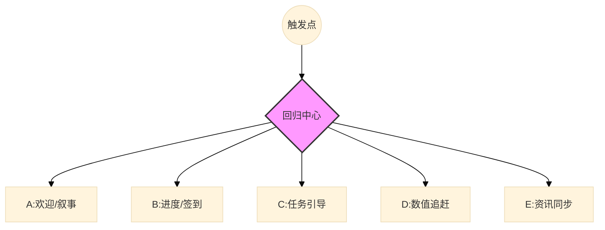
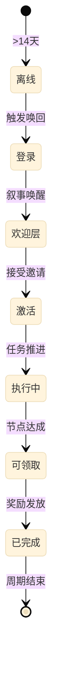

# 手游回归系统交互设计规范 V1.0

> [!NOTE]
> **设计背景**：回归系统是用户生命周期管理中“再激活（Re-activation）”阶段的基石。其核心挑战在于平衡“信息过载”与“收益补偿强度”。本规范通过对二次元、MOBA、MMO 等顶刊产品的逆向工程，提炼了一套普适性的交互逻辑。


---

## 模块 1：核心信息架构 (Information Architecture)

本规范定义了回归系统主视图必须呈现的字段，旨在确保玩家在回归的“前 30 秒”内建立明确的目标感。

| 字段名           | 英文标识                | 展示优先级  | 可视化形式              | 典型参考   |
| :------------ | :------------------ | :----- | :----------------- | :----- |
| **回归状态标识**    | `comeback.status`   | **P0** | 勋章/标题（如“江湖重逢”）     | 《逆水寒》  |
| **核心里程碑进度**   | `progression.track` | **P0** | 路径图 (S-Path) / 轨道线 | 《星穹铁道》 |
| **限时特权 Buff** | `active.buffs`      | **P0** | 悬浮图标 + 倒计时词条       | 《王者荣耀》 |
| **分天奖励预览**    | `reward.daily_list` | **P1** | 7-14 天垂直/水平卡片序列    | 通用规范   |
| **资源补位汇总**    | `catchup.summary`   | **P1** | 数值滚动条 / 弹出层列表      | 《无期迷途》 |
| **版本情报简报**    | `version.intel`     | **P2** | 轮播大图 / 资讯卡片        | 《王者荣耀》 |

### 1.1 系统层级拓扑


---

## 模块 2：交互流与用户旅程 (User Journey)

回归玩家的心理状态是不连续的，交互流必须通过“渐进式引导”重新接合断裂的认知。

### 2.1 状态机模型：回归资源状态


### 2.2 核心路径规范
1.  **仪式感阶段 (The Hook)**：禁止立即进入任务界面。必须包含一个沉浸式欢迎层，建立情感锚点（如《无期》的绘本或《逆水寒》的 NPC 寒暄）。
2.  **定型任务阶段 (The Goal)**：任务显示需具备**强线性感**。建议采用 1-7 天的锁定期限，防止玩家首日因任务过多而产生疲劳感。
3.  **对冲阶段 (The Buffer)**：在排位或高难副本入口处，必须外显回归 Buffer（如保星记录、爆率加成），将“收益外显化”。

---

## 模块 3：布局范式横评 (Layout Paradigms)

| 布局模式 | 视觉特征描述 | 代表产品 | 适用场景 | 视觉参考 |
| :--- | :--- | :--- | :--- | :--- |
| **S型/里程碑轨道** | 树状分岔轨道，每节点标注所需点数和奖励，流程因果链路极其透明。 | 《星穹铁道》 | 效率导向型。适用于卡牌、轻度 RPG，追求快速告知。 |  |
| **多模块网格式** | 2x3 内容卡片阵列，小暖 AI 吸睬常驻引导，小芽保护期倒计时醒目显示。 | 《逆水寒》 | 重度系统型。适用于 MMO，系统繁杂需要强制分发入口。 |  |
| **叙事容器式** | UI 包装在三维办公室拟物场景，模块以实体道具形式展现，溃出强烈叙事代入感。 | 《无期迷途》 | 内容驱动型。强叙事产品，降低系统生硬感。 |  |
| **皮肤试用行为绑定型** | 展示多款史诗/精英皮肤免费试用，并将体验时长与对战局数直接绑定。 | 《王者荣耀》 | MOBA 类。将回归系统与核心玩法深度融合。 |  |

---

## 模块 4：UX 防坑与体验优化

| # | 痛点描述 | 标准解法 | 参考案例 |
| :--- | :--- | :--- | :--- |
| **1** | **认知负荷过载** | 进入回归中心后，仅高亮“当前天数”任务，置灰未来天数，减少信息干扰。 | 《星穹铁道》 |
| **2** | **版本落伍感** | 回归首页直接展示“版本变动 Top3”，用极简词条补齐认知断层。 | 《王者荣耀》 |
| **3** | **社交压力/冷启动** | 提供“小芽权益”与 AI 队友协助，回归期间隐藏战绩，建立社交保护罩。 | 《逆水寒》 |
| **4** | **决策障碍** | 针对回归礼包或自选奖励，提供“推荐”标签或“热门选择百分比”，引导快速决策。 | 通用设计 |
| **5** | **缺失反馈** | 补回资源的领取动效必须具备“资源回流”的视觉流向（向资源栏飞去）。 | 《无期迷途》 |
| **6** | **皮肤试用断层** | 用户体验皮肤后无法继续使用而产生失落感。 | 展示明确的“每对战 1 局 +1 天体验”行为引导，将皮肤体验与对战行为绑定。 | 《王者荣耀》 |
| **7** | **AI引导缺就** | 回归指引为静态文字，人气不足。 | 将指引包装为 IP化吸睬形象（小暖模式），增强互动亲和力。 | 《逆水寒》 |

---

## 模块 5：系统级抽象定义 (JSON Schema)

```json
{
  "component": "ComebackSystemRoot",
  "version": "1.0",
  "system_type": "retention_hub",
  "context": {
    "ab_test_group": "narrative_vs_direct",
    "days_away": "integer",
    "is_virgin_comeback": "boolean"
  },
  "modules": {
    "greeting": {
      "type": "narrative_modal",
      "npc_content": "YeWenzhou_Welcome_Msg",
      "reward_preview": ["item_id_1", "item_id_2"]
    },
    "progression": {
      "paradigm": "enum: s_path | track | grid",
      "total_score": 1000,
      "milestones": [
        { "step": 1, "score": 100, "status": "claimed" },
        { "step": 7, "score": 700, "status": "claimable" }
      ]
    },
    "buffs": {
      "is_active": true,
      "labels": ["DoubleDrop", "RankProtection"],
      "remaining_hours": 72
    }
  }
}
```

---

## AI 校验与维护
- **来源验证**：本规范结论基于 `wiki/analysis/` 模块的历史数据，确保无凭空描述。
- **版本控制**：迭代时须确保 `progression.track` 逻辑的向下兼容性。

---
*关联路径：[[wiki/index.md]]、[[mechanics/回归系统.md]]*
