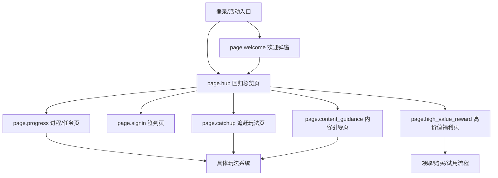
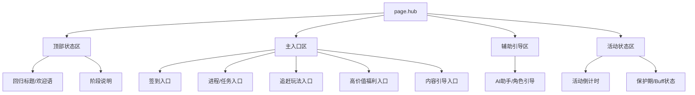

# 手游回归系统交互设计规范 V3.0

> [!IMPORTANT]
> 本版本严格遵循游戏 HUD 空间结构拆解，新增了给 AI 模型的**视觉空间与构图蓝图**，彻底杜绝输入规范生图时跑偏成网页流的情况。

> [!NOTE]
> 本版本的空间构图增强已并入 [[exports/回归系统-交互设计规范_V4.md]]，当前仅保留为历史补强版本。

## 模块 0：系统范围与页面地图

### 0.1 页面清单

| 页面 ID | 页面名称 | 页面类型 | 页面目标 | 入口条件 | 退出路径 | 主 CTA | 来源案例 |
|---|---|---|---|---|---|---|---|
| `page.welcome` | 欢迎弹窗 | overlay | 完成回归激活、展示欢迎语与即时回流利益 | 登录后自动触发 | 进入 Hub / 关闭 | 前往回归中心 | 《无期迷途》《星穹铁道》 |
| `page.hub` | 回归总览页 | hub | 汇总回归模块入口，明确先做什么 | 欢迎弹窗或活动入口 | 进入子页 / 返回主界面 | 进入核心模块 | 四款通用 |
| `page.progress` | 进程/任务页 | detail | 展示回归阶段、任务与里程碑进度 | Hub 点击任务/进程入口 | 跳具体玩法 / 返回 Hub | 前往任务 / 领取奖励 | 《星穹铁道》《逆水寒》 |
| `page.signin` | 签到页 | detail | 承载 7 日或多日留存奖励 | Hub 点击签到入口 | 领取奖励 / 返回 Hub | 今日领取 | 四款通用 |
| `page.catchup` | 追赶玩法页 | detail | 提供低门槛追赶玩法或回归 Buff | Hub 点击助力/副本入口 | 跳玩法 / 返回 Hub | 前往玩法 | 《星穹铁道》《逆水寒》《无期迷途》 |
| `page.high_value_reward` | 高价值福利页 | detail | 展示皮肤/时装/礼包等强钩子内容 | Hub 点击福利入口 | 领取 / 购买 / 返回 Hub | 领取或购买 | 《王者荣耀》《逆水寒》《无期迷途》 |
| `page.content_guidance` | 内容引导页 | detail | 帮助回归玩家理解当前版本去向 | Hub 点击情报/推荐入口 | 跳玩法 / 返回 Hub | 前往内容 | 《星穹铁道》《王者荣耀》《逆水寒》 |

### 0.2 页面地图



---

## 模块 1：页面级信息架构 (Page-level IA)

### 1.1 `page.hub` 回归总览页



### 1.2 区域合同 (Region Contract)

| 区域 ID | 区域名 | 空间槽位 (Spatial Slot) | 构图职责 | 占比/尺寸倾向 | 阅读优先级 | 滚动方向 | 来源案例 |
|---|---|---|---|---|---|---|---|
| `region.header` | 顶部状态区 | `top_bar` | 系统级信息与标题 | 10%-15% | P0 | none | 四款通用 |
| `region.entry_grid` | 主入口区 | `center_panel` | 核心分发面板 | 40%-60% | P0 | none | 《无期迷途》《逆水寒》 |
| `region.progress_zone` | 进度展示区 | `center_stage` | 视觉重心与核心进度 | 35%-50% | P0 | none | 《星穹铁道》 |
| `region.task_zone` | 任务清单区 | `right_panel` | 密集任务与交互 | 30%-45% | P0 | vertical | 《星穹铁道》《无期迷途》 |
| `region.signin_grid` | 签到区 | `center_panel` | 日常资源领取 | 40%-55% | P0 | none | 四款通用 |
| `region.reward_showcase` | 高价值奖励区 | `center_stage` | 核心福利视觉呈现 | 40%-60% | P0 | horizontal | 《王者荣耀》《逆水寒》 |
| `region.assist_panel` | 辅助引导区 | `right_panel` | 动态辅助指引 | 15%-25% | P1 | none | 《逆水寒》 |

### 1.3 视觉空间与构图蓝图 (Spatial Blueprint)

> **目标**：为 AI 生图模型（如 Midjourney、GPT-4 Vision）提供强制的空间布局约束，彻底阻断网页化（Anti-Web）倾向。

**【直接输入给 AI 大模型的生图 Prompt 段落】：**

```text
【构图语法 (Composition Syntax)】: 16:9 横屏游戏内置 HUD (In-game HUD Layout)。
【反网页化指令 (Anti-Web Rules)】: 绝对禁止生成上下滚动的网页流 (Responsive Webpage Flow)、扁平化的仪表盘卡片 (Dashboard Cards) 和着陆页 (Landing Page)。界面必须具有明显的舞台层次感和沉浸式的游戏内环境。
【空间划分 (Spatial Zones)】:
- [Top-Bar]: 顶部统筹条，放置返回键、系统标题（如“回归活动”）和货币资源。
- [Left-Rail]: 左侧导航轨，放置全局子系统切页 Tab。
- [Center-Stage]: 必须包含无边界的沉浸式视觉重心（比如大尺寸的高精度角色原画、炫酷的皮肤大图或立体的回归奖励宝箱），占据画面的视觉主导地位，严禁将其降格为文字列表卡片。
- [Right-Panel]: 右侧悬浮交互面板，放置密集的任务列表、签到格位或“一键领取”操作按钮组。
```

---

## 模块 2：组件合同 (Component Contract)

*(同 V2.0 保持一致，省略部分常规组件说明，聚焦于核心验证的组件)*

| component_id | 组件名称 | 组件类型 | 所属区域 | 数据绑定 | 状态枚举 | 用户动作 | 反馈 |
|---|---|---|---|---|---|---|---|
| `btn.enter_comeback` | 进入回归按钮 | primary_button | `region.header` | `entry_target` | enabled | tap | 关闭弹窗并进入 Hub |
| `entry.high_value` | 高价值福利入口 | entry_card | `region.entry_grid` | `reward_hook` | default / highlighted | tap | 跳转高价值福利页 |
| `progress.node` | 里程碑节点 | milestone_node | `region.progress_zone` | `milestones[]` | locked / claimable | tap | 节点高亮、预览奖励 |
| `task.item` | 任务项 | list_item | `region.task_zone` | `tasks[]` | incomplete / ready | tap / jump | 跳转玩法或领取 |
| `reward.hero_card` | 高价值奖励卡 | preview_card | `region.reward_showcase` | `featured_rewards` | preview / claimable | tap | 放大预览、试用或领取 |

---

## 模块 3：状态、事件与导航矩阵

*(同 V2.0 保持一致，详见 `page.hub -> page.progress -> gameplay` 的导航闭环)*

---

## 模块 4：生成约束与适配规范

### 4.1 布局与防偏科约束 (Layout & Anti-Bias Constraints)

| 页面 | 16:9 空间焦点 | 信息阅读顺序 | 必须固定区域 | 可折叠区域 | 强制禁止的偏科倾向 |
|---|---|---|---|---|---|
| `page.hub` | `center_stage` (场景重心) + `right_panel` | 顶部标题 -> 中央重心 -> 左/右侧入口 | `top_bar`、`left_rail` | 辅助说明 | **绝对禁止使用网页卡片瀑布流排布入口**，禁止把核心功能隐藏进二级菜单 |
| `page.progress` | `center_stage` (进度树) + `right_panel` (任务) | 当前阶段 -> 里程碑树 -> 右侧任务清单 | `top_bar`、`left_rail` | 次级规则 | 禁止只展示任务卡片而不展示全景进度 |
| `page.high_value`| `center_stage` (皮肤/原画大图) | 大图 -> 价值说明 -> 右下 CTA | `top_bar` | 辅助介绍 | 禁止把高价值奖励缩成普通的小图列表项 |

**防网页化红线**：
- 绝对禁止在文档流中从上往下堆砌卡片（Web Dashboard 倾向）。
- 任何主菜单或总览页（hub），必须强制锁定游戏 HUD 舞台感（左导航、中原画/模型、右面板）。

### 4.2 多端适配
*(同 V2.0 保持一致，详见安全区和 16:9 基准要求)*

---
*关联路径：[[analysis/无期迷途-回归系统.md]]、[[analysis/星穹铁道-回归系统.md]]、[[analysis/王者荣耀-回归系统.md]]、[[analysis/逆水寒-回归系统.md]]、[[index.md]]*
