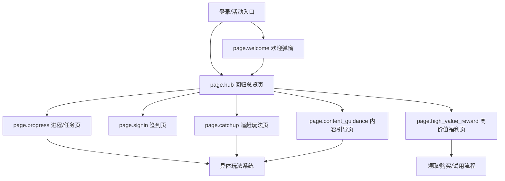
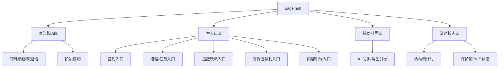
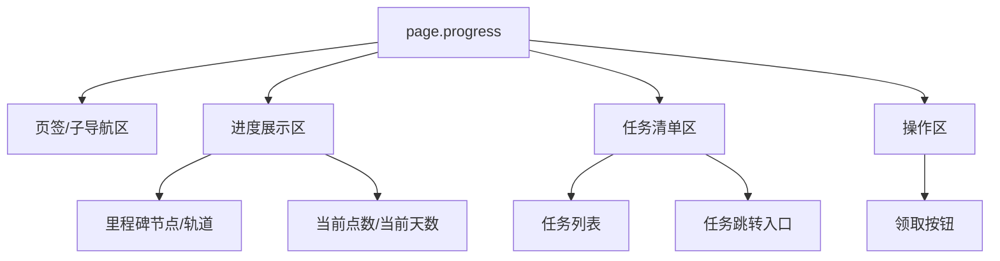
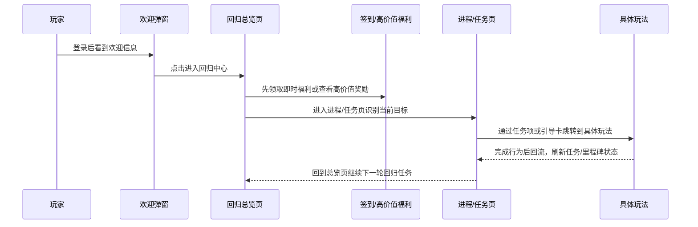

# 手游回归系统交互设计规范 V4.0

> [!IMPORTANT]
> 本版为回归系统的唯一主规范入口。它合并了 V2 的完整页面合同、组件合同、状态矩阵与 UI Manifest，也吸收了 V3 的 Spatial Slot、视觉空间蓝图与防网页化约束。

> [!NOTE]
> 本版本已由 [[exports/回归系统-交互设计规范_V5.md]] 接管为当前生图主入口。V4 继续保留为完整系统合同版历史基线。

> [!NOTE]
> 适用模式：
> - `generation_contract`：用于 AI 生成界面、视觉稿、组件树或页面结构。
> - `wireframe_interactive`：用于灰白线框原型、HTML/Figma 可交互原型和流程验证。

## 模块 0：系统范围与页面地图

### 0.1 页面清单

| 页面 ID | 页面名称 | 页面类型 | 页面目标 | 入口条件 | 退出路径 | 主 CTA | 来源案例 |
|---|---|---|---|---|---|---|---|
| `page.welcome` | 欢迎弹窗 | overlay | 完成回归激活、展示欢迎语与即时回流利益 | 登录后自动触发 | 进入 Hub / 关闭 | 前往回归中心 | 《无期迷途》《星穹铁道》 |
| `page.hub` | 回归总览页 | hub | 汇总回归模块入口，明确先做什么 | 欢迎弹窗或活动入口 | 进入子页 / 返回主界面 | 进入核心模块 | 四款通用 |
| `page.progress` | 进程/任务页 | detail | 展示回归阶段、任务与里程碑进度 | Hub 点击任务/进程入口 | 跳具体玩法 / 返回 Hub | 前往任务 / 领取奖励 | 《星穹铁道》《逆水寒》 |
| `page.signin` | 签到页 | detail | 承载 7 日或多日留存奖励 | Hub 点击签到入口 | 领取奖励 / 返回 Hub | 今日领取 | 四款通用 |
| `page.catchup` | 追赶玩法页 | detail | 提供低门槛追赶玩法或回归 Buff | Hub 点击助力/副本入口 | 跳玩法 / 返回 Hub | 前往玩法 | 《星穹铁道》《逆水寒》《无期迷途》 |
| `page.high_value_reward` | 高价值福利页 | detail | 展示皮肤、时装、礼包等强钩子内容 | Hub 点击福利入口 | 领取 / 购买 / 返回 Hub | 领取或购买 | 《王者荣耀》《逆水寒》《无期迷途》 |
| `page.content_guidance` | 内容引导页 | detail | 帮助回归玩家理解当前版本去向 | Hub 点击情报/推荐入口 | 跳玩法 / 返回 Hub | 前往内容 | 《星穹铁道》《王者荣耀》《逆水寒》 |

### 0.2 页面地图



### 0.3 原型呈现规则

| 页面 ID | 默认可见 | 与哪些页面互斥 | 呈现方式 | 返回目标 | 是否要求遮罩 |
|---|---|---|---|---|---|
| `page.welcome` | yes | `page.hub` 之外的全部主页面 | overlay | `page.hub` | yes |
| `page.hub` | no | `page.progress` `page.signin` `page.catchup` `page.high_value_reward` `page.content_guidance` | replace | 主界面入口 | no |
| `page.progress` | no | `page.hub` 及其他 detail 页面 | replace | `page.hub` | no |
| `page.signin` | no | `page.hub` 及其他 detail 页面 | replace | `page.hub` | no |
| `page.catchup` | no | `page.hub` 及其他 detail 页面 | replace | `page.hub` | no |
| `page.high_value_reward` | no | `page.hub` 及其他 detail 页面 | replace | `page.hub` | no |
| `page.content_guidance` | no | `page.hub` 及其他 detail 页面 | replace | `page.hub` | no |

**强制规则**：
- 同一时刻只允许一个 `hub/detail` 页面处于激活显示态。
- 只有 `overlay/modal` 允许叠加显示。
- 线框原型不得把多个主页面堆叠在同一可见画布中。

---

## 模块 1：页面级信息架构 (Page-level IA)

### 1.1 `page.hub` 回归总览页



### 1.2 `page.progress` 进程/任务页



### 1.3 区域合同

| 区域 ID | 区域名 | 空间槽位 | 构图职责 | 页面位置 | 占比/尺寸倾向 | 阅读优先级 | 滚动方向 | 固定/滚动 | 内容容量上限 | 来源案例 |
|---|---|---|---|---|---|---|---|---|---|---|
| `region.header` | 顶部状态区 | `top_bar` | 系统级信息与标题 | top | 10%-15% | P0 | none | fixed | 4-6 个信息点 | 四款通用 |
| `region.entry_grid` | 主入口区 | `center_panel` | 核心分发面板 | center | 40%-60% | P0 | none | fixed | 4-6 个主入口 | 《无期迷途》《逆水寒》 |
| `region.progress_zone` | 进度展示区 | `center_stage` | 视觉重心与核心进度 | center_left | 35%-50% | P0 | none | mixed | 5-8 个里程碑 | 《星穹铁道》 |
| `region.task_zone` | 任务清单区 | `right_panel` | 密集任务与交互承接 | right | 30%-45% | P0 | vertical | scroll | 4-8 条任务 | 《星穹铁道》《无期迷途》 |
| `region.signin_grid` | 签到区 | `center_panel` | 日常资源领取 | center | 40%-55% | P0 | none | fixed | 7-14 个格位 | 四款通用 |
| `region.reward_showcase` | 高价值奖励展示区 | `center_stage` | 核心福利视觉呈现 | center | 40%-60% | P0 | horizontal | mixed | 3-6 张核心卡片 | 《王者荣耀》《逆水寒》 |
| `region.assist_panel` | 辅助引导区 | `right_panel` | 动态辅助指引 | right | 15%-25% | P1 | none | fixed | 1 个助手 + 1-3 条提示 | 《逆水寒》 |

### 1.4 视觉空间与构图蓝图 (Spatial Blueprint)

> 目标：为 AI 生图模型和中保真原型提供强制空间布局约束，彻底阻断网页化倾向。

```text
【构图语法】16:9 横屏游戏内 HUD 布局，具有明显的左导航、中舞台、右交互面板层次。
【反网页化指令】绝对禁止生成响应式长页面、仪表盘卡片瀑布流、着陆页 Hero Banner、文章式分段布局。
【空间划分】
- [Top-Bar]：返回键、系统标题、剩余时间、保护期、资源状态。
- [Left-Rail]：回归子模块页签或主入口切换轨。
- [Center-Stage]：必须容纳主视觉重心，优先承载高价值奖励、回归宝箱、角色立绘或阶段进度树。
- [Right-Panel]：承接任务列表、签到格位、即时领取按钮、引导提示。
【布局语义】
- Hub 不是网页首页，而是游戏内功能中枢。
- Progress 不是任务列表页，而是“进度树 + 任务承接”的双栏舞台。
- High Value Reward 不是商品列表，而是高价值奖励放大预览页。
```

### 1.5 线框布局合同

| 区域 ID | 16:9 槽位映射 | 宽高占比 | 是否必须保留 | 是否允许滚动 | 是否允许折叠 | 占位要求 |
|---|---|---|---|---|---|---|
| `region.header` | `top_bar` | 高 10%-15% | yes | no | no | 必须保留标题、剩余时间与至少一个状态标签 |
| `region.entry_grid` | `center_panel` | 宽 45%-60%，高 35%-55% | yes | no | no | 无素材时仍需保留 4-6 个入口卡位 |
| `region.progress_zone` | `center_stage` | 宽 35%-50%，高 40%-55% | yes | no | no | 必须保留阶段树或进度轨占位 |
| `region.task_zone` | `right_panel` | 宽 28%-40%，高 45%-60% | yes | yes | no | 需保留任务列表和领取按钮位 |
| `region.reward_showcase` | `center_stage` | 宽 40%-60%，高 45%-60% | yes | horizontal | no | 必须保留大奖或皮肤大图占位 |
| `region.assist_panel` | `right_panel` | 宽 15%-25%，高 25%-40% | no | no | yes | 可折叠，但默认应有一条引导信息 |

---

## 模块 2：组件合同 (Component Contract)

| component_id | 组件名称 | 组件类型 | 所属页面 | 所属区域 | 数据绑定 | 优先级 | 状态枚举 | 用户动作 | 反馈 | 来源案例 |
|---|---|---|---|---|---|---|---|---|---|---|
| `btn.enter_comeback` | 进入回归中心按钮 | primary_button | `page.welcome` | `region.header` | `entry_target` | P0 | enabled | tap | 关闭弹窗并进入 Hub | 《无期迷途》《星穹铁道》 |
| `label.countdown` | 活动倒计时 | countdown | `page.hub` | `region.header` | `event_remaining_time` | P0 | active / expired | none | 倒计时刷新 | 四款通用 |
| `badge.protection` | 保护期标签 | status_badge | `page.hub` | `region.header` | `protection_remaining_days` | P0 | active / inactive | none | 剩余天数变化 | 《逆水寒》《王者荣耀》 |
| `entry.signin` | 签到入口 | entry_card | `page.hub` | `region.entry_grid` | `signin_status` | P0 | default / highlighted | tap | 跳转签到页 | 四款通用 |
| `entry.progress` | 进程入口 | entry_card | `page.hub` | `region.entry_grid` | `progress_status` | P0 | default / highlighted | tap | 跳转进程页 | 《星穹铁道》《无期迷途》 |
| `entry.catchup` | 追赶入口 | entry_card | `page.hub` | `region.entry_grid` | `catchup_available` | P0 | default / highlighted | tap | 跳转追赶玩法页 | 《无期迷途》《逆水寒》 |
| `entry.high_value_reward` | 高价值福利入口 | entry_card | `page.hub` | `region.entry_grid` | `reward_hook_type` | P0 | default / highlighted | tap | 跳转福利页 | 《王者荣耀》《逆水寒》 |
| `assistant.guide` | AI/角色引导组件 | assistant_widget | `page.hub` | `region.assist_panel` | `guide_copy` | P1 | visible / hidden | tap / read | 气泡提示刷新 | 《逆水寒》《星穹铁道》 |
| `progress.node` | 里程碑节点 | milestone_node | `page.progress` | `region.progress_zone` | `milestones[]` | P0 | locked / current / claimable / claimed | tap | 节点高亮、预览奖励 | 《星穹铁道》 |
| `task.item` | 任务项 | list_item | `page.progress` | `region.task_zone` | `tasks[]` | P0 | incomplete / ready / claimed | tap / jump | 跳转玩法或领取 | 《星穹铁道》《无期迷途》 |
| `signin.cell` | 签到格位 | reward_cell | `page.signin` | `region.signin_grid` | `signin_rewards[]` | P0 | locked / claimable / claimed | tap | 奖励飞入、格位状态切换 | 四款通用 |
| `reward.hero_card` | 高价值奖励卡 | preview_card | `page.high_value_reward` | `region.reward_showcase` | `featured_rewards[]` | P0 | preview / claimable / purchasable / trial_active | tap | 放大预览、试用或领取 | 《王者荣耀》《逆水寒》 |
| `label.trial_rule` | 行为绑定规则 | badge | `page.high_value_reward` | `region.reward_showcase` | `retention_rule` | P0 | visible | none | 文案常驻 | 《王者荣耀》 |
| `card.content_guidance` | 内容引导卡 | entry_card | `page.content_guidance` | `region.entry_grid` | `recommended_content[]` | P1 | default / recommended | tap | 跳转内容系统 | 《星穹铁道》《王者荣耀》《逆水寒》 |

### 2.1 交互原型合同

| trigger_id | 触发对象 | 当前页面 | 交互动作 | 结果页面/结果区域 | 是否更新选中态 | 是否关闭当前层 | 保留状态 |
|---|---|---|---|---|---|---|---|
| `btn.enter_comeback` | 欢迎弹窗主按钮 | `page.welcome` | click | `page.hub` | no | yes | 顶部状态栏保留 |
| `entry.signin` | 签到入口卡 | `page.hub` | click | `page.signin` | yes | yes | Header 保留 |
| `entry.progress` | 进程入口卡 | `page.hub` | click | `page.progress` | yes | yes | Header 保留 |
| `entry.catchup` | 追赶入口卡 | `page.hub` | click | `page.catchup` | yes | yes | Header 保留 |
| `entry.high_value_reward` | 福利入口卡 | `page.hub` | click | `page.high_value_reward` | yes | yes | Header 保留 |
| `task.item` | 任务项按钮 | `page.progress` | click | 具体玩法系统 | no | yes | 任务页状态待回流刷新 |
| `reward.hero_card` | 高价值奖励卡 | `page.high_value_reward` | click | 领取/购买/试用流程 | no | no | 当前奖励聚焦态保留 |

### 2.2 占位符规则

| placeholder_id | 占位内容 | 所属页面 | 所属区域 | 占位形态 | 标注文本 | 是否允许省略 |
|---|---|---|---|---|---|---|
| `ph.hero_reward` | 高价值奖励主视觉 | `page.high_value_reward` | `region.reward_showcase` | 大矩形框 | 高价值奖励占位 | no |
| `ph.assistant_avatar` | 引导角色/AI 助手 | `page.hub` | `region.assist_panel` | 竖向人物框 | 引导角色占位 | yes |
| `ph.welcome_reward` | 欢迎弹窗即时奖励 | `page.welcome` | `region.header` | 小奖励组框 | 即时奖励占位 | no |
| `ph.progress_tree` | 进度树/里程碑轨 | `page.progress` | `region.progress_zone` | 横向或树状框体 | 进度树占位 | no |

**强制规则**：
- 立绘、皮肤大图、运营横幅、大奖图只能以“占位框 + 游戏内容标签”的形式表现。
- 不得在界面上显示 `page.*`、`region.*`、`component.*` 等规范元信息。
- 缺少素材时保留正确位置和比例，不得删区。

---

## 模块 3：状态、事件与导航矩阵

### 3.1 状态事件矩阵

| 对象 | 当前状态 | 触发事件 | 条件 | 下一状态 | UI 反馈 | 数据变化 |
|---|---|---|---|---|---|---|
| `page.welcome` | `visible` | `tap_enter` | 用户点击进入 | `hidden` | 弹窗关闭，进入 Hub | `entered_comeback=true` |
| `entry.signin` | `highlighted` | `tap` | 当日未领签到 | `visited` | 跳转签到页 | `last_page=signin` |
| `progress.node` | `locked` | `progress_reached` | 达到目标点数 | `claimable` | 节点高亮/扫光 | `claimable_node_count+1` |
| `task.item` | `incomplete` | `task_done` | 完成指定行为 | `ready` | 按钮点亮或出现领取态 | `ready_task_count+1` |
| `signin.cell` | `claimable` | `tap_claim` | 当日可领 | `claimed` | 奖励飞入资源栏、格位盖章/置灰 | `claimed_days+1` |
| `reward.hero_card` | `preview` | `tap_claim_or_trial` | 满足领取或试用条件 | `claimable` / `trial_active` | 卡片放大、进入领取或试用流程 | `trial_remaining_days` 或 `claimed_rewards` 变化 |
| `badge.protection` | `active` | `time_elapsed` | 保护期结束 | `inactive` | 标签变灰或消失 | `protection_remaining_days=0` |

### 3.2 主路径交互链



### 3.3 页面跳转规则

| 来源页面 | 触发组件 | 跳转目标 | 跳转类型 | 返回方式 |
|---|---|---|---|---|
| `page.welcome` | `btn.enter_comeback` | `page.hub` | overlay_close + replace | 自动进入 |
| `page.hub` | `entry.signin` | `page.signin` | replace | back |
| `page.hub` | `entry.progress` | `page.progress` | replace | back |
| `page.hub` | `entry.catchup` | `page.catchup` | replace | back |
| `page.hub` | `entry.high_value_reward` | `page.high_value_reward` | replace | back |
| `page.hub` | `card.content_guidance` | `page.content_guidance` | replace | back |
| `page.progress` | `task.item` | 具体玩法系统 | push | 系统返回或任务刷新 |
| `page.high_value_reward` | `reward.hero_card` | 领取/购买/试用流程 | modal / push | success redirect / close |

---

## 模块 4：生成约束与适配规范

### 4.1 布局与防网页化约束

| 页面 | 16:9 空间焦点 | 信息阅读顺序 | 必须固定区域 | 可折叠区域 | 强制禁止事项 |
|---|---|---|---|---|---|
| `page.hub` | `center_panel` + `right_panel` | 标题/倒计时 -> 主入口 -> 辅助引导 | `top_bar` | `assist_panel` | 禁止使用网页卡片瀑布流；禁止把核心入口隐藏进二级菜单 |
| `page.progress` | `center_stage` + `right_panel` | 当前阶段 -> 里程碑 -> 任务入口 | `top_bar` | 次级规则说明 | 禁止只展示任务，不展示进度树或阶段状态 |
| `page.signin` | `center_panel` | 今日可领 -> 未来奖励 -> 终极大奖 | `top_bar` | 辅助说明 | 禁止让可领态与锁定态无差异 |
| `page.high_value_reward` | `center_stage` | 大奖大图 -> 规则说明 -> CTA | `top_bar` | 辅助介绍 | 禁止把高价值奖励缩成普通商品列表 |

### 4.2 文案与素材槽位

| slot_id | 类型 | 用途 | 必填/选填 | 内容约束 |
|---|---|---|---|---|
| `copy.welcome_title` | text | 欢迎标题 | 必填 | 8-16 个汉字，需明确“回归”语义 |
| `copy.countdown` | text | 活动剩余时间 | 必填 | 含明确时间单位 |
| `copy.primary_cta` | text | 主按钮文案 | 必填 | 不超过 6 个汉字 |
| `copy.retention_rule` | text | 回归规则文案 | 选填 | 适合单行展示 |
| `asset.hero_reward` | image | 高价值奖励展示图 | 选填 | 适用于皮肤、时装、角色、礼包 |
| `asset.assistant_avatar` | image | 引导角色形象 | 选填 | 适用于 AI 助手或吉祥物引导 |

### 4.3 多端适配

| 设备类型 | 分辨率基准 | 页面调整规则 |
|---|---|---|
| 横屏手机 | 16:9 | Hub 采用多入口并列，进程页优先左右双栏，CTA 固定在安全区上方 |
| 竖屏手机 | 9:16 | Hub 入口改双列或单列卡片，进度区与任务区改上下堆叠，辅助引导收纳成可展开面板 |
| 平板 / 小屏 PC | 4:3+ | 允许常驻双栏甚至三栏，总览页可同时显示入口区与引导区，高价值奖励常驻预览 |

### 4.4 线框表现红线

- 只允许使用灰、白、黑三阶线框表达，不直接进入高保真材质、发光或皮肤感。
- 不得显示浏览器导航、网页标题栏、图例说明条或规范阅读标签。
- 不得把多个 `hub/detail` 页面叠在同一可见界面里，除非本规范明确要求 `overlay/modal`。
- 左侧页签、入口卡、返回按钮和主 CTA 必须可点击并有明确结果页面。

**安全区强制规范**：
- 所有高频 CTA 必须位于 `safeAreaInset` 内。
- Home Indicator 上方至少预留 24-30px 的点击缓冲。
- 倒计时、保护期等系统状态信息不得被刘海或系统栏遮挡。

---

## 模块 5：UI Manifest JSON

```json
{
  "system_name": "ComebackSystem",
  "version": "4.0",
  "mode": "generation_contract+wireframe_interactive",
  "entry_point": "login_overlay_or_event_entry",
  "default_page": "page.welcome",
  "pages": [
    {
      "page_id": "page.hub",
      "page_type": "hub",
      "goal": "让玩家知道当前回归福利、下一步优先动作和活动剩余时间",
      "visible_by_default": false,
      "regions": [
        {
          "region_id": "region.header",
          "position": "top",
          "slot": "top_bar",
          "priority": "P0",
          "scroll": "none",
          "components": ["label.countdown", "badge.protection"]
        },
        {
          "region_id": "region.entry_grid",
          "position": "center",
          "slot": "center_panel",
          "priority": "P0",
          "scroll": "none",
          "components": ["entry.signin", "entry.progress", "entry.catchup", "entry.high_value_reward"]
        },
        {
          "region_id": "region.assist_panel",
          "position": "right",
          "slot": "right_panel",
          "priority": "P1",
          "scroll": "none",
          "components": ["assistant.guide"]
        }
      ]
    },
    {
      "page_id": "page.progress",
      "page_type": "detail",
      "goal": "展示回归阶段、缺口任务和直接跳转目标",
      "visible_by_default": false,
      "regions": [
        {
          "region_id": "region.progress_zone",
          "position": "center_left",
          "slot": "center_stage",
          "priority": "P0",
          "scroll": "none",
          "components": ["progress.node"]
        },
        {
          "region_id": "region.task_zone",
          "position": "right",
          "slot": "right_panel",
          "priority": "P0",
          "scroll": "vertical",
          "components": ["task.item"]
        }
      ]
    },
    {
      "page_id": "page.signin",
      "page_type": "detail",
      "goal": "承载按天发放的回归留存奖励",
      "visible_by_default": false,
      "regions": [
        {
          "region_id": "region.signin_grid",
          "position": "center",
          "slot": "center_panel",
          "priority": "P0",
          "scroll": "none",
          "components": ["signin.cell"]
        }
      ]
    },
    {
      "page_id": "page.high_value_reward",
      "page_type": "detail",
      "goal": "放大展示高价值福利并驱动领取、试用或购买",
      "visible_by_default": false,
      "regions": [
        {
          "region_id": "region.reward_showcase",
          "position": "center",
          "slot": "center_stage",
          "priority": "P0",
          "scroll": "horizontal",
          "components": ["reward.hero_card", "label.trial_rule"]
        }
      ]
    }
  ],
  "components": [
    {
      "component_id": "entry.signin",
      "type": "entry_card",
      "page_id": "page.hub",
      "region_id": "region.entry_grid",
      "data_binding": ["signin_status"],
      "states": ["default", "highlighted"],
      "events": ["tap_open_signin"],
      "feedback": {
        "visual": "card_highlight_or_red_dot",
        "audio": "sfx_ui_click"
      }
    },
    {
      "component_id": "progress.node",
      "type": "milestone_node",
      "page_id": "page.progress",
      "region_id": "region.progress_zone",
      "data_binding": ["milestones"],
      "states": ["locked", "current", "claimable", "claimed"],
      "events": ["tap_preview_reward", "claim_milestone"],
      "feedback": {
        "visual": "node_glow_or_stamp",
        "audio": "sfx_reward_ready"
      }
    },
    {
      "component_id": "signin.cell",
      "type": "reward_cell",
      "page_id": "page.signin",
      "region_id": "region.signin_grid",
      "data_binding": ["signin_rewards"],
      "states": ["locked", "claimable", "claimed"],
      "events": ["tap_claim_signin_reward"],
      "feedback": {
        "visual": "reward_fly_to_wallet",
        "audio": "sfx_reward_claim"
      }
    },
    {
      "component_id": "reward.hero_card",
      "type": "preview_card",
      "page_id": "page.high_value_reward",
      "region_id": "region.reward_showcase",
      "data_binding": ["featured_rewards"],
      "states": ["preview", "claimable", "purchasable", "trial_active"],
      "events": ["tap_preview", "tap_claim_or_trial"],
      "feedback": {
        "visual": "card_zoom_or_modal_open",
        "audio": "sfx_reward_focus"
      }
    }
  ],
  "navigation": [
    {
      "from": "page.welcome",
      "trigger": "btn.enter_comeback",
      "to": "page.hub",
      "mode": "replace"
    },
    {
      "from": "page.hub",
      "trigger": "entry.progress",
      "to": "page.progress",
      "mode": "replace"
    },
    {
      "from": "page.hub",
      "trigger": "entry.signin",
      "to": "page.signin",
      "mode": "replace"
    },
    {
      "from": "page.hub",
      "trigger": "entry.high_value_reward",
      "to": "page.high_value_reward",
      "mode": "replace"
    },
    {
      "from": "page.progress",
      "trigger": "task.item",
      "to": "gameplay_system",
      "mode": "push"
    }
  ],
  "prototype_rules": {
    "single_active_screen": true,
    "meta_labels_visible": false,
    "wireframe_palette": ["#ffffff", "#d9d9d9", "#4a4a4a"],
    "placeholder_required": ["ph.hero_reward", "ph.progress_tree"]
  },
  "layout_constraints": {
    "primary_focus": ["region.entry_grid", "region.progress_zone", "region.signin_grid", "region.reward_showcase"],
    "fixed_regions": ["region.header"],
    "safe_area_required": true,
    "do_not_hide_core_entries_in_secondary_menus": true,
    "anti_web_layout": true
  }
}
```

---

## 模块 6：研究附录 (Secondary)

### 6.1 四款案例的角色分工

| 游戏 | 主设计重心 | 可直接借鉴的生成线索 |
|---|---|---|
| 《无期迷途》 | 叙事化欢迎与拟物 Hub | Hub 可以不是列表，也可以是具象化场景入口 |
| 《星穹铁道》 | 进度树 + 任务清单透明化 | 进程页优先双栏，把“还差多少”和“该做什么”放同屏 |
| 《王者荣耀》 | 皮肤试用和行为绑定 | 高价值奖励页适合放大皮肤/时装，并把体验时间和行为规则并列 |
| 《逆水寒》 | AI 引导 + 保护期外显 | Hub 右侧可常驻助手和保护状态，缓解回归焦虑 |

### 6.2 使用建议

- 如果目标产品偏效率导向，优先采用《星穹铁道》的进程页结构。
- 如果目标产品偏内容/审美驱动，优先采用《无期迷途》或《王者荣耀》的高价值奖励放大方式。
- 如果目标产品系统复杂且回归玩家容易恐惧失败，优先采用《逆水寒》的保护期 + AI 引导结构。

---
*关联路径：[[analysis/无期迷途-回归系统.md]]、[[analysis/星穹铁道-回归系统.md]]、[[analysis/王者荣耀-回归系统.md]]、[[analysis/逆水寒-回归系统.md]]、[[mechanics/回归系统.md]]、[[index.md]]*
