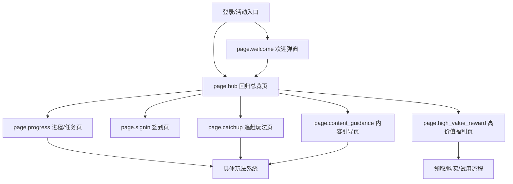

# 手游回归系统交互设计规范 V5.0

> [!IMPORTANT]
> 本版是**面向生图的回归系统规范**。它服务的不是“完整系统文档阅读”，而是“把整套系统拆成多个可单独生成的页面目标”，用于上传给图片模型或网页版 AI 后稳定生成单个界面。

> [!NOTE]
> 使用原则：
> - 这是一整套系统规范，但**每次生图只允许选择其中一个页面**。
> - 设计规范负责结构真相，UI 资源图负责视觉语法。
> - 不允许把多页功能拼接在一张界面图里，除非目标本身就是 `overlay/modal`。

## 模块 0：系统范围与页面地图

### 0.1 页面清单

| 页面 ID                    | 页面名称   | 页面类型    | 页面目标                | 入口条件          | 退出路径             | 主 CTA       | 来源案例              |
| ------------------------ | ------ | ------- | ------------------- | ------------- | ---------------- | ----------- | ----------------- |
| `page.welcome`           | 欢迎弹窗   | overlay | 完成回归激活、展示欢迎语与即时回流利益 | 登录后自动触发       | 进入 Hub / 关闭      | 前往回归中心      | 《无期迷途》《星穹铁道》      |
| `page.hub`               | 回归总览页  | hub     | 汇总回归模块入口，明确先做什么     | 欢迎弹窗或活动入口     | 进入子页 / 返回主界面     | 进入核心模块      | 四款通用              |
| `page.progress`          | 进程/任务页 | detail  | 展示回归阶段、任务与里程碑进度     | Hub 点击任务/进程入口 | 跳具体玩法 / 返回 Hub   | 前往任务 / 领取奖励 | 《星穹铁道》《逆水寒》       |
| `page.signin`            | 签到页    | detail  | 承载 7 日或多日留存奖励       | Hub 点击签到入口    | 领取奖励 / 返回 Hub    | 今日领取        | 四款通用              |
| `page.catchup`           | 追赶玩法页  | detail  | 提供低门槛追赶玩法或回归 Buff   | Hub 点击助力/副本入口 | 跳玩法 / 返回 Hub     | 前往玩法        | 《星穹铁道》《逆水寒》《无期迷途》 |
| `page.high_value_reward` | 高价值福利页 | detail  | 展示皮肤、时装、礼包等强钩子内容    | Hub 点击福利入口    | 领取 / 购买 / 返回 Hub | 领取或购买       | 《王者荣耀》《逆水寒》《无期迷途》 |
| `page.content_guidance`  | 内容引导页  | detail  | 帮助回归玩家理解当前版本去向      | Hub 点击情报/推荐入口 | 跳玩法 / 返回 Hub     | 前往内容        | 《星穹铁道》《王者荣耀》《逆水寒》 |

### 0.2 页面地图



### 0.3 生图模式的硬规则

| 规则项    | 要求                                                                                                                   |
| ------ | -------------------------------------------------------------------------------------------------------------------- |
| 单次目标   | 一次只生成一个页面                                                                                                            |
| 默认目标页  | 用户未指定时，默认生成 `page.hub`                                                                                               |
| 多页糅合   | 禁止把 `page.hub`、`page.progress`、`page.signin`、`page.catchup`、`page.high_value_reward`、`page.content_guidance` 混在同一主画面 |
| 例外情况   | 仅 `page.welcome` 允许以 `overlay` 形式叠加在 `page.hub` 上                                                                    |
| 结构真相来源 | 本规范                                                                                                                  |
| 视觉语法来源 | 对应 UI 资源图、控件图谱、参考截图                                                                                                  |

**生图前必须先回答 2 个问题**：

1. 这次生成的是哪一个页面？
2. 这次走哪种风格分支？

如果这两件事没有说清，不能直接进入最终 Prompt。

---

## 模块 1：页面选择与风格分支

### 1.1 页面选择规则

| 页面 ID | 适合生成的场景 | 不该混进来的内容 |
|---|---|---|
| `page.hub` | 需要表现“回归系统总览、今天先做什么、有哪些入口” | 完整签到格子、完整任务长列表、完整内容引导页 |
| `page.progress` | 需要强调“进度树、里程碑、追赶任务” | 签到整页、福利整页、内容总览整页 |
| `page.signin` | 需要强调“多日签到、今日可领、终极大奖锚点” | 完整任务树、复杂玩法入口矩阵 |
| `page.catchup` | 需要强调“低门槛追赶玩法、回归 Buff、推荐去处” | 完整签到页、完整大奖页 |
| `page.high_value_reward` | 需要强调“皮肤、礼包、大奖、高价值回流钩子” | 复杂任务树、完整模块总览 |
| `page.content_guidance` | 需要强调“版本推荐内容、去哪里玩、做什么” | 完整签到格、完整大奖页 |

### 1.2 通用风格分支

本系统至少支持以下 3 个生图分支：

| 分支 | 说明 | 更接近的案例倾向 |
|---|---|---|
| `总览分发型` | 多入口、多模块、强调先做什么 | 《逆水寒》 |
| `进度聚焦型` | 强调进度树、里程碑、任务承接 | 《星穹铁道》 |
| `奖励展示型` | 强调高价值奖励、皮肤、礼包和强 CTA | 《王者荣耀》 |

默认问法：

`这次你更想要总览分发型、进度聚焦型，还是奖励展示型？`

---

## 模块 2：单页生图合同

> 这一部分不是要求模型理解整套系统，而是要求模型在单次生成中只消费“当前目标页”的合同。

### 2.1 `page.hub` 回归总览页

**页面目标**：
- 让玩家 3 秒内知道“这是回归系统”
- 让玩家知道“今天先做什么”
- 让玩家知道“当前有什么值得领取或追的奖励”

**必须出现**：
- 顶部状态区：回归标题、活动剩余时间、保护期或回归状态
- 主入口区：签到、进程、追赶、高价值奖励、内容引导中的 4-5 个入口
- 一个高权重主视觉区：当前焦点奖励、当前推荐模块或回归核心钩子
- 一个辅助引导区：角色引导、AI 助手或简短提示

**禁止出现**：
- 完整 7 日签到格铺满全页
- 完整任务长列表
- 多页并排拼贴
- 营销专题页式大 Banner

### 2.2 `page.progress` 进程/任务页

**页面目标**：
- 让玩家一眼看懂当前回归阶段
- 明确下一段里程碑
- 明确该做的任务和回流去向

**必须出现**：
- 进度树 / 里程碑区
- 当前阶段或当前点数信息
- 任务承接区
- 至少一个可领取或可追赶状态

**禁止出现**：
- 完整签到页
- 完整福利总览页
- 与 Hub 同级的多入口矩阵

### 2.3 `page.signin` 签到页

**页面目标**：
- 让玩家清楚看到今天能领什么
- 让玩家知道后续还有哪些奖励
- 给出终极奖励锚点

**必须出现**：
- 今日可领格位
- 已领 / 未领 / 锁定状态差异
- 终极奖励或连续签到大奖锚点

**禁止出现**：
- 完整任务进度树
- 完整功能总览入口矩阵

### 2.4 `page.catchup` 追赶玩法页

**页面目标**：
- 告诉玩家哪些玩法最适合回归期补进度
- 告诉玩家有哪些 Buff 或保护机制

**必须出现**：
- 推荐玩法入口
- 回归 Buff / 保护状态
- 低门槛追赶路径

**禁止出现**：
- 完整签到格
- 大奖展示页主体

### 2.5 `page.high_value_reward` 高价值福利页

**页面目标**：
- 放大展示高价值奖励
- 形成强烈回流诱因
- 给出明确领取 / 试用 / 购买行动

**必须出现**：
- 高价值奖励主视觉
- 规则说明或体验时长说明
- 强 CTA

**禁止出现**：
- 复杂任务树
- 多模块入口矩阵

### 2.6 `page.content_guidance` 内容引导页

**页面目标**：
- 告诉玩家当前版本值得回去玩的内容
- 帮助玩家快速建立方向感

**必须出现**：
- 推荐内容卡
- 简要推荐理由
- 去玩法系统的跳转入口

**禁止出现**：
- 完整签到格
- 完整任务树
- 大奖展示页主体

---

## 模块 3：构图与页面语法

### 3.1 共用构图约束

- 默认 `16:9`
- 横屏优先，但不锁死方向
- 采用游戏 HUD 式布局，不允许网页流布局
- 保持明显的主舞台和承接信息区

### 3.2 页面构图提示

| 页面 | 推荐构图 | 主视觉焦点 |
|---|---|---|
| `page.hub` | 中央主舞台 + 入口矩阵 + 辅助栏 | 当前推荐奖励 / 回归主题视觉 |
| `page.progress` | 左中进度树 + 右侧任务区 | 进度树 / 里程碑 |
| `page.signin` | 中央签到格阵列 + 大奖锚点 | 今日可领奖励 / 终极奖励 |
| `page.catchup` | 中央推荐玩法 + 右侧加成说明 | 推荐玩法 / Buff |
| `page.high_value_reward` | 中央大奖大图 + 右下行动区 | 皮肤 / 礼包 / 大奖 |
| `page.content_guidance` | 内容卡列表 + 去向提示 | 推荐内容卡 |

### 3.3 反网页化红线

- 不要生成 dashboard 卡片流
- 不要生成长页面滚动
- 不要生成浏览器导航或运营专题页结构
- 不要把多个系统页并排放在一张图上
- 不要把“模块介绍文字”当成正文主体

---

## 模块 4：状态、热区与基础适配

### 4.1 必须可见的状态

每次单页生图，至少外显 3 个状态：

- `claimable`
- `claimed`
- `locked`
- `active`
- `protected`
- `recommended`

### 4.2 基础触控与热区底线

| 项目 | 默认值 |
|---|---|
| 最小触控热区 | iOS `44pt` / Android `48dp` 等效 |
| 相邻可点击目标最小间距 | `8dp` 等效 |
| 高频主 CTA | 优先 `56dp` 等效 |
| 边缘缓冲 | `16-24dp` 等效 |
| 底部 CTA 与 Home Indicator 缓冲 | `24dp` 等效 |

### 4.3 默认出图画布

| 场景 | 默认画布 |
|---|---|
| 横屏主界面 | `1920 × 1080` |
| 竖屏主界面 | `1080 × 1920` |

---

## 模块 5：上传给生图模型时的使用方式

### 5.1 结构与视觉的分工

- **本规范**：定义“这次到底生成哪个页面、该出现什么、不该出现什么”
- **UI 资源图 / atlas / 控件图**：定义“星穹铁道风格的按钮、页签、底板、奖励展示语法”

### 5.2 给模型的阅读顺序

1. 先看本规范中的“页面选择”与“单页生图合同”
2. 再看 UI 资源图谱，学习控件与框体语法
3. 最后看补充截图，学习材质和氛围

### 5.3 上传包中必须附带的关键信息

- 目标页面 ID
- 风格分支
- 必须出现
- 禁止出现
- 画布方向
- 主视觉焦点

---

## 模块 6：单页生图 Prompt 模板

### 6.1 通用模板

```text
根据回归系统交互设计规范，只生成一个页面，不要把整套系统糅合在同一张图里。

目标页面：
- [target_page]

风格分支：
- [style_branch]

结构真相来源：
- 回归系统交互设计规范 V5

视觉语法来源：
- 星穹铁道 UI 资源图 / atlas / 控件图

这是游戏内系统界面，不是网页，不是 dashboard，不是营销专题页。
默认 16:9，横屏优先。

必须出现：
- [must_have_1]
- [must_have_2]
- [must_have_3]

禁止出现：
- [must_not_have_1]
- [must_not_have_2]
- [must_not_have_3]

主视觉焦点：
- [primary_focus_1]
- [primary_focus_2]

必须外显状态：
- [state_1]
- [state_2]
- [state_3]
```

### 6.2 `page.hub` 示例模板

```text
根据回归系统交互设计规范，只生成回归系统总览页（page.hub），不要生成整套回归系统拼贴图。

风格分支：进度聚焦型 / 总览分发型 / 奖励展示型（三选一）。

这是一张星穹铁道风格的游戏内系统界面，不是网页，不是 dashboard。
默认 16:9，横屏优先。

必须出现：
- 顶部状态区：回归标题、活动剩余时间、保护期或回归状态
- 主入口区：签到入口、进程入口、追赶入口、高价值奖励入口
- 一个高权重主视觉区，展示当前回归焦点奖励或回流钩子
- 一个辅助引导区

禁止出现：
- 完整七日签到格铺满页面
- 完整任务长列表
- 多个子页面并排

主视觉焦点：
- 回归主题视觉
- 当前最值得点开的奖励或模块

必须外显状态：
- claimable
- active
- locked
```

---

## 模块 7：版本关系

- `V4`：完整系统主规范，适合规范沉淀、原型和前端实现。
- `V5`：生图特化版，适合上传资料、单页出图和网页版 AI 消费。

---
*关联路径：[[analysis/无期迷途-回归系统.md]]、[[analysis/星穹铁道-回归系统.md]]、[[analysis/王者荣耀-回归系统.md]]、[[analysis/逆水寒-回归系统.md]]、[[mechanics/回归系统.md]]、[[index.md]]*
