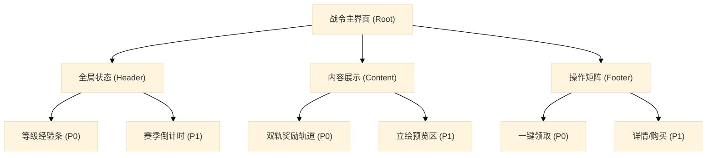
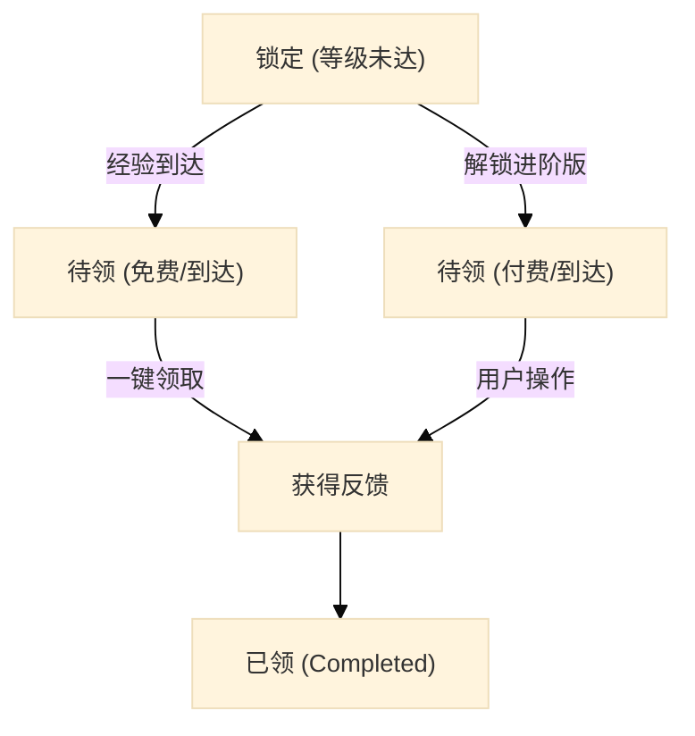
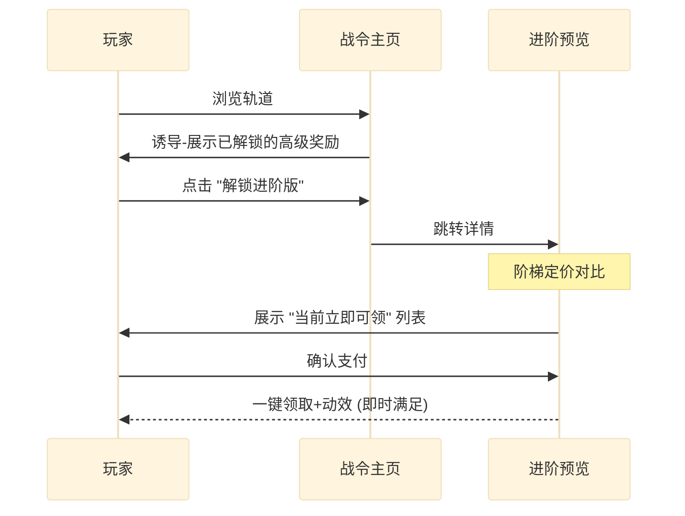

# 战令系统 - 交互设计规范 V3

> [!IMPORTANT]
> 本文档严格遵循 `skills/02-game_system_ux_spec.md` 框架生成，旨在提供可落地的战令系统交互准则。

---

## 模块 1：核心信息架构 (Information Architecture)

**目标**：定义战令系统主界面的核心数据字段与视觉权重。

| 字段名 | 英文标识 | 展示优先级 | 可视化形式 | 来源案例 |
|------|------|------|------|------|
| 当前等级 | `level.current` | P0 | 居中数字/进度条前端 | 《王者荣耀》、《星穹铁道》 |
| 经验进度 | `xp.current/required` | P0 | 线性扫光进度条 | 通用现状 |
| 免费轨奖励 | `track.free[]` | P0 | 线性排列格位（锁定/可领状态） | 通用现状 |
| 付费轨奖励 | `track.premium[]` | P0 | 叠加/并行排列（带装饰框） | 《无期迷途》 |
| 赛季倒计时 | `season.countdown` | P1 | 顶部边缘微缩标注 | 《逆水寒》 |
| 每周经验上限 | `xp.weekly_cap` | P1 | 进度条下方小字 (e.g. 1500/8000) | 《星穹铁道》 |
| 任务分栏 | `tabs.daily/weekly/period` | P1 | 顶部/左侧页签 | 《无期迷途》 |

### IA 架构树



---

## 模块 2：状态机与交互流 (State Machine & Flow)

### 2.1 奖励槽位状态机



**即时反馈节点 (Instant Feedback)**：当状态转变为 `Claimed` 时，系统必须触发“光效扫过奖励槽”+“弹出通用获得界面”的视听组合，解决玩家对“是否领取成功”的回馈预期。

### 2.2 付费转化决策链



---

## 模块 3：布局与适配范式 (Layout Paradigms)

| 布局模式名称 | 视觉特征描述 | 代表产品 | 适用判断条件 | 视觉参考 |
| :--- | :--- | :--- | :--- | :--- |
| **横向线性轨道 (Horizontal Rail)** | 等级作为 X 轴线性铺开，奖励在滑块内双轨延伸，具有强烈的进度条暗示。 | 《王者荣耀》、《星穹铁道》 | 内容节点极多（≥ 50级），需要通过持续滚屏建立“长线成长感”。 |  |
| **情感立绘中心 (Character-Centric)** | 大型角色立绘占据视觉重心，奖励轨道偏置或半透明化，强调皮肤吸引力。 | 《无期迷途》 | 强二次元/人设驱动游戏，强调“为爱买单”的审美引导。 |  |
| **中央展示+对称购买 (Symmetric Purchase)** | 核心皮肤 3D 模型居中，左右分布两档付费方案卡片，利用对称性建立公平感。 | 《逆水寒》、《王者荣耀》 | 进阶购买专用页。利用 ¥68 与 ¥128 的对比（锚定效应）转化深度用户。 |  |

### 3.2 适配建议
- **横屏 (16:9)**：主奖励轨道占据中心 60% 高度区域，左右预留预览与任务页签区。
- **安全区 (SafeArea)**：所有操作性 CTA 二级按钮须在 Home Indicator 上方至少 30px，避免误触系统切换。

---

## 模块 4：防坑与体验优化 (UX Best Practices)

| # | 痛点描述 | 典型错误场景 | 标准解法 | 参考来源 |
|---|------|------|------|------|
| 1 | **领奖重复劳动** | 玩家需要逐个点击 5 个已解锁的奖励。 | **必须提供一键领取全部奖励**，置于操作核心区。 | 通用规范 |
| 2 | **购买盲盒感** | 玩家不清楚进阶后到底能立刻拿到什么。 | 进阶页面明确标注 **“当前等级立即可得”**。 | 《星穹铁道》 |
| 3 | **经验上限焦虑** | 玩家担心本周肝出头的经验被吞掉。 | 进度条旁通过标签显示 **“本周经验进度 1500/8000”**。 | 《星穹铁道》 |
| 4 | **视觉价值偏见** | 免费奖励和付费奖励在图标上区分度低。 | 为付费轨道增加 **动态扫光底座** 或 **高亮金边装饰**。 | 《王者荣耀》 |
| 5 | **预览断层** | 任务界面无法直接看到对应的奖励模型。 | 任务列表右侧集成 **本期核心大奖预览位** 及一键跳转入口。 | 《逆水寒》 |
| 6 | **决策阻力** | 玩家对 ¥128 档位的“高价”产生心理排斥。 | **阶梯锚定法**：在 128 元档位标注“直升 30 级”带来的即时收割奖励列表。 | 《无期迷途》 |
| 7 | **单机孤独感** | 战令任务由于周期长，容易让玩家感觉在玩单机。 | **组队经验加成**：在任务栏标注组队可得 10%-20% 额外经验。 | 《王者荣耀》 |

---

## 模块 5：系统级抽象定义 (JSON Schema)

```json
{
  "component": "BattlePassRoot",
  "version": "1.0",
  "system_type": "battle_pass",
  "core_data": {
    "level": { "current": 25, "xp_next": 1000, "xp_step": 2000 },
    "track": {
      "is_premium": true,
      "items": [
        { "level": 1, "id": "skin_01", "type": "skin", "is_paid": true, "status": "claimed" },
        { "level": 1, "id": "coin_100", "type": "currency", "is_paid": false, "status": "claimable" }
      ]
    },
    "weekly_cap": { "used": 5400, "max": 8000 }
  },
  "interactive_elements": [
    {
      "element_id": "btn_claim_all",
      "type": "button",
      "action": "batch_claim",
      "feedback": { "visual": "reward_fly_animation", "audio": "sfx_claimed" }
    }
  ],
  "layout": {
    "paradigm": "horizontal_rail",
    "primary_cta": "一键领取",
    "entry_point": "hub_tab"
  }
}
```

---
*关联素材：[[analysis/王者荣耀-战令系统.md]]、[[analysis/星穹铁道-战令系统.md]]、[[analysis/无期迷途-战令系统.md]]、[[analysis/逆水寒-战令系统.md]]*
*维护索引：[[index.md]]*
