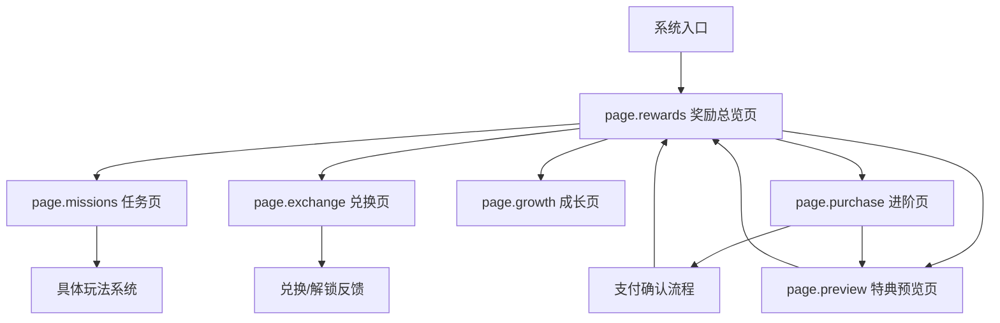
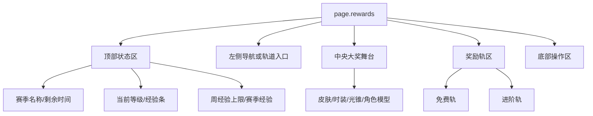
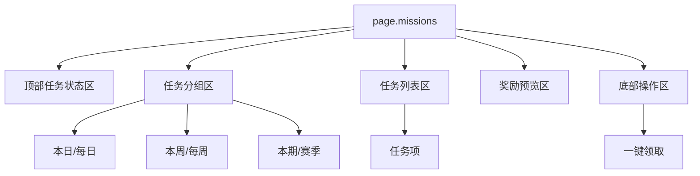
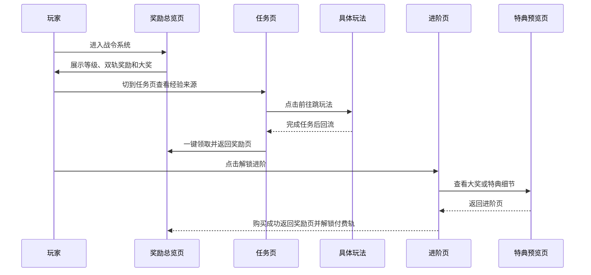

# 手游战令系统交互设计规范 V4.0

> [!IMPORTANT]
> 本版规范遵循 `skills/02-game_system_ux_spec.md` 的新结构，主目标是沉淀“战令页面由什么组成、如何组织、何时出现、点击后会怎样”，而不是继续做竞品优劣点评。

**本次模式**：`generation_contract`

## 模块 0：系统范围与页面地图

### 0.1 页面清单

| 页面 ID | 页面名称 | 页面类型 | 页面目标 | 入口条件 | 退出路径 | 主 CTA | 来源案例 |
|---|---|---|---|---|---|---|---|
| `page.rewards` | 奖励总览页 | hub | 同屏展示等级进度、双轨奖励、大奖预览与进阶入口 | 战令主入口 | 切任务/兑换/成长/进阶 | 一键领取 / 解锁进阶 | 四款通用 |
| `page.missions` | 任务页 | detail | 用日/周/期任务驱动经验积累并回流奖励页 | 奖励页页签或图标 | 返回奖励页 / 跳玩法 | 一键领取 / 前往 | 四款通用 |
| `page.exchange` | 兑换页 | detail | 展示可通过战令等级或战令币获取的额外奖励 | 奖励页导航 | 返回奖励页 | 预览或兑换 | 《王者荣耀》 |
| `page.growth` | 成长页 | detail | 外显赛季继承、额外成长或历史赛季规则 | 奖励页导航 | 返回奖励页 | 获取经验 / 购买等级 | 《王者荣耀》 |
| `page.purchase` | 进阶页 | checkout | 比较基础档与高阶档，放大即时可得内容和直升价值 | 奖励页进阶入口 | 支付成功返回奖励页 / 关闭 | 购买 | 四款通用 |
| `page.preview` | 特典预览页 | detail | 展示大奖、光锥、皮肤或特选奖励的详细信息 | 奖励页大奖卡 / 进阶页特典入口 | 返回奖励页或进阶页 | 切换预览对象 | 《星穹铁道》 |

### 0.2 页面地图



---

## 模块 1：页面级信息架构 (Page-level IA)

### 1.1 `page.rewards` 奖励总览页



### 1.2 `page.missions` 任务页



### 1.3 区域合同

| 区域 ID | 区域名 | 空间槽位 | 构图职责 | 占比/尺寸倾向 | 阅读优先级 | 滚动方向 | 内容容量 | 来源案例 |
|---|---|---|---|---|---|---|---|---|
| `region.header` | 顶部状态区 | `top_bar` | 外显等级、赛季剩余时间、经验节奏与快捷操作 | 高 10%-15% | P0 | none | 4-6 个信息点 | 四款通用 |
| `region.side_nav` | 左侧导航区 | `left_rail` | 组织奖励/任务/兑换/成长等系统内切页 | 宽 12%-18% | P1 | vertical | 3-6 个页签 | 《王者荣耀》《逆水寒》 |
| `region.hero_stage` | 中央大奖舞台 | `center_stage` | 放大奖、皮肤、光锥或角色模型，建立进阶欲望 | 宽 25%-40%，高 45%-70% | P0 | none | 1 个主大奖 | 四款通用 |
| `region.reward_track` | 奖励轨区 | `center_panel` | 展示免费/付费双轨奖励推进 | 宽 35%-55% | P0 | horizontal | 10-100 个等级格 | 四款通用 |
| `region.mission_tabs` | 任务分组区 | `left_rail` | 切换日/周/期任务或本周/赛季任务态 | 宽 12%-20% | P0 | none | 2-4 个任务分组 | 四款通用 |
| `region.mission_list` | 任务列表区 | `center_panel` | 展示任务条目、奖励值与跳转行为 | 宽 40%-60% | P0 | vertical | 4-8 条任务 | 四款通用 |
| `region.preview_panel` | 奖励预览区 | `right_panel` | 用具体奖励维持任务动力 | 宽 18%-28% | P1 | none | 1-2 个大奖卡 | 《王者荣耀》《星穹铁道》 |
| `region.exchange_grid` | 兑换网格区 | `center_panel` | 展示等级解锁或战令币兑换项 | 宽 40%-60% | P0 | vertical | 6-12 个格位 | 《王者荣耀》 |
| `region.growth_timeline` | 成长时间线区 | `center_panel` | 解释继承与赛季成长规则 | 宽 45%-65% | P1 | horizontal | 5-8 个节点 | 《王者荣耀》 |
| `region.purchase_compare` | 进阶档位对比区 | `center_panel` | 呈现基础档与高阶档的权益差异 | 宽 45%-70% | P0 | none | 2 个档位卡 | 四款通用 |
| `region.preview_selector` | 特典选择列 | `left_rail` | 支持切换可选大奖 | 宽 10%-18% | P1 | vertical | 4-8 个候选项 | 《星穹铁道》 |
| `region.preview_detail` | 特典详情区 | `right_panel` | 展示属性、技能、文案和细节说明 | 宽 25%-35% | P0 | vertical | 1 组详情 | 《星穹铁道》 |

### 1.4 视觉空间与构图蓝图 (Spatial Blueprint)

```text
【构图语法 (Composition Syntax)】: 16:9 横屏游戏内置 HUD (In-game HUD Layout)
【反网页化指令 (Anti-Web Rules)】: 绝对禁止生成上下滚动的网页流、仪表盘卡片和着陆页。战令必须表现为游戏内系统菜单，具备明显的舞台层次与大奖外显。
【空间划分 (Spatial Zones)】:
- [Top-Bar]: 赛季名称、当前等级、经验条、周经验上限、资源与快捷购买入口
- [Left-Rail]: 系统内导航，或免费/进阶轨道入口，或任务分组页签
- [Center-Stage]: 必须包含大奖角色、皮肤、时装、光锥或 3D 模型的沉浸式视觉重心
- [Center-Panel]: 承载双轨奖励、任务列表、兑换网格或成长时间线
- [Right-Panel]: 放置大奖预览、任务奖励预览、进阶档位对比或特典属性说明
- [Bottom-Bar]: 放置一键领取、进阶购买、商店入口等高频操作
```

---

## 模块 2：组件合同 (Component Contract)

| component_id | 组件名称 | 组件类型 | 所属页面 | 所属区域 | 数据绑定 | 优先级 | 状态枚举 | 用户动作 | 反馈 | 来源案例 |
|---|---|---|---|---|---|---|---|---|---|---|
| `label.level_progress` | 等级经验条 | progress_bar | `page.rewards` | `region.header` | `level.current`, `xp.current/required` | P0 | active | none | 数值刷新 | 四款通用 |
| `label.weekly_cap` | 周经验上限 | badge | `page.rewards` | `region.header` | `xp.weekly_cap` | P0 | active / capped | none | 文案刷新 | 《星穹铁道》《逆水寒》《王者荣耀》 |
| `nav.section` | 系统页签 | tab | `page.rewards` | `region.side_nav` | `page_state` | P0 | selected / unselected / red_dot | tap | 切页高亮 | 《王者荣耀》《逆水寒》 |
| `reward.cell` | 奖励格 | reward_cell | `page.rewards` | `region.reward_track` | `track.free[]`, `track.premium[]` | P0 | locked / claimable / claimed / premium_locked | tap | 高亮、扫光、预览 | 四款通用 |
| `card.featured_reward` | 大奖预览卡 | preview_card | `page.rewards` | `region.hero_stage` | `featured_reward` | P0 | preview / unlocked / purchasable | tap | 放大预览或切详情页 | 四款通用 |
| `btn.claim_all` | 一键领取 | primary_button | `page.rewards` or `page.missions` | `region.action_bar` or `region.claim_action` | `claimable_count` | P0 | enabled / disabled / loading | tap | 奖励飞入、Toast | 四款通用 |
| `btn.unlock_premium` | 解锁进阶 | primary_button | `page.rewards` | `region.action_bar` | `purchase_target` | P0 | enabled | tap | 打开进阶页 | 四款通用 |
| `tab.mission_group` | 任务分组页签 | tab | `page.missions` | `region.mission_tabs` | `mission_group` | P0 | selected / unselected / red_dot | tap | 列表刷新 | 四款通用 |
| `mission.item` | 任务项 | list_item | `page.missions` | `region.mission_list` | `missions[]` | P0 | incomplete / ready / claimed / jumpable | tap | 跳转玩法或领取 | 四款通用 |
| `btn.goto_mission` | 前往按钮 | secondary_button | `page.missions` | `region.mission_list` | `mission_target` | P0 | enabled | tap | 跳玩法系统 | 《王者荣耀》《逆水寒》 |
| `badge.team_bonus` | 组队加成标签 | badge | `page.missions` | `region.mission_list` | `bonus_rule` | P1 | visible / hidden | none | 文案高亮 | 《王者荣耀》 |
| `exchange.cell` | 兑换格位 | reward_cell | `page.exchange` | `region.exchange_grid` | `exchange_items[]` | P0 | locked_by_level / available / claimed | tap | 预览或兑换 | 《王者荣耀》 |
| `growth.node` | 成长节点 | milestone_node | `page.growth` | `region.growth_timeline` | `carryover_rules[]` | P1 | current / future / achieved | tap | 节点高亮 | 《王者荣耀》 |
| `card.tier_basic` | 基础档卡 | preview_card | `page.purchase` | `region.purchase_compare` | `tier.basic` | P0 | default / selected | tap | 卡片高亮 | 四款通用 |
| `card.tier_premium` | 高阶档卡 | preview_card | `page.purchase` | `region.purchase_compare` | `tier.premium` | P0 | recommended / selected | tap | 卡片高亮 | 四款通用 |
| `list.preview_option` | 特典候选列表 | list | `page.preview` | `region.preview_selector` | `preview_options[]` | P1 | selected / unselected | tap | 中央预览切换 | 《星穹铁道》 |
| `panel.preview_detail` | 特典说明面板 | info_card | `page.preview` | `region.preview_detail` | `preview_detail` | P0 | scrollable | read | 文本滚动 | 《星穹铁道》 |

---

## 模块 3：状态、事件与导航矩阵

### 3.1 状态事件矩阵

| 对象 | 当前状态 | 触发事件 | 条件 | 下一状态 | UI 反馈 | 数据变化 |
|---|---|---|---|---|---|---|
| `reward.cell` | `locked` | `xp_reached` | 等级满足 | `claimable` | 格位扫光、边框高亮 | `claimable_count+1` |
| `reward.cell` | `premium_locked` | `premium_purchased` | 成功进阶 | `claimable` or `locked` | 锁图标消失、付费轨点亮 | `premium_unlocked=true` |
| `mission.item` | `incomplete` | `mission_done` | 达成任务条件 | `ready` | 出现领取按钮或完成态 | `ready_task_count+1` |
| `mission.item` | `ready` | `tap_claim` | 玩家点击领取 | `claimed` | 奖励飞入、按钮消失 | `xp.current += mission.reward_xp` |
| `card.tier_premium` | `recommended` | `tap_purchase` | 支付成功 | `purchased` | 回到奖励页，轨道解锁 | `premium_unlocked=true` |
| `list.preview_option` | `unselected` | `tap_option` | 玩家切换目标 | `selected` | 中央大卡与右侧详情刷新 | `preview_target` changes |

### 3.2 主路径交互链



### 3.3 页面跳转规则

| 来源页面            | 触发组件                   | 跳转目标            | 跳转类型          | 返回方式                    |
| --------------- | ---------------------- | --------------- | ------------- | ----------------------- |
| `page.rewards`  | `nav.section[任务]`      | `page.missions` | tab_switch    | tab back                |
| `page.rewards`  | `nav.section[兑换]`      | `page.exchange` | tab_switch    | tab back                |
| `page.rewards`  | `nav.section[成长]`      | `page.growth`   | tab_switch    | tab back                |
| `page.rewards`  | `btn.unlock_premium`   | `page.purchase` | push          | back / success redirect |
| `page.rewards`  | `card.featured_reward` | `page.preview`  | push or modal | back / close            |
| `page.purchase` | `reward_preview_entry` | `page.preview`  | push          | back                    |
| `page.missions` | `btn.goto_mission`     | 具体玩法系统          | push          | 系统返回或任务刷新               |

---

## 模块 4：生成约束与适配规范

### 4.1 布局与防偏科约束 (Layout & Anti-Bias Constraints)

| 页面 | 16:9 空间焦点 | 信息阅读顺序 | 必须固定区域 | 可折叠区域 | 强制禁止的偏科倾向 |
|---|---|---|---|---|---|
| `page.rewards` | `center_stage` 大奖 + `center_panel` 奖励轨 | 顶部状态 -> 中央大奖/奖励轨 -> 底部 CTA | `region.header`、`region.reward_track` | 次级说明 | 禁止只画奖励格，不放大奖舞台 |
| `page.missions` | `center_panel` 任务列表 + `right_panel` 奖励预览 | 任务分组 -> 列表 -> 奖励预览 -> 领取 | `region.mission_tabs`、`region.mission_list` | 次级规则 | 禁止把任务页做成纯表格清单 |
| `page.purchase` | `center_stage` 特典/皮肤 + `center_panel` 双档卡 | 大奖 -> 基础档 -> 高阶档 -> 价格 | `region.purchase_compare` | 次级文案 | 禁止只写价格，不外显即时可得内容 |
| `page.preview` | `center_stage` 大卡 + `right_panel` 属性说明 | 候选列表 -> 当前大奖 -> 详细说明 | `region.preview_detail` | 背景装饰 | 禁止把特典详情缩成 Tooltip |

**防网页化红线**：
- 战令总览页必须有中心大奖舞台，不允许退化成纯网格或网页商城。
- 任务页必须同时表现任务与行为路由，不允许只列任务名称。
- 进阶页必须有双档对比，不允许只做单一购买按钮。

### 4.2 文案与素材槽位

| slot_id | 类型 | 用途 | 必填/选填 | 内容约束 |
|---|---|---|---|---|
| `copy.season_title` | text | 赛季名称 | 必填 | 4-12 个汉字 |
| `copy.primary_cta` | text | 主 CTA 文案 | 必填 | 不超过 6 个汉字 |
| `copy.weekly_cap` | text | 周经验上限提示 | 选填 | 应含明确数值单位 |
| `asset.featured_reward` | image | 中央大奖素材 | 必填 | 皮肤、时装、角色、光锥或 3D 模型 |
| `asset.premium_preview` | image | 进阶页特典素材 | 选填 | 用于高阶档差异化展示 |

### 4.3 多端适配

| 设备类型 | 分辨率基准 | 页面调整规则 |
|---|---|---|
| 横屏手机 | 16:9 | 奖励轨横向展开，中央大奖与右侧/中部轨道同屏 |
| 竖屏手机 | 9:16 | 奖励轨改为上下双层，大奖缩到顶部或中部主卡，任务列表纵向堆叠 |
| 平板 / 小屏 PC | 4:3+ | 允许大奖舞台和进阶对比卡同时放大，兑换/成长页可常驻更多说明 |

### 4.4 安全区强制规范

- 所有高频 CTA 必须位于 `safeAreaInset` 内。
- Home Indicator 上方至少预留 24-30px 的点击缓冲。
- 顶部经验条、赛季倒计时和周上限不得被刘海或系统栏遮挡。

---

## 模块 5：UI Manifest JSON

```json
{
  "system_name": "BattlePassSystem",
  "version": "4.0",
  "mode": "generation_contract",
  "entry_point": "battle_pass_entry",
  "default_page": "page.rewards",
  "pages": [
    {
      "page_id": "page.rewards",
      "page_type": "hub",
      "goal": "让玩家识别当前等级、可领奖励、大奖目标和进阶价值",
      "regions": [
        {
          "region_id": "region.header",
          "position": "top",
          "priority": "P0",
          "scroll": "none",
          "components": ["label.level_progress", "label.weekly_cap"]
        },
        {
          "region_id": "region.hero_stage",
          "position": "center",
          "priority": "P0",
          "scroll": "none",
          "components": ["card.featured_reward"]
        },
        {
          "region_id": "region.reward_track",
          "position": "center_right",
          "priority": "P0",
          "scroll": "horizontal",
          "components": ["reward.cell"]
        }
      ]
    },
    {
      "page_id": "page.missions",
      "page_type": "detail",
      "goal": "让玩家知道本期经验来源、如何前往以及何时回收奖励",
      "regions": [
        {
          "region_id": "region.mission_tabs",
          "position": "left",
          "priority": "P0",
          "scroll": "none",
          "components": ["tab.mission_group"]
        },
        {
          "region_id": "region.mission_list",
          "position": "center",
          "priority": "P0",
          "scroll": "vertical",
          "components": ["mission.item", "btn.goto_mission"]
        }
      ]
    },
    {
      "page_id": "page.purchase",
      "page_type": "checkout",
      "goal": "对比两档价值并推动购买",
      "regions": [
        {
          "region_id": "region.purchase_compare",
          "position": "center",
          "priority": "P0",
          "scroll": "none",
          "components": ["card.tier_basic", "card.tier_premium"]
        }
      ]
    }
  ],
  "components": [
    {
      "component_id": "reward.cell",
      "type": "reward_cell",
      "page_id": "page.rewards",
      "region_id": "region.reward_track",
      "data_binding": ["track.free[]", "track.premium[]"],
      "states": ["locked", "claimable", "claimed", "premium_locked"],
      "events": ["tap_preview_reward"]
    },
    {
      "component_id": "mission.item",
      "type": "list_item",
      "page_id": "page.missions",
      "region_id": "region.mission_list",
      "data_binding": ["missions[]"],
      "states": ["incomplete", "ready", "claimed", "jumpable"],
      "events": ["tap_claim", "tap_goto"]
    },
    {
      "component_id": "card.tier_premium",
      "type": "preview_card",
      "page_id": "page.purchase",
      "region_id": "region.purchase_compare",
      "data_binding": ["tier.premium"],
      "states": ["recommended", "selected", "purchased"],
      "events": ["tap_purchase_premium"]
    }
  ],
  "navigation": [
    {
      "from": "page.rewards",
      "trigger": "nav.section[任务]",
      "to": "page.missions",
      "mode": "tab_switch"
    },
    {
      "from": "page.rewards",
      "trigger": "btn.unlock_premium",
      "to": "page.purchase",
      "mode": "push"
    },
    {
      "from": "page.purchase",
      "trigger": "reward_preview_entry",
      "to": "page.preview",
      "mode": "push"
    }
  ],
  "layout_constraints": {
    "primary_focus": ["region.hero_stage", "region.reward_track", "region.purchase_compare"],
    "fixed_regions": ["region.header"],
    "safe_area_required": true,
    "must_keep_center_stage": true,
    "do_not_collapse_featured_reward_into_plain_grid": true
  }
}
```

---

## 模块 6：研究附录 (Secondary)

### 6.1 四款案例的角色分工

| 游戏 | 主设计重心 | 可直接借鉴的生成线索 |
|---|---|---|
| 《无期迷途》 | 左侧立绘驱动的高压付费转化 | 用单个角色皮肤作为长期大奖的情绪锚点 |
| 《星穹铁道》 | 进度节奏透明化 + 特典详情前置 | 奖励页突出周上限，进阶页支持先看大奖细节 |
| 《王者荣耀》 | 多页签赛季成长中心 + 3D 大奖展示 | 把兑换、成长也收进战令体系，扩大系统角色 |
| 《逆水寒》 | 拟物化商城式战令 + 商店并行入口 | 战令不仅是奖励轨，也是战令币消费入口 |

### 6.2 使用建议

- 如果目标产品偏长线进度管理，优先采用《星穹铁道》的“周上限 + 大奖预览”组合。
- 如果目标产品偏皮肤或时装转化，优先采用《无期迷途》或《王者荣耀》的中心大奖舞台。
- 如果目标产品想把战令做成赛季成长中心，可借鉴《王者荣耀》的奖励/任务/兑换/成长四页结构。
- 如果目标产品要把战令与商城体系打通，可借鉴《逆水寒》的战令 + 商店并行入口。

---
*关联路径：[[analysis/无期迷途-战令系统.md]]、[[analysis/星穹铁道-战令系统.md]]、[[analysis/王者荣耀-战令系统.md]]、[[analysis/逆水寒-战令系统.md]]、[[mechanics/战斗通行证系统.md]]、[[index.md]]*
