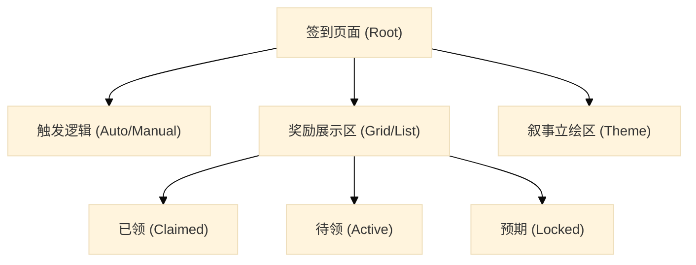
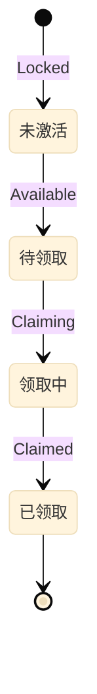

# 签到系统 - 交互设计规范 V1

> [!NOTE]
> 本规范旨在定义一套能够平衡“强制留存”与“视觉愉悦”的签到系统标准，核心目标是提升奖励的**价值感感知**（Perceived Value）。

---

## 模块 1：核心信息架构 (Information Architecture)

| 阶段 | 关键数据字段 | 英文标识 | 优先级 | 可视化形式 | 典型参考 |
|---|------|------|---|------|------|
| **循环层** | 总奖励天数 | `login.cycle_days` | **P0** | 7格/14格网格架构 | 通用现状 |
| **状态层** | 今日领取状态 | `login.today_status` | **P0** | 高亮/扫光/点击提示 | 《王者荣耀》 |
| **状态层** | 已领取标记 | `login.claimed_tag` | **P1** | 置灰/打勾/印章戳记 | 《无期迷途》 |
| **预期层** | 未来/终极大奖预览 | `login.milestone_preview` | **P0** | 异步放大展示/右侧长格位 | 《星穹铁道》 |

### 信息架构树 (IA)



---

## 模块 2：状态机与交互流 (State Machine & Flow)

### 2.1 奖项位状态流转



### 2.2 领取反馈路径 (视觉状态切换)
- **触发**：用户点击奖励图标或“领取”按钮。
- **反馈 (目前可见)**：按钮文字切换、格位高亮框消失、或覆盖“已领取”印章。
- **终态 (Post-action)**：界面焦点自动移向“明日奖励/今日已领”的视觉标记。

---

## 模块 3：布局范式对比 (Layout Paradigms)

| 布局模式                           | 视觉特征                              | 代表产品         | 适用条件                          | 视觉参考                                                                                     |
| :----------------------------- | :-------------------------------- | :----------- | :---------------------------- | :--------------------------------------------------------------------------------------- |
| **均衡宫格型 (Balanced Grid)**      | 3x2, 4x2 或线性平铺，由于视觉路径单一，极其容易快速扫视。 | 《王者荣耀》       | 奖励价值相对平均，强调“快进快出”的效率感。        |  |
| **大奖锚定型 (Epic Anchor)**        | 将第 7/14 日奖励做特殊放大/加高处理，形成视觉重音。     | 《星穹铁道》       | 核心奖励（如抽卡券）是用户留存的唯一核心动力。       |  |
| **拟物叙事型 (Thematic/Narrative)** | 将签到项伪装成“屏风”、“机密文件”或“押解令”。         | 《逆水寒》、《无期迷途》 | 高沉浸感/强剧情游戏，通过拟物化减少 UI 对叙事的破坏。 |   |

---

## 模块 4：防坑与体验优化 (UX Best Practices)

| # | 痛点描述 | 标准解法 | 参考来源 |
|---|------|------|------|
| 1 | **强制弹窗反感** | 对当日**已签到**的用户不再弹出全屏。 | 通用规范 |
| 2 | **界面元素拥挤** | 将角色立绘置于左侧，通过偏置布局腾出右侧清晰的列表空间。 | 《王者荣耀》 |
| 3 | **终极目标模糊** | 为周期性终极大奖提供 **Tap Preview**（点击弹出详情）功能。 | 《星穹铁道》 |
| 4 | **领取挫败感** | 动画周期不宜超过 1.2s，提供 **Tap to Skip** 快速跳过动效。 | 《王者荣耀》 |
| 5 | **多阶段断层** | 加入“累计签到附加奖”，鼓励用户不仅要签到 7 天。 | 业内多款产品 |

---

## 模块 5：系统级抽象定义 (JSON Schema)

```json
{
  "component": "DailyClaimRoot",
  "version": "1.0",
  "system_type": "check_in",
  "config": {
    "cycle_days": 14,
    "automatic_popup": true,
    "allow_makeup": false
  },
  "data": {
    "current_day": 6,
    "total_claimed": 5,
    "rewards_list": [
      {
        "day": 6,
        "item_id": "gem_100",
        "status": "available",
        "is_milestone": false
      },
      {
        "day": 14,
        "item_id": "premium_skin",
        "status": "locked",
        "is_milestone": true
      }
    ]
  },
  "interaction": {
    "on_claim": "trigger_collect_anim",
    "on_miss": "show_makeup_prompt"
  }
}
```

---
*关联素材：[[analysis/王者荣耀-签到系统.md]]、[[analysis/星穹铁道-签到系统.md]]、[[analysis/无期迷途-签到系统.md]]、[[analysis/逆水寒-14日签到分析.md]]*
*维护索引：[[index.md]]*
