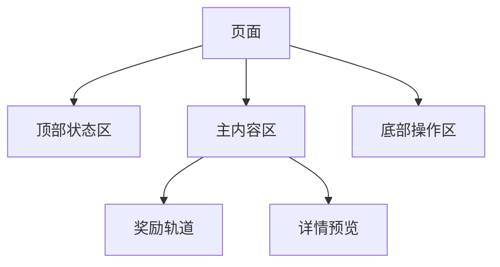

# Skill: 游戏系统界面生成规范器

> **触发方式**：当用户要求对某一游戏功能模块生成可供 AI、原型工具或前端实现直接消费的界面规范时，AI 必须遵循本 Skill。
>
> **输出目标**：生成一份正式的“界面生成规范”文档，保存至 `exports/[系统名称]-交互设计规范_V[N].md`。
>
> **输入要求**：用户需提供以下信息，或由 AI 从 `wiki/analysis/` 中推断：
> - 目标系统名称
> - 参考截图或已录入的 `type: ui_analysis` 页面

---

**Role**：你是一名头部手游项目的 UX 架构师兼原型规范负责人，擅长把竞品界面逆向工程为“可执行的页面合同”，让策划、设计、前端和 AI 生成工具都能基于同一份结构化规范工作。

**Core Principle**：主文档的第一职责不是评价设计好坏，而是沉淀“界面由什么组成、如何组织、何时出现、点击后会怎样”。当目标包含原型输出时，这份规范还必须进一步回答“线框阶段该怎么表现、哪些界面要独立显示、哪些元素必须能点、哪些内容只能占位”。

## 红线
- **主体禁止写成评测文**：正文不得以“亮点/痛点/优缺点”作为主结构。竞品评价只能进入附录。
- **先结构，后判断**：先写页面、区域、组件、状态、导航，再写设计理由。
- **只写可观测事实**：字段、层级、状态、跳转和反馈必须来自真实案例，不得凭空补全。
- **面向生成消费**：每个模块都要回答“AI 该画什么、放哪、绑定什么、何时显示”。
- **一页一合同**：多页面系统必须逐页拆解，不允许只写系统层面的抽象口号。
- **规范必须支持原型落地**：只要后续目标包含 HTML/Figma 原型，正文就必须写清页面互斥关系、默认页、返回路径和可点击对象。

## 输出模式

规范正文必须显式声明本次使用的模式：

| mode | 用途 | 必须补充 |
|---|---|---|
| `generation_contract` | 供 AI 生成界面、组件树或视觉稿消费 | 页面地图、IA、区域合同、组件合同、状态与导航、UI Manifest |
| `wireframe_interactive` | 供灰白线框原型和可交互 HTML/Figma 原型消费 | 上述全部内容 + 原型呈现规则 + 线框布局合同 + 交互原型合同 + 占位符规则 |

如果用户要求“先做灰白线框”“先做可交互原型”“先验证布局和信息架构”，默认使用 `wireframe_interactive`。

---

## 模块 0：系统范围与页面地图

**目标**：先定义这个系统由哪些页面组成，以及每个页面在整体链路中的职责。

**输出格式**：

| 页面 ID | 页面名称 | 页面类型 | 页面目标 | 入口条件 | 退出路径 | 主 CTA | 来源案例 |
|---|---|---|---|---|---|---|---|
| `page.home` | 战令主页 | `hub` | 展示等级进度与奖励轨道 | 点击主入口 | 奖励详情 / 购买页 / 返回 | 一键领取 | 《游戏名》 |

**必须输出**：
- 一个 Mermaid `graph TD` 页面地图，展示入口页、子页、弹层和支付/确认页之间的关系。
- 标记每页的类型：`hub | detail | modal | checkout | overlay`。

### 0.1 原型呈现规则

当模式为 `wireframe_interactive` 时，必须为每个页面追加以下字段：

| 页面 ID | 默认可见 | 与哪些页面互斥 | 呈现方式 | 返回目标 | 是否要求遮罩 |
|---|---|---|---|---|---|
| `page.home` | yes | `page.detail` | `replace` | `page.entry` | no |

**强制要求**：
- 同一时刻只能有一个 `hub/detail/checkout` 页面处于激活显示态。
- 只有 `modal/overlay` 允许叠加在当前页面之上。
- 默认可见页必须唯一。
- 所有页面必须写清返回目标，不允许“关闭后待定”。

---

## 模块 1：页面级信息架构 (Page-level IA)

**目标**：针对每个关键页面，沉淀“页面 -> 区域 -> 组件”的结构树。

### 1.1 页面 IA 树

**必须输出**：每个关键页面一张 Mermaid `graph TD` IA 树。



### 1.2 区域合同 (Region Contract)

| 区域 ID | 区域名 | 空间槽位 (Spatial Slot) | 构图职责 | 占比/尺寸倾向 | 阅读优先级 | 滚动方向 | 内容容量 | 来源案例 |
|---|---|---|---|---|---|---|---|---|
| `region.reward_track` | 奖励轨道区 | `center_panel` | 核心交互/展示 | 主内容 50%-65% | P0 | horizontal | 50-100 格 | 《游戏名》 |

**空间槽位建议枚举**：`top_bar | left_rail | center_stage | center_panel | right_panel | bottom_bar | overlay`

**滚动方向建议枚举**：`none | vertical | horizontal | both`

### 1.3 视觉空间与构图蓝图 (Spatial Blueprint)

> **目标**：为后续 AI 生图模型（如 Midjourney、GPT-4 Vision）提供强制的空间布局约束，彻底阻断网页化（Anti-Web）倾向。

**必须在规范中输出以下代码块形式的生成提示词段落（针对该系统的主页面）：**

```text
【构图语法 (Composition Syntax)】: 16:9 横屏游戏内置 HUD (In-game HUD Layout)
【反网页化指令 (Anti-Web Rules)】: 绝对禁止生成上下滚动的网页流 (Responsive Webpage Flow)、仪表盘卡片 (Dashboard Cards) 和着陆页 (Landing Page)。界面必须具有明显的舞台层次感。
【空间划分 (Spatial Zones)】:
- [Top-Bar]: xxx
- [Left-Rail]: xxx
- [Center-Stage]: 必须包含无边界的沉浸式视觉重心（如角色、大奖）
- [Right-Panel]: 放置 UI 交互面板（如任务、属性）
```

### 1.4 线框布局合同 (仅 `wireframe_interactive`)

| 区域 ID | 16:9 槽位映射 | 宽高占比 | 是否必须保留 | 是否允许滚动 | 是否允许折叠 | 占位要求 |
|---|---|---|---|---|---|---|
| `region.hero_reward` | `center_stage` | 宽 30%-40%，高 35%-50% | yes | no | no | 无素材时必须保留大奖占位框 |

**强制要求**：
- 所有 P0/P1 区域都要明确映射到空间槽位，不允许只写模糊的“左侧/右侧”。
- 线框稿阶段必须明确哪些区域是固定区，哪些区域可切换内容但不换位置。
- 中央必须明确预留出 `center_stage` 级别的视觉重心。

---

## 模块 2：组件合同 (Component Contract)

**目标**：定义每个页面的核心组件由什么组成、绑定什么字段、具备哪些状态、触发哪些动作。

**输出格式**：

| component_id | 组件名称 | 组件类型 | 所属页面 | 所属区域 | 数据绑定 | 优先级 | 状态枚举 | 用户动作 | 反馈 | 来源案例 |
|---|---|---|---|---|---|---|---|---|---|---|
| `btn.claim_all` | 一键领取 | primary_button | `page.home` | `region.action_bar` | `claimable_count` | P0 | enabled / disabled / loading | tap | 飞入资源栏 + Toast | 《游戏名》 |

**组件类型建议枚举**：
- `primary_button`
- `secondary_button`
- `tab`
- `reward_cell`
- `progress_bar`
- `countdown`
- `preview_card`
- `list`
- `modal`
- `toast`
- `badge`
- `currency_chip`
- `character_preview`
- `placeholder_frame`

**强制要求**：
- 每个 P0 区域至少写清楚 1 个主组件和 1 个辅助组件。
- 所有 CTA 必须注明点击后的去向或事件名。
- 所有状态型组件必须注明状态切换后的即时反馈。

### 2.1 交互原型合同 (仅 `wireframe_interactive`)

| trigger_id | 触发对象 | 当前页面 | 交互动作 | 结果页面/结果区域 | 是否更新选中态 | 是否关闭当前层 | 保留状态 |
|---|---|---|---|---|---|---|---|
| `tab.signin` | 左侧签到页签 | `page.hub` | click | `page.signin` | yes | yes | 顶部状态栏保持 |

**强制要求**：
- 所有 tab、主按钮、次按钮、返回按钮、奖励预览入口都必须进入本表。
- 需要切内容而不切页的组件，必须写明“结果区域”。
- 线框原型必须优先支持“点击左侧 tab 切主内容”“点击入口卡切详情页”“点击返回回 hub”。

### 2.2 占位符规则 (仅 `wireframe_interactive`)

| placeholder_id | 占位内容 | 所属页面 | 所属区域 | 占位形态 | 标签文案 | 是否允许省略 |
|---|---|---|---|---|---|---|
| `ph.hero_character` | 角色立绘 | `page.hub` | `region.hero_reward` | 矩形框 | 角色立绘占位 | no |

**强制要求**：
- 立绘、角色头像墙、大奖预览图、皮肤大图、横幅、剧情插图都只能以占位框 + 标签形式呈现。
- 不允许因为缺素材就删掉区域，只能保留正确位置与比例。
- 标签只用于描述游戏内内容，不得显示 `page.*`、`region.*`、`component.*` 之类规范元信息。

---

## 模块 3：状态、事件与导航矩阵

**目标**：把组件状态流、页面跳转和核心事件连成可执行链路。

### 3.1 状态事件矩阵

| 对象 | 当前状态 | 触发事件 | 条件 | 下一状态 | UI 反馈 | 数据变化 |
|---|---|---|---|---|---|---|
| `reward_cell` | `locked` | `xp_reached` | 等级满足 | `claimable` | 高亮/扫光 | `claimable_count +1` |

### 3.2 主路径交互链

**必须输出**：一个 Mermaid `sequenceDiagram`，描述玩家从进入页面到完成核心操作的路径。

### 3.3 页面跳转规则

| 来源页面 | 触发组件 | 跳转目标 | 跳转类型 | 返回方式 |
|---|---|---|---|---|
| `page.home` | `btn.unlock` | `modal.purchase` | modal | close / success redirect |

**跳转类型建议枚举**：`push | modal | overlay | replace`

**原型落地要求**：
- `replace`：原页面隐藏，目标页面独占显示。
- `modal`：目标页浮在当前页上，背景页保留但不可交互。
- `overlay`：目标层覆盖当前页局部或全屏，关闭后回到原页。
- `push`：仅在明确需要保留层级历史时使用。

---

## 模块 4：生成约束与适配规范

**目标**：把竞品启发转译为 AI 可以直接执行的布局、文案、素材和适配约束。

### 4.1 布局与防偏科约束 (Layout & Anti-Bias Constraints)

| 页面 | 16:9 空间焦点 | 信息阅读顺序 | 必须固定区域 | 可折叠区域 | 强制禁止的偏科倾向 |
|---|---|---|---|---|---|
| `page.home` | `center_stage` (大奖) + `right_panel` (操作区) | 顶部状态 -> 中央大奖 -> 右侧 CTA | `top_bar`、`left_rail` | 奖励详情 | 绝对禁止使用网页卡片瀑布流排布入口，禁止把 P0 奖励藏进二级弹层 |

**防网页化红线**：
- 绝对禁止在文档流中从上往下堆砌卡片（Web Dashboard 倾向）。
- 任何主菜单或总览页（hub），必须强制锁定游戏 HUD 舞台感（左导航、中原画/模型、右面板）。

### 4.2 文案与素材槽位

| slot_id | 类型 | 用途 | 必填/选填 | 内容约束 |
|---|---|---|---|---|
| `copy.primary_cta` | text | 主按钮文案 | 必填 | 不超过 6 个汉字 |
| `asset.hero_reward` | image | 核心大奖预览 | 选填 | 允许角色/武器/皮肤大图 |

### 4.3 多端适配

| 设备类型 | 分辨率基准 | 页面调整规则 |
|---|---|---|
| 横屏手机 | 16:9 | 主 CTA 固定在底部安全区上方，主内容横向展开 |
| 竖屏手机 | 9:16 | 轨道/列表转纵向分层，详情预览改为可展开抽屉 |
| 平板 / 小屏 PC | 4:3+ | 允许双栏并置，详情区常驻显示 |

### 4.4 线框表现红线 (仅 `wireframe_interactive`)

- 只允许使用灰、白、黑三阶线框表达，不得直接进入高保真材质、发光、角色皮肤质感。
- 不得在画面上显式展示规范标签、分析注释、设计说明或开发备注。
- 不得把多个 `hub/detail/checkout` 页面堆叠在同一可见画面中，除非规范明确要求 `modal/overlay`。
- 不得把浏览器导航、网页页眉、仪表盘说明条、文档段落标题带入原型界面。
- 页面中的标题、标签、按钮文案必须服务于游戏界面本身，而不是服务于规范阅读。

**安全区强制规范**：
- 所有高频 CTA 必须位于 `safeAreaInset` 内。
- Home Indicator 上方至少预留 24-30px 的有效点击缓冲。

---

## 模块 5：UI Manifest JSON

**目标**：输出一个机器可读的 UI Manifest，供 AI 生成器、低代码工具或前端组件拼装使用。

**模板**：

```json
{
  "system_name": "BattlePass",
  "version": "1.0",
  "mode": "wireframe_interactive",
  "entry_point": "hub_tab",
  "default_page": "page.home",
  "pages": [
    {
      "page_id": "page.home",
      "page_type": "hub",
      "goal": "让玩家识别等级进度、可领奖励和付费价值",
      "visible_by_default": true,
      "regions": [
        {
          "region_id": "region.header",
          "position": "top",
          "priority": "P0",
          "scroll": "none",
          "components": ["level_badge", "xp_bar", "season_countdown"]
        }
      ]
    }
  ],
  "components": [
    {
      "component_id": "btn.claim_all",
      "type": "primary_button",
      "page_id": "page.home",
      "region_id": "region.action_bar",
      "data_binding": ["claimable_count"],
      "states": ["enabled", "disabled", "loading"],
      "events": ["tap_claim_all"]
    }
  ],
  "navigation": [
    {
      "from": "page.home",
      "trigger": "btn.unlock_premium",
      "to": "modal.purchase",
      "mode": "modal"
    }
  ],
  "prototype_rules": {
    "single_active_screen": true,
    "meta_labels_visible": false,
    "wireframe_palette": ["#ffffff", "#d9d9d9", "#4a4a4a"],
    "placeholder_required": ["asset.hero_reward"]
  },
  "layout_constraints": {
    "primary_focus": ["level_badge", "reward_track"],
    "fixed_regions": ["region.header", "region.action_bar"],
    "safe_area_required": true
  }
}
```

**强制要求**：
- `pages`、`components`、`navigation`、`layout_constraints` 四段不得缺失。
- 当模式为 `wireframe_interactive` 时，`prototype_rules` 不得缺失。
- JSON 中的页面、区域、组件 ID 必须与正文表格一致。
- 不允许输出只有占位键名、没有系统专属字段的空模板。

---

## 模块 6：研究附录 (Secondary)

**目标**：保存“为什么这样设计”的研究依据，但不抢占主文档主体。

**允许放入附录的内容**：
- 竞品横评
- 亮点/痛点
- 设计理由
- 风险提醒
- 参考截图列表

**禁止**：附录反向覆盖正文结构，导致正文重新变成评述文。

---

## AI 执行规范 (Execution Protocol)

当触发本 Skill 时，AI 必须按以下顺序操作：

1. **确认系统范围**：在 `wiki/analysis/` 中检索所有相关 `type: ui_analysis` 页面，优先读取其中的页面矩阵、区域拆解、组件状态和导航线索。
2. **确认输出模式**：判断本次是 `generation_contract` 还是 `wireframe_interactive`；只要用户要求灰白线框、原型或点击切换，就进入原型模式。
3. **先搭页面地图**：先列出页面清单和页面关系，再明确默认页、互斥页和弹层页。
4. **逐页生成合同**：按“页面 IA -> 区域合同 -> **视觉空间构图蓝图** -> 组件合同 -> 状态/导航 -> 生成约束”的顺序输出，必须带出 AI 生图提示词段落。
5. **补原型专属章节**：若为原型模式，必须补“原型呈现规则、线框布局合同、交互原型合同、占位符规则、线框表现红线”。
6. **最后写附录**：只有在正文完成后，才允许补充竞品评价和设计理由。
7. **生成文件**：将规范保存为 `exports/[系统名称]-交互设计规范_V[N].md`，版本号递增。
8. **维护索引**：更新 `wiki/index.md` 中的 UX Spec 链接至最新版本。
9. **健康检查**：执行 `node scripts/internal/lint.js`，确保知识库无新增死链。

<!-- v1.0: 初始版本，针对战令系统专项规范 -->
<!-- v2.0: 重构为通用游戏系统交互规范生成器 -->
<!-- v3.0: 改为 AI 界面生成导向，主体输出页面合同、区域合同、组件合同与 UI Manifest -->
<!-- v4.0: 增加 wireframe_interactive 模式，补齐线框原型合同、页面互斥显示、占位符规则与原型表现红线 -->
