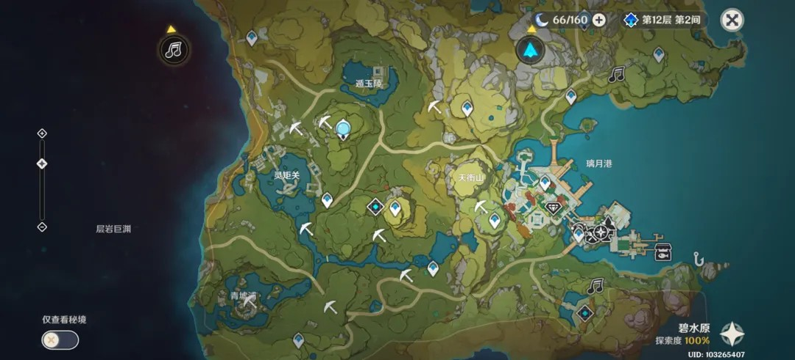
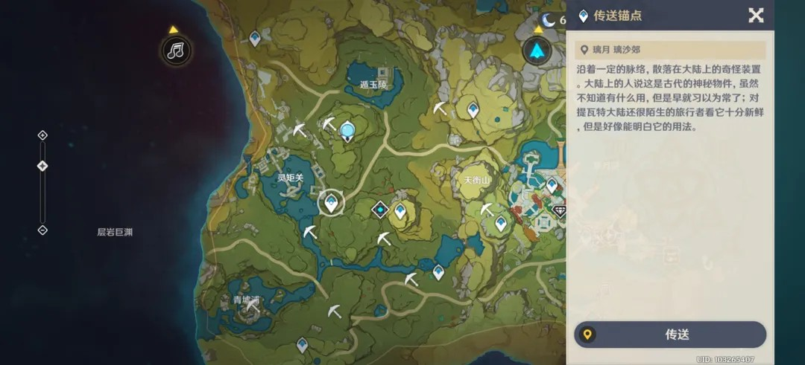
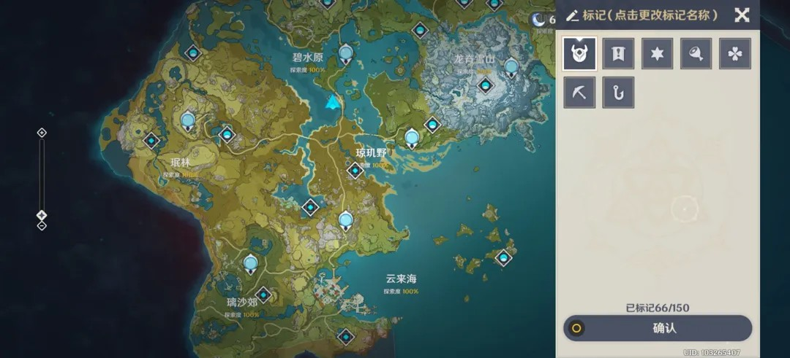

# 原神大地图与导航系统交互分析

在《原神》的开放世界体验中，大地图（Map）是承载探索决策的核心容器。其交互设计的挑战在于：**如何在极大的缩放跨度下，兼容海量的点位信息，并提供极速的移动路径反馈。**

## 1. 视觉分层与点位管理 (Visual Hierarchy)

### 1.1 POI 符号化设计

- **色彩语义**：
    - **蓝色**：已激活点位（传送锚点、神像）。
    - **灰色**：未发现/未激活点位，形成明显的“探索动力”视觉诱导。
    - **黄色/金色**：主线任务/重要活动目标。
- **信息密度控制**：随着地图缩放，非核心图标（如资源标记、小动物）会进行聚合或隐藏，防止视觉噪音过载。

### 1.2 传送交互路径 (Quick Travel)

- **交互逻辑**：点击地图点位 -> 右侧弹出浮层 -> 确认传送。
- **UX 细节**：传送详情页不仅包含地点名，还关联了当前该地点的“任务状态”或“副本掉落预览”，减少了玩家在不同系统间反复跳读。

---

## 2. 玩家自建坐标系 (Custom Markers)

### 2.1 自定义标记系统

- **分类多样性**：提供矿石、花卉、强敌、感叹号等 6-8 种固定图标，满足玩家对不同资源产出的差异化标注需求。
- **数量限制反馈**：底部显示“已标记 66/150”，给玩家明确的资产上限预期，引导其定期清理旧点位。

### 2.2 命名与编辑交互
- **短路径操作**：点击空白区域即可触发标记，长按或点击二级按钮进入编辑模式，这种“先放置后微调”的逻辑极大提升了移动端的操作效率。

---

## 3. 多维空间适配 (Multi-Layer Map)

### 3.1 垂直层级切换 (Contextual Toggle)
- **层岩巨渊/稻妻地下案例**：在涉及多层垂直空间的区域，左侧出现层级切换按钮。
- **逻辑闭环**：地图背景色会根据所属层级（地下 vs 地上）发生色温偏移（如地下偏深蓝紫色），从视觉感官上辅助玩家判定当前维度。

---

## 4. 总结与分析

### 交互亮点 (Gems)
1. **极速反馈**：传送加载（Loading）与地图开启的瞬间响应，是支撑玩家在广阔世界频繁“折跃”的技术基础。
2. **场景关联**：地图不仅是位置工具，也是副本入口、活动入口、任务追踪器的集成体。

### 设计启示 (Insights)
- **减法原则**：通过图标的缩放聚合算法，在移动端小屏幕上依然能维持清晰的视觉导向。
- **符号记忆**：极高辨识度的锚点图标已成为《原神》品牌视觉资产的一部分。

---
*关联阅读：[[analysis/原神-角色养成系统.md]]*
