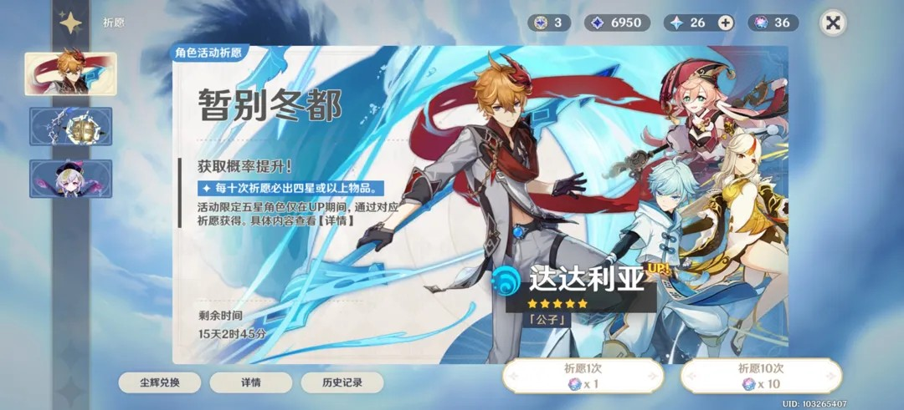
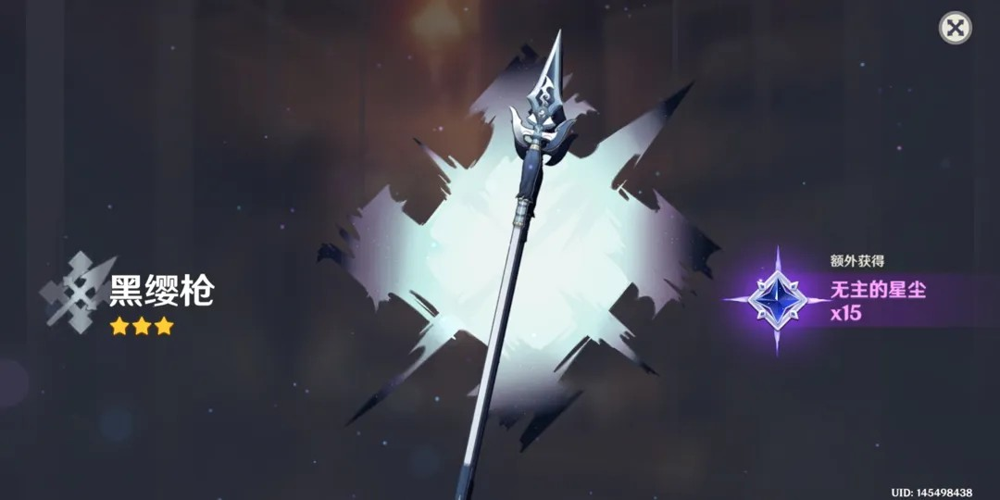
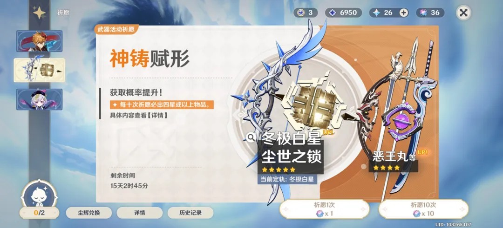
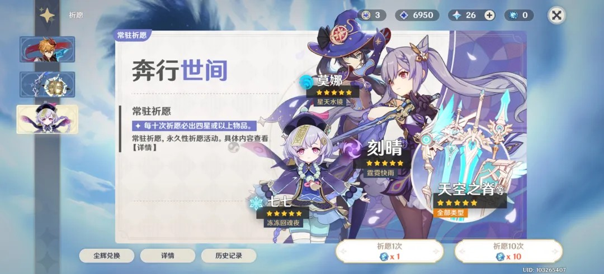

# 原神祈愿系统交互分析

祈愿系统（Wish System）是《原神》商业化设计的中枢，其交互核心在于：**通过极强的仪式感（Ritual）与清晰的价值传达（Value Proposition），平衡玩家的期待感与消费冲动。**

## 1. 界面布局与信息分层 (Interface Layout)

### 1.1 多池并行的导航逻辑

- **视觉重心**：居中的角色立绘占据 60% 以上的面积，通过高精度的 2D 形象与动态效果直接激发玩家的拥有欲。
- **垂直导航**：左侧 Tab 使用简单的 Icon 区分角色、武器、常驻及新手池。选中的 Tab 具有发光特效，符合“流星/愿望”的主题语境。

### 1.2 商业化关键信息
- **水位显示**：虽然界面没有显式的“保底进度条”，但通过底部的“详情”与“历史记录”按钮引导玩家自我核算，这是一种“去功利化”的交互包装。
- **代币转换**：右上角实时显示原石、纠缠之缘、相遇之缘的数量，点击“祈愿”按钮时，系统会自动处理原石到抽卡券的快捷兑换流程，极大地降低了支付摩擦。

---

## 2. 仪式感与反馈设计 (Feedback & Ceremony)

### 2.1 揭示过程的视觉语言
- **背景色语义**：
    - **三星**：蓝色流星（普通反馈）。
    - **四星**：紫色流星（惊喜反馈）。
    - **五星**：金色流星（终极成就反馈）。
- **节奏控制**：从点击按钮到流星划过天空，再到最终结果的揭示，整个过程约 3-5 秒，这种“延迟满足”的设计是抽卡系统的灵魂。

### 2.2 结果反馈界面

- **信息呈现**：单抽结果（如 3 星武器）采用居中展示，背景为抽象的星空光斑，维持整体设计的一致性。
- **循环交互**：右下角提供“再次祈愿”按钮，利用短路径交互引导玩家产生连续消费行为。

---

## 3. 不同池种的差异化交互 (Banner Variations)

### 3.1 武器池的“神铸定轨”

- **UX 补丁**：针对武器池“双 UP”导致的不确定性，系统引入了“定轨”机制（左下角图标）。
- **交互逻辑**：这是一种典型的“保底补足”设计，通过显式的计数（0/2）给玩家提供明确的终点预期。

### 3.2 常驻池与新手池

- **视觉区隔**：常驻池（奔行世间）采用多角色群像，背景色彩较浅，与限时池的强烈色彩形成对比，传达“长期稳定”的心理感受。

---

## 4. 总结

《原神》祈愿系统的交互设计成功地将“博彩”行为包装成了“向星辰许愿”的浪漫叙事。
1. **统一的主题语境**：从原石图标到流星动画，所有视觉元素均指向“星空与愿望”。
2. **极简的决策路径**：在卡池主界面，玩家唯一的逻辑出口就是“抽卡”，去除了所有干扰因素。
3. **分层的透明度**：虽然底层概率复杂，但通过前端直观的“详情”列表，满足了不同硬核程度玩家的信息诉求。

---
*关联阅读：[[analysis/原神-背包与资源管理.md]]*
