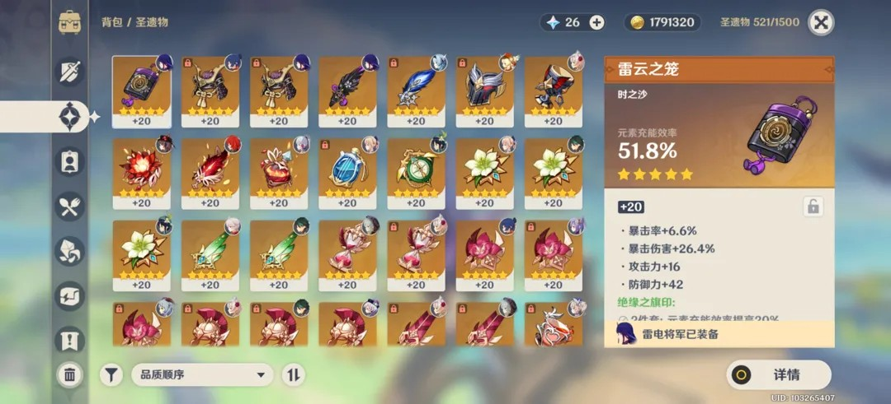
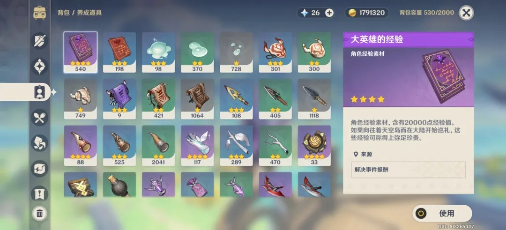
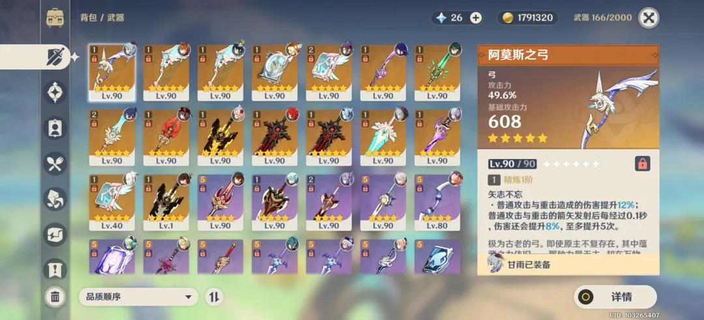
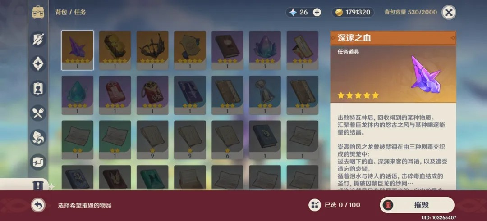

# 原神背包与资源管理系统交互分析

在《原神》这类长线运营的 RPG 中，背包系统不仅是玩家存放资产的“仓库”，更是高频决策的“桌面”。其设计核心在于：**如何在数千件异构资产中，利用极小的视觉面积实现极高的辨识效率。**

## 1. 网格化管理与视觉角标 (Grid & Badges)

### 1.1 高信息密度的网格设计

- **网格规范**：移动端采用 5xN 的网格布局。这在保证每个格子具有足够点击面积的同时，兼顾了首屏的资产展示量（约 15-20 件）。
- **底色语义**：背景色严格遵循稀有度色彩体系（白、绿、蓝、紫、橙）。这种色彩编码是玩家认知的第一优先级，无需阅读文字即可判定价值。

### 1.2 多维角标逻辑

- **归属提示**：右下角的“角色头像”是极其成功的视觉速记符号，告诉玩家该资产“已被占用”，避免了重复决策。
- **保护状态**：左上角的“锁”图标传达了资产的安全性，防止在批量强化或摧毁中被误操作。
- **新获得提示**：右上角的红色“新”字标签，通过视觉噪音引导玩家查看最新资产，完成获得感反馈。

---

## 2. 分类与多维筛选 (Filtering & Sorting)

### 2.1 长列表的“减法”逻辑

- **横向一级分类**：通过左侧固定的 Icon Tab（武器、圣遗物、角色经验、食物、材料等）实现物理隔离，减少单屏滚动压力。
- **智能排序**：左下角的排序按钮提供了“品质、等级、获取时间、角色归属”等多维选项。

### 2.2 筛选弹窗交互

- **UX 细节**：在圣遗物筛选中，系统支持“主属性筛选”和“套装筛选”。这解决了一个核心痛点：玩家在数千个散件中寻找特定词条。

---

## 3. 批量操作：效率与安全的平衡 (Batch Operations)

### 3.1 摧毁与回收流程

- **防误触设计**：
    1. **显式选择模式**：进入批量操作后，界面下方出现明显的红色“摧毁”状态栏。
    2. **二次确认框**：涉及高价值资产（如 4 星以上）时，会触发强提示 Modal 框。
    3. **反选交互**：支持“一键选择低星级”功能，极大减少了机械性点击。

### 3.2 强化时的资源填充
- **UX 优化**：在武器或圣遗物强化界面，系统允许玩家一次点击填充多个素材，并实时展示进度条预估（Exp Preview），让玩家对消耗产出有即时预期。

---

## 4. 总结与评估

### 优势 (Pros)
- **符号化认知极强**：头像角标和稀有度色彩让资产检索变得极其迅速。
- **性能优化**：即便在数千个物品下，长列表的滑动与渲染依然保持了极高流畅度。

### 可改进点 (Opportunities)
- **深度筛选入口较深**：部分复杂的圣遗物筛选功能隐藏在二级菜单，对于极高阶玩家来说，操作步数依然偏多。
- **移动端点击精度**：由于网格密集，在开启批量选择模式时，误触概率依然存在。

---
*关联阅读：[[analysis/原神-角色养成系统.md]]*
