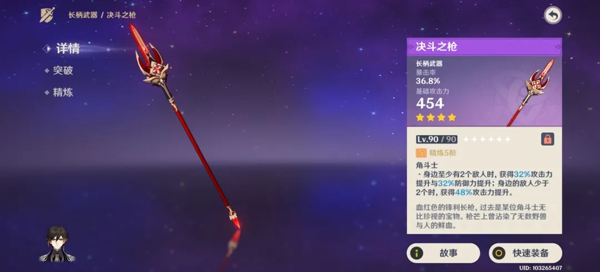
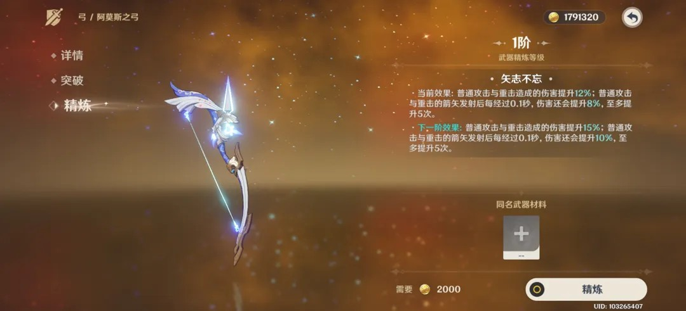
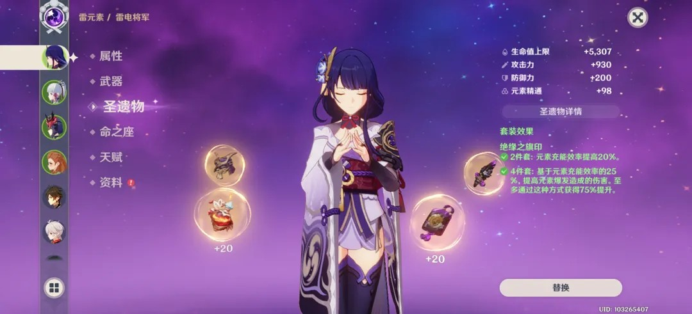
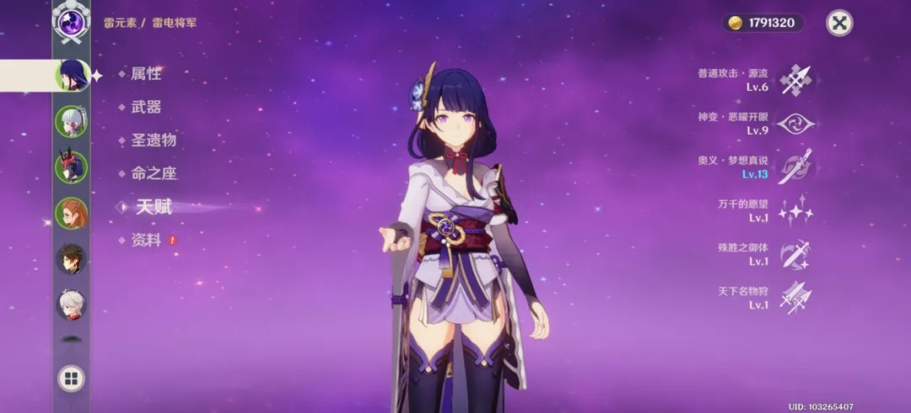
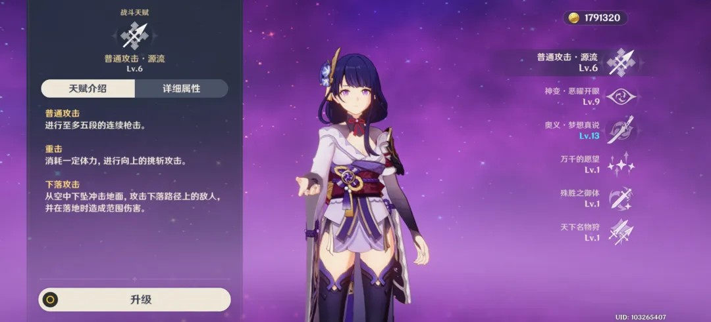
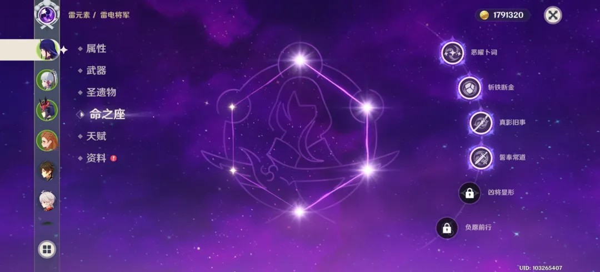
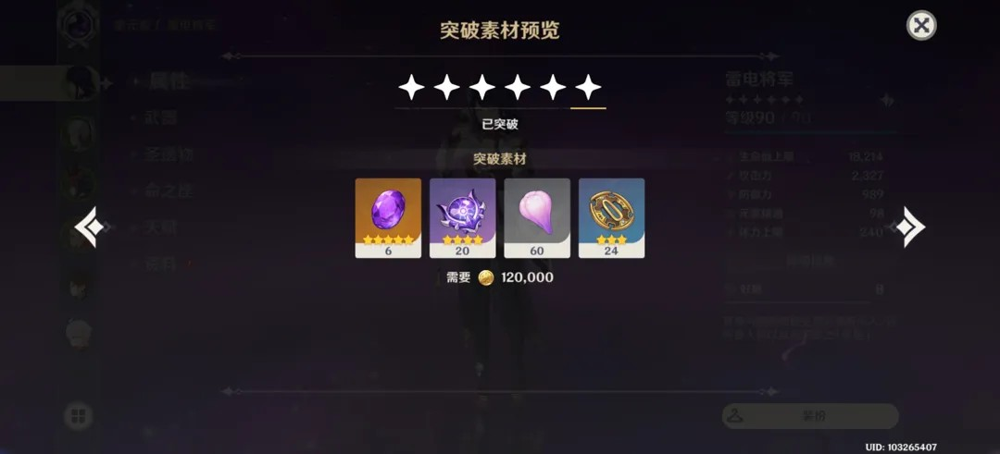

# 原神角色养成系统交互分析

> **分析对象**：雷电将军 (UID: 103265407)
> **设计核心**：高信息密度下的分层展示与闭环反馈。

## 1. 核心交互流：属性与入口

### 1.1 角色属性主界面 (Attributes Panel)

- **视觉层级**：左侧为垂直导航，中间为 3D 角色立绘，右侧为核心战斗数值。这种布局保证了玩家在切换不同角色时，视觉重心（立绘）保持稳定。
- **UX设计逻辑**：将复杂的“二级属性”（如暴击、充能）隐藏在“详细信息”按钮后，一级界面仅展示最直观的基础属性，降低了新玩家的认知门槛。

---

## 2. 深度养成模块拆解

### 2.1 武器系统 (Weapon System)

- **反馈设计**：采用“预览+属性”对比模式。在更换或升级时，数值增量会以绿色高亮显示，强化“变强”的心理暗示。

- **精炼交互**：通过强调技能描述中的关键数字变化，让玩家清晰感知每一级投入的边际收益。

### 2.2 圣遗物系统 (Artifact System)

- **布局设计**：采用“五星连珠”环绕排布，不仅符合“圣遗物”这一带有玄学色彩的背景设定，也直观展示了当前槽位的空缺状态。
- **套装效果反馈**：右侧实时同步套装激活状态，使用绿色字体和勾选图标确认激活。

### 2.3 天赋系统 (Talent System)

- **操作层级**：天赋列表按照“战斗频率”排序（普通攻击 -> 战技 -> 爆发）。

- **深度信息**：点击天赋后的详情页提供了极高的信息密度（倍率、冷却时间等），满足核心硬核玩家的精算需求。

### 2.4 命之座 (Constellation)

- **仪式感设计**：星图式布局，每一个节点的点亮都伴随着强烈的视觉特效。在交互上，它是线性的，强化了阶级突破的成就感。

---

## 3. 背包与资源流转

### 3.1 圣遗物网格管理

- **效率方案**：每行展示 5 个格子的网格布局。
- **状态标记**：通过左上角的锁（保护）和右下角的头像（已装备）角标，玩家无需点击即可完成 80% 的筛选工作。

### 3.2 突破预览与材料获取

- **上下文感知**：采用半透明 Modal 浮层，不彻底跳出养成界面，允许玩家快速确认材料缺口后立即寻找获取途径。

---

## 4. 总结

《原神》养成系统的设计哲学是 **“复杂功能的模块化封装”**。
1. **统一的视觉语言**：无论哪个子系统，都保持左 Tab、右详情的结构。
2. **渐进式的信息披露**：通过“详细信息”、“属性列表”等按钮，将硬核数据藏在直观反馈之后。
3. **强烈的成长暗示**：利用颜色变化（绿/红）、图标（箭头）、动效（命之座点亮）持续反馈养成的正向收益。
