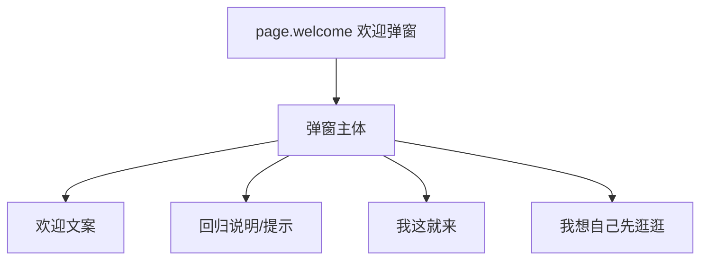
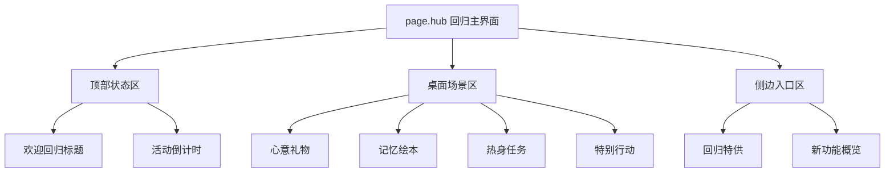

# 无期迷途 - 回归系统 (欢迎回归) 系统级分析

## 0. 预处理：视觉噪声过滤 [MANDATORY]
> [!IMPORTANT]
> 原始截图含 Bilibili 水印、录制账号标识及视频字幕。以下分析仅针对游戏原生 UI 组件，外部噪声均已过滤。

## 0.5 OCR Context (原始文本上下文)
<details>
<summary>点击展开查看各页面提取文本</summary>

### [欢迎弹窗]
- **文案**：局长欢迎回来！欢迎您重回管理局，请查看以下信息。
- **CTA**：我这就来 / 我想自己先逛逛

### [主界面]
- **核心状态**：距离结束 13天20时7分
- **功能模块**：回归特供、心意礼物、记忆绘本、特别行动、热身任务、新功能概览

### [热身任务]
- **任务内容**：消耗200体力、收取监管奖励1次、采购办购买1次、浊暗之阱完成1次

### [七日签到]
- **奖励**：异方晶×100、狄斯币×30000、狂乱精粹×30000、搜索令×100

</details>

## 0.6 视觉参考 (Visual Reference) [MANDATORY]


*图 1：欢迎弹窗。*


*图 2：回归 Hub 主界面。*


*图 3：记忆绘本页。*


*图 4：热身任务页。*


*图 5：特别行动页。*


*图 6：七日签到页。*

---

## 1. 页面矩阵与系统概览 (Page Matrix & Overview)

### 1.1 页面矩阵

| 页面 ID | 页面名称 | 页面角色 | 核心目标 | 入口线索 | 退出线索 | 视觉权重 |
|---|---|---|---|---|---|---|
| `page.welcome` | 欢迎弹窗 | overlay | 完成回归激活与首次分流 | 登录后自动触发 | 进入 Hub / 关闭弹窗 | P0 |
| `page.hub` | 回归主界面 | hub | 汇总全部回归模块入口 | 欢迎弹窗 CTA | 跳转子页面 / 返回主城 | P0 |
| `page.memory_book` | 记忆绘本 | detail | 建立离线时长与情感锚点 | Hub 点击绘本入口 | 返回 Hub | P1 |
| `page.warmup` | 热身任务 | detail | 引导完成低门槛行为任务 | Hub 点击热身任务 | 任务跳转 / 返回 Hub | P0 |
| `page.special_ops` | 特别行动 | detail | 提供追赶副本与开放期加成 | Hub 点击特别行动 | 副本入口 / 返回 Hub | P1 |
| `page.signin` | 心意礼物 | detail | 承载 7 日签到福利 | Hub 点击心意礼物 | 领取奖励 / 返回 Hub | P0 |
| `page.bundle` | 回归特供 | detail | 承载回归限时礼包转化 | Hub 点击回归特供 | 购买 / 返回 Hub | P1 |

### 1.2 系统概览
- 该系统是明显的 **Hub-and-Spoke** 结构：欢迎弹窗负责激活，拟物化 Hub 负责分发，任务、签到、特别行动和礼包分别承担行为恢复、即时福利、资源追赶和商业化。
- 从截图看，系统先给“情绪确认”和“空间探索感”，再把福利与追赶目标分散到桌面实体入口上。

---

## 2. 页面级信息架构 (Page-level IA)

### 2.1 页面 IA 树





### 2.2 空间区域拆解 (Spatial Region Breakdown)

| 区域 ID | 所属页面 | 区域名称 | 空间槽位 (Spatial Slot) | 构图职责 | 主内容 | 阅读优先级 | 滚动方式 | 可观察证据 |
|---|---|---|---|---|---|---|---|---|
| `region.welcome_body` | `page.welcome` | 欢迎弹窗主体 | `overlay` | 阻断式全屏聚焦 | 欢迎文案、双 CTA | P0 | none | 图 1 |
| `region.header` | `page.hub` | 顶部状态区 | `top_bar` | 系统信息与活动全局 | 标题、剩余时间 | P0 | none | 图 2 |
| `region.scene` | `page.hub` | 拟物桌面场景区 | `center_stage` | 沉浸式场景重心 | 礼盒、绘本、任务本、投影等实体入口 | P0 | none | 图 2 |
| `region.side_entry` | `page.hub` | 侧边入口区 | `right_panel` | 辅助功能挂载 | 回归特供、新功能概览 | P1 | none | 图 2 |
| `region.task_list` | `page.warmup` | 任务列表区 | `center_panel` | 密集信息陈列 | 回归任务条目、完成条件 | P0 | vertical | 图 4 |
| `region.bonus_panel` | `page.special_ops` | 副本说明区 | `center_panel` | 核心信息聚焦 | 目标副本、开放描述、掉落说明 | P1 | none | 图 5 |
| `region.signin_grid` | `page.signin` | 7 日签到区 | `center_panel` | 核心交互与资源展示 | 日历格位、奖励图标 | P0 | none | 图 6 |

---

## 3. 组件清单与状态线索 (Components & States)

### 3.1 组件清单

| component_id | 所属页面 | 所属区域 | 组件类型 | 文案/数据 | 状态线索 | 用户动作 | 证据 |
|---|---|---|---|---|---|---|---|
| `btn.enter_comeback` | `page.welcome` | `region.welcome_body` | primary_button | 我这就来 | 高亮主按钮 | tap | 图 1 |
| `btn.defer` | `page.welcome` | `region.welcome_body` | secondary_button | 我想自己先逛逛 | 次级灰按钮 | tap | 图 1 |
| `label.countdown` | `page.hub` | `region.header` | countdown | 距离结束 13天20时7分 | 红色倒计时 | none | 图 2 |
| `entry.signin_gift` | `page.hub` | `region.scene` | entry_card | 心意礼物 | 场景实体入口 | tap | 图 2 |
| `entry.memory_book` | `page.hub` | `region.scene` | entry_card | 记忆绘本 | 场景实体入口 | tap | 图 2 |
| `entry.warmup_task` | `page.hub` | `region.scene` | entry_card | 热身任务 | 场景实体入口 | tap | 图 2 |
| `entry.special_ops` | `page.hub` | `region.scene` | entry_card | 特别行动 | 场景实体入口 | tap | 图 2 |
| `task.item` | `page.warmup` | `region.task_list` | list_item | 消耗体力、采购办购买等 | 可完成/未完成 | tap / jump | 图 4 |
| `signin.cell` | `page.signin` | `region.signin_grid` | reward_cell | 异方晶、搜索令等 | 今日可领 / 已领 / 未来锁定 | tap | 图 6 |

### 3.2 状态表达
- `btn.enter_comeback` 与 `btn.defer` 构成显式双路径分流，表明系统允许“立即进入”与“暂时略过”两种状态。
- `label.countdown` 用红色时间标签表达活动进行中状态。
- `signin.cell` 至少存在 `claimable / claimed / locked` 三类状态，依据签到系统通用格位和图 6 奖励层级可见。
- `task.item` 通过任务内容与清单排布表达“未完成任务池”，完成态在截图中未完全展示，保留为后续页面观察点。

---

## 4. 交互链路与导航推导 (Interaction & Navigation)

### 4.1 主路径
1. 登录后自动进入 `page.welcome`。
2. 点击 `btn.enter_comeback` 进入 `page.hub`。
3. 在 Hub 中优先点击 `entry.memory_book` 或 `entry.signin_gift` 完成情绪确认与即时领取。
4. 再进入 `entry.warmup_task` 完成低门槛任务。
5. 最后通过 `entry.special_ops` 或 `page.bundle` 分别进入追赶副本与商业化路径。

### 4.2 跳转关系表

| 来源页面 | 触发组件 | 目标页面/弹层 | 跳转类型 | 证据 |
|---|---|---|---|---|
| `page.welcome` | `btn.enter_comeback` | `page.hub` | overlay_close + push | 图 1, 图 2 |
| `page.hub` | `entry.memory_book` | `page.memory_book` | push | 图 2, 图 3 |
| `page.hub` | `entry.signin_gift` | `page.signin` | push | 图 2, 图 6 |
| `page.hub` | `entry.warmup_task` | `page.warmup` | push | 图 2, 图 4 |
| `page.hub` | `entry.special_ops` | `page.special_ops` | push | 图 2, 图 5 |
| `page.hub` | `回归特供入口` | `page.bundle` | push | 图 2 |

### 4.3 反馈闭环
- 欢迎弹窗的反馈是“进入 Hub 并展开全景场景”，属于空间切换反馈。
- 签到与任务页的反馈主轴是奖励领取和任务推进，但截图未完整展示领奖终态，建议后续继续补领奖页面。
- 特别行动页通过开放副本描述和目标区域信息，让“可以去哪里追赶”在进入前就可见。

---

## 5. 面向生成的线索提炼 (Generation-facing Notes)

### 5.1 页面生成线索

| 页面 ID | 主视觉焦点 | 信息阅读顺序 | 不可缺失组件 | 可后置组件 | 备注 |
|---|---|---|---|---|---|
| `page.welcome` | 信封式欢迎弹窗 | 欢迎文案 -> 主 CTA -> 次 CTA | 标题、双 CTA | 辅助说明 | 图 1 |
| `page.hub` | 拟物桌面入口群 | 顶部状态 -> 场景入口 -> 侧边入口 | 倒计时、四个核心入口 | 新功能概览 | 图 2 |
| `page.warmup` | 任务清单 | 标题 -> 任务项 -> 跳转行为 | 任务列表 | 背景装饰 | 图 4 |
| `page.signin` | 礼盒式签到奖励 | 奖励格位 -> 今日奖励 -> 未来奖励 | 7 日格位、奖励图标 | 说明文字 | 图 6 |

### 5.2 可疑点与待裁定
- `⚠️ 待裁定`：主界面中“新功能概览”是否属于回归系统内部页面，还是一个跳出回归系统的版本信息页，当前截图证据不足。
- `⚠️ 待裁定`：热身任务的完成态和领奖态未在现有截图中出现，后续如补图需更新状态矩阵。

### 5.3 次级 UX 诊断
- 优势是把回归入口做成叙事化空间而不是纯福利面板。
- 代价是信息入口分散在拟物场景中，首次回归的模块扫描成本高于列表式 Hub。

---

## 6. 抽象定义 (Analysis Manifest)
```json
{
  "system_name": "ReturnSystem_PtN",
  "is_multi_page": true,
  "pages": [
    {
      "page_id": "page.welcome",
      "role": "overlay",
      "regions": [
        {
          "region_id": "region.welcome_body",
          "position": "center",
          "components": ["btn.enter_comeback", "btn.defer"]
        }
      ]
    },
    {
      "page_id": "page.hub",
      "role": "hub",
      "regions": [
        {
          "region_id": "region.header",
          "position": "top",
          "components": ["label.countdown"]
        },
        {
          "region_id": "region.scene",
          "position": "center",
          "components": ["entry.signin_gift", "entry.memory_book", "entry.warmup_task", "entry.special_ops"]
        }
      ]
    }
  ],
  "components": [
    {
      "component_id": "btn.enter_comeback",
      "type": "primary_button",
      "page_id": "page.welcome",
      "state_hints": ["enabled"],
      "action_hints": ["enter_hub"]
    },
    {
      "component_id": "signin.cell",
      "type": "reward_cell",
      "page_id": "page.signin",
      "state_hints": ["claimable", "claimed", "locked"],
      "action_hints": ["claim_reward"]
    }
  ],
  "navigation_hints": [
    {
      "from": "page.welcome",
      "trigger": "btn.enter_comeback",
      "to": "page.hub"
    },
    {
      "from": "page.hub",
      "trigger": "entry.warmup_task",
      "to": "page.warmup"
    }
  ]
}
```

---
*关联页面：[[analysis/无期迷途-签到系统.md]] | [[games/无期迷途.md]]*
