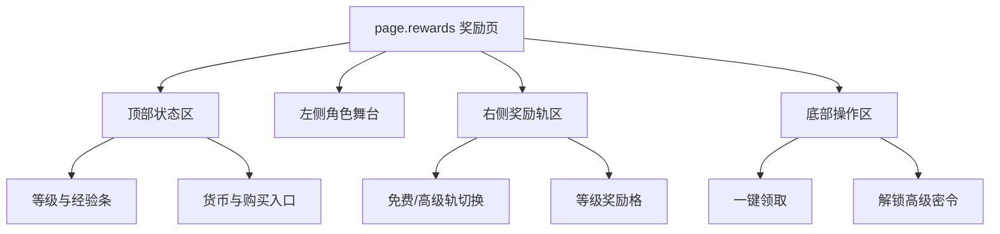
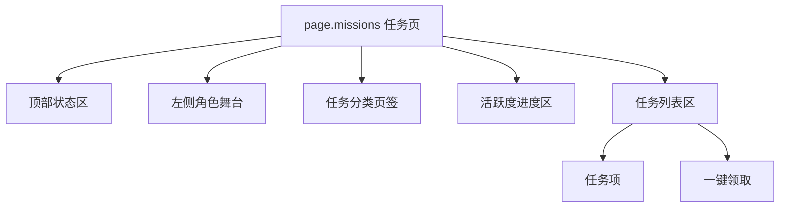
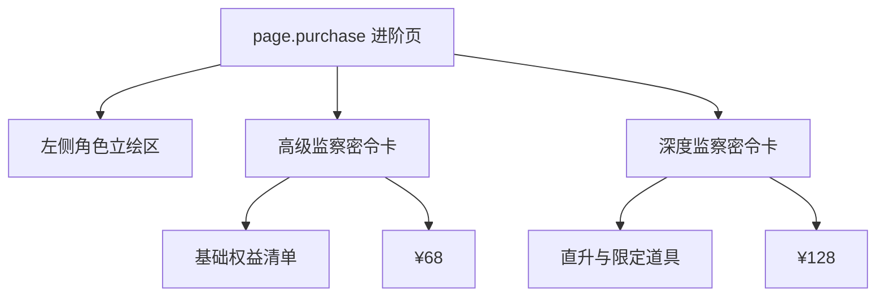

# 无期迷途 - 战令系统 (监察密令) 系统级分析

## 0. 预处理：视觉噪声过滤 [MANDATORY]
> [!IMPORTANT]
> 原始截图包含系统状态栏与录屏残留信息，已过滤，仅分析游戏原生战令界面。

## 0.5 OCR Context (原始文本上下文)
<details>
<summary>点击展开查看提取的 UI 文本</summary>

### [奖励页]
- **核心文案**：夏燃之火、等级 1、150/1000、奖励预览。
- **CTA**：购买等级、获得数据、一键领取、解锁高级密令。
- **状态词**：高级监察密令、锁图标、等级列。

### [任务页]
- **页签**：每日 24、每周、密令。
- **任务文案**：登录游戏、升级 1 次禁闭者、采购办购买任意商品 1 次。
- **CTA**：领取、一键领取。

### [进阶页]
- **档位文案**：高级监察密令、深度监察密令。
- **转化卖点**：包含全部高级密令奖励、密令等级直升 20 级、立即获得限定道具。

</details>

## 0.6 视觉参考 (Visual Reference) [MANDATORY]


*图 1：奖励主页面。*


*图 2：任务页面。*


*图 3：进阶购买页。*

---

## 1. 页面矩阵与系统概览 (Page Matrix & Overview)

### 1.1 页面矩阵

| 页面 ID | 页面名称 | 页面角色 | 核心目标 | 入口线索 | 退出线索 | 视觉权重 |
|---|---|---|---|---|---|---|
| `page.rewards` | 奖励页 | hub | 展示等级、双轨奖励和当前大奖，引导领取或进阶 | 系统主入口 | 切任务页 / 打开进阶页 | P0 |
| `page.missions` | 任务页 | detail | 用每日/每周/密令任务驱动活跃与经验累积 | 底部页签切换 | 返回奖励页 / 领取完成 | P0 |
| `page.purchase` | 进阶页 | checkout | 比较两档付费方案并放大“直升 20 级”价值 | 奖励页 CTA | 支付成功返回奖励页 / 关闭 | P0 |

### 1.2 系统概览
- 该系统是 **共享左侧角色主舞台 + 右侧功能页切换** 的战令结构。
- `page.rewards` 与 `page.missions` 共用同一视觉母板，说明系统鼓励玩家在“看奖励”和“做任务”之间快速来回。
- `page.purchase` 不是简单弹层，而是独立的强转化页面，用大面积角色立绘和双档权益卡直接承接付费决策。

---

## 2. 页面级信息架构 (Page-level IA)

### 2.1 页面 IA 树







### 2.2 空间区域拆解 (Spatial Region Breakdown)

| 区域 ID | 所属页面 | 区域名称 | 空间槽位 | 构图职责 | 主内容 | 阅读优先级 | 滚动方式 | 可观察证据 |
|---|---|---|---|---|---|---|---|---|
| `region.header` | `page.rewards` | 顶部状态区 | `top_bar` | 外显等级、经验、货币和快捷操作 | 等级 1、150/1000、购买等级、获得数据 | P0 | none | 图 1 |
| `region.hero_stage` | `page.rewards` | 左侧角色舞台 | `center_stage` | 形成大奖情绪锚点 | 卓娅立绘、赛季皮肤主题 | P0 | none | 图 1 |
| `region.reward_track` | `page.rewards` | 奖励轨区 | `center_panel` | 承载免费/付费奖励等级推进 | 双轨奖励格、等级列 | P0 | horizontal | 图 1 |
| `region.action_bar` | `page.rewards` | 底部操作区 | `bottom_bar` | 组织跨页切换与主 CTA | 监察任务、监察密令、一键领取、解锁高级密令 | P0 | none | 图 1 |
| `region.task_tabs` | `page.missions` | 任务分类区 | `left_rail` | 在任务视图内继续分层 | 每日、每周、密令 | P0 | none | 图 2 |
| `region.activity_bar` | `page.missions` | 活跃度进度区 | `top_bar` | 让玩家理解今日活跃与阶段节点 | 0/20/40/60/80/100 节点 | P1 | none | 图 2 |
| `region.mission_list` | `page.missions` | 任务列表区 | `right_panel` | 承载任务和领取动作 | 任务项、奖励、领取按钮 | P0 | vertical | 图 2 |
| `region.purchase_compare` | `page.purchase` | 档位对比区 | `center_panel` | 承载定价与权益对比 | 68 档、128 档、直升 20 级 | P0 | none | 图 3 |

---

## 3. 组件清单与状态线索 (Components & States)

### 3.1 组件清单

| component_id | 所属页面 | 所属区域 | 组件类型 | 文案/数据 | 状态线索 | 用户动作 | 证据 |
|---|---|---|---|---|---|---|---|
| `label.level_progress` | `page.rewards` | `region.header` | progress_bar | 等级 1、150/1000 | 当前等级态 | none | 图 1 |
| `btn.buy_level` | `page.rewards` | `region.header` | secondary_button | 购买等级 | enabled | tap | 图 1 |
| `btn.get_data` | `page.rewards` | `region.header` | secondary_button | 获得数据 | enabled | tap | 图 1 |
| `reward.cell` | `page.rewards` | `region.reward_track` | reward_cell | 1-5 级奖励格 | locked / claimable / claimed | tap | 图 1 |
| `tab.track_type` | `page.rewards` | `region.reward_track` | tab | 监察密令 / 高级监察密令 | selected / unselected | tap | 图 1 |
| `btn.claim_all` | `page.rewards` | `region.action_bar` | primary_button | 一键领取 | enabled / disabled | tap | 图 1 |
| `btn.unlock_premium` | `page.rewards` | `region.action_bar` | primary_button | 解锁高级密令 | enabled | tap | 图 1 |
| `tab.mission_group` | `page.missions` | `region.task_tabs` | tab | 每日 / 每周 / 密令 | selected / red_dot | tap | 图 2 |
| `mission.item` | `page.missions` | `region.mission_list` | list_item | 登录游戏、升级禁闭者等 | ready / incomplete / claimed | tap | 图 2 |
| `btn.claim_task` | `page.missions` | `region.mission_list` | primary_button | 领取 | enabled / hidden | tap | 图 2 |
| `card.tier_basic` | `page.purchase` | `region.purchase_compare` | preview_card | 高级监察密令 | default | tap / pay | 图 3 |
| `card.tier_deluxe` | `page.purchase` | `region.purchase_compare` | preview_card | 深度监察密令 | recommended | tap / pay | 图 3 |

### 3.2 状态表达
- `reward.cell` 的锁图标直接承担“高级轨未解锁”与“等级未达成”双重提示。
- `tab.mission_group` 用页签切换承担任务分组，红点用于提醒未处理任务。
- `btn.claim_all` 与 `btn.claim_task` 的并存说明系统允许“单任务领取”和“批量回收”两种节奏。
- `card.tier_deluxe` 通过更亮的金色底板与“直升 20 级”标签承担默认推荐档职责。

---

## 4. 交互链路与导航推导 (Interaction & Navigation)

### 4.1 主路径
1. 进入 `page.rewards`，先识别当前等级与右侧双轨奖励。
2. 查看左侧立绘和高等级奖励，建立进阶动机。
3. 若有可领奖励，点击 `btn.claim_all` 完成回收。
4. 若需要补经验，切到底部 `监察任务` 进入 `page.missions`。
5. 在任务页逐项领取或返回奖励页。
6. 当玩家希望解锁高级轨时，通过 `btn.unlock_premium` 进入 `page.purchase`。

### 4.2 跳转关系表

| 来源页面 | 触发组件 | 目标页面/弹层 | 跳转类型 | 证据 |
|---|---|---|---|---|
| `page.rewards` | `监察任务` | `page.missions` | tab_switch | 图 1, 图 2 |
| `page.missions` | `监察密令` | `page.rewards` | tab_switch | 图 1, 图 2 |
| `page.rewards` | `btn.unlock_premium` | `page.purchase` | push | 图 1, 图 3 |
| `page.missions` | `btn.claim_task` | 通用获得反馈 | inline_feedback | 图 2 |

### 4.3 反馈闭环
- 奖励领取以红色主按钮承担高优先级反馈，领取后格位状态应转为已领。
- 任务页把“当前有奖励可领取”直接写入列表区底部，降低漏领概率。
- 进阶页通过立刻可得的限定道具和直升等级，把支付反馈前置为可视化承诺。

---

## 5. 面向生成的线索提炼 (Generation-facing Notes)

### 5.1 页面生成线索

| 页面 ID | 主视觉焦点 | 信息阅读顺序 | 不可缺失组件 | 可后置组件 | 备注 |
|---|---|---|---|---|---|
| `page.rewards` | 左侧卓娅立绘 + 右侧双轨奖励 | 顶部等级 -> 左侧大奖 -> 奖励轨 -> 底部 CTA | 立绘、等级条、双轨奖励、一键领取 | 奖励预览入口 | 图 1 |
| `page.missions` | 左侧角色舞台 + 右侧任务列表 | 顶部活跃度 -> 分类页签 -> 任务列表 -> 一键领取 | 分类页签、任务列表、单任务领取、一键领取 | 底部提示文字 | 图 2 |
| `page.purchase` | 大立绘 + 双档权益对比 | 左侧立绘 -> 68 档 -> 128 档 -> 价格按钮 | 双档卡、价格、直升卖点 | 次级文案 | 图 3 |

### 5.2 可疑点与待裁定
- `⚠️ 待裁定`：截图中未直接展示“奖励预览”打开后的详情页，当前只能确认其存在入口，不能确认其具体页面结构。
- `⚠️ 待裁定`：`获得数据` 按钮的完整跳转目的地未在本批截图中展开。

### 5.3 次级 UX 诊断
- 系统用固定立绘舞台强化了皮肤转化，但也压缩了任务页的纯信息密度空间。
- 奖励页与任务页共享同一母板，让页面切换成本很低，适合频繁来回操作。

---

## 6. 抽象定义 (Analysis Manifest)
```json
{
  "system_name": "BattlePass_PathToNowhere",
  "is_multi_page": true,
  "pages": [
    {
      "page_id": "page.rewards",
      "role": "hub",
      "regions": [
        {
          "region_id": "region.hero_stage",
          "position": "left",
          "components": ["label.level_progress", "btn.buy_level"]
        },
        {
          "region_id": "region.reward_track",
          "position": "center_right",
          "components": ["tab.track_type", "reward.cell"]
        }
      ]
    },
    {
      "page_id": "page.missions",
      "role": "detail",
      "regions": [
        {
          "region_id": "region.task_tabs",
          "position": "center_left",
          "components": ["tab.mission_group"]
        },
        {
          "region_id": "region.mission_list",
          "position": "right",
          "components": ["mission.item", "btn.claim_task"]
        }
      ]
    },
    {
      "page_id": "page.purchase",
      "role": "checkout",
      "regions": [
        {
          "region_id": "region.purchase_compare",
          "position": "center",
          "components": ["card.tier_basic", "card.tier_deluxe"]
        }
      ]
    }
  ],
  "components": [
    {
      "component_id": "reward.cell",
      "type": "reward_cell",
      "page_id": "page.rewards",
      "state_hints": ["locked", "claimable", "claimed"],
      "action_hints": ["preview_reward"]
    },
    {
      "component_id": "mission.item",
      "type": "list_item",
      "page_id": "page.missions",
      "state_hints": ["ready", "incomplete", "claimed"],
      "action_hints": ["claim_task_reward"]
    }
  ],
  "navigation_hints": [
    {
      "from": "page.rewards",
      "trigger": "监察任务",
      "to": "page.missions"
    },
    {
      "from": "page.rewards",
      "trigger": "btn.unlock_premium",
      "to": "page.purchase"
    }
  ]
}
```

---
*关联页面：[[mechanics/战斗通行证系统.md]] | [[concepts/按钮交互状态.md]]*
