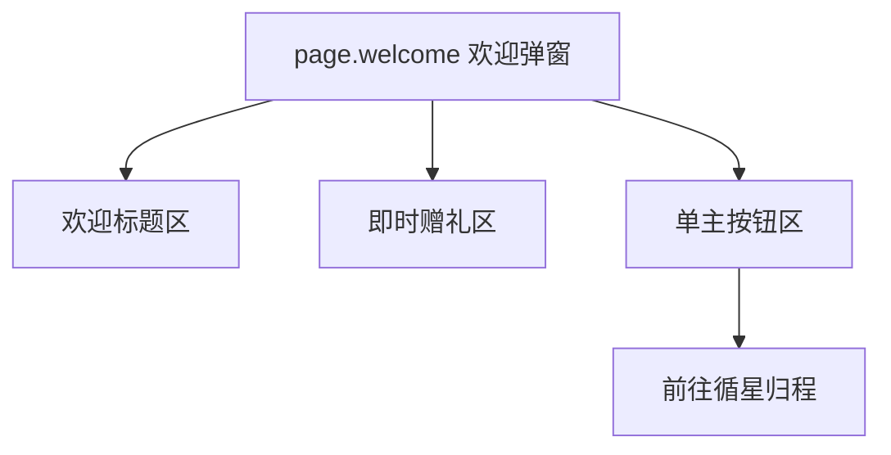
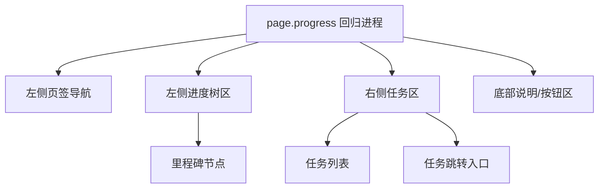

# 星穹铁道 - 回归系统 (循星归程) 系统级分析

## 0. 预处理：视觉噪声过滤 [MANDATORY]
> [!IMPORTANT]
> 原始截图含 Bilibili 顶部字幕及账号水印，已过滤，仅分析游戏原生 UI。

## 0.5 OCR Context (原始文本上下文)
<details>
<summary>点击展开查看各页面文本</summary>

### [欢迎弹窗]
- **文案**：欢迎重返开拓之旅！好久不见帕！
- **即时赠礼**：星琼、燃料、信用点、遗器经验
- **CTA**：前往循星归程

### [回归进程页]
- **进度树节点**：0 / 50 / 100 / 200 / 300 / 400
- **任务清单**：登录游戏、完成锋芒崭露、领取活跃度奖励、派遣委托

</details>

## 0.6 视觉参考 (Visual Reference) [MANDATORY]


*图 1：欢迎弹窗。*


*图 2：回归进程页。*


*图 3：归途助力页。*


*图 4：归路指引页。*


*图 5：礼遇成双页。*

---

## 1. 页面矩阵与系统概览 (Page Matrix & Overview)

### 1.1 页面矩阵

| 页面 ID | 页面名称 | 页面角色 | 核心目标 | 入口线索 | 退出线索 | 视觉权重 |
|---|---|---|---|---|---|---|
| `page.welcome` | 欢迎弹窗 | overlay | 完成欢迎、展示即时赠礼、强引导进入系统 | 登录后自动触发 | 进入进程页 | P0 |
| `page.progress` | 回归进程 | hub | 同屏展示里程碑进度与任务缺口 | 欢迎弹窗 CTA | 左侧子页切换 / 返回 | P0 |
| `page.assistance` | 归途助力 | detail | 外显回归 Buff 与追赶帮助 | 左侧导航 | 返回进程页 | P1 |
| `page.guidance` | 归路指引 | detail | 提供玩法导航和版本内容入口 | 左侧导航 | 玩法跳转 / 返回进程页 | P1 |
| `page.double_reward` | 礼遇成双 | detail | 展示回归期增益与奖励翻倍规则 | 左侧导航 | 返回进程页 | P1 |

### 1.2 系统概览
- 该系统是 **单一入口 + 左侧子导航** 的效率导向型结构。
- 核心页面是 `page.progress`，它把“当前进度”与“下一步该做什么”放在同一屏内，明显优先于叙事包装。

---

## 2. 页面级信息架构 (Page-level IA)

### 2.1 页面 IA 树





### 2.2 空间区域拆解 (Spatial Region Breakdown)

| 区域 ID | 所属页面 | 区域名称 | 空间槽位 (Spatial Slot) | 构图职责 | 主内容 | 阅读优先级 | 滚动方式 | 可观察证据 |
|---|---|---|---|---|---|---|---|---|
| `region.welcome_header` | `page.welcome` | 欢迎标题区 | `overlay` | 弹层引导 | 帕姆欢迎语 | P0 | none | 图 1 |
| `region.reward_list` | `page.welcome` | 即时赠礼区 | `overlay` | 弹层内容 | 多个回归即领资源 | P0 | none | 图 1 |
| `region.enter_action` | `page.welcome` | 进入按钮区 | `overlay` | 弹层操作 | 前往循星归程 | P0 | none | 图 1 |
| `region.side_nav` | `page.progress` | 左侧导航区 | `left_rail` | 全局系统切页 | 进程、助力、签到、指引等页签 | P1 | vertical | 图 2 |
| `region.progress_tree` | `page.progress` | 进度树区 | `center_stage` | 视觉重心与核心进度 | 分叉里程碑、当前点数 | P0 | none | 图 2 |
| `region.task_panel` | `page.progress` | 任务清单区 | `right_panel` | 密集任务与交互 | 任务条目、奖励、跳转 | P0 | vertical | 图 2 |
| `region.buff_panel` | `page.assistance` | 助力说明区 | `center_panel` | 信息详情陈列 | 归途助力权益与持续时间 | P1 | vertical | 图 3 |
| `region.content_nav` | `page.guidance` | 内容引导区 | `center_panel` | 信息详情陈列 | 玩法入口与版本内容推荐 | P1 | vertical | 图 4 |

---

## 3. 组件清单与状态线索 (Components & States)

### 3.1 组件清单

| component_id | 所属页面 | 所属区域 | 组件类型 | 文案/数据 | 状态线索 | 用户动作 | 证据 |
|---|---|---|---|---|---|---|---|
| `reward.instant_item` | `page.welcome` | `region.reward_list` | reward_cell | 星琼、燃料等即领奖励 | 已确认勾选 | none / acknowledge | 图 1 |
| `btn.enter_journey` | `page.welcome` | `region.enter_action` | primary_button | 前往循星归程 | 单 CTA 高亮 | tap | 图 1 |
| `nav.comeback_tab` | `page.progress` | `region.side_nav` | tab | 进程、助力、签到、指引 | 选中 / 未选中 | tap | 图 2 |
| `progress.node` | `page.progress` | `region.progress_tree` | milestone_node | 50、100、200 等节点 | 当前 / 未达成 / 已领取 | tap | 图 2 |
| `label.current_score` | `page.progress` | `region.progress_tree` | badge | 当前点数 0 | 数值态 | none | 图 2 |
| `task.item` | `page.progress` | `region.task_panel` | list_item | 登录游戏、派遣委托等 | 可完成 / 未完成 | tap / jump | 图 2 |
| `entry.buff_card` | `page.assistance` | `region.buff_panel` | info_card | 回归助力权益 | 生效中 | tap / read | 图 3 |
| `entry.guidance_card` | `page.guidance` | `region.content_nav` | entry_card | 新玩法或版本重点 | 可进入 | tap | 图 4 |

### 3.2 状态表达
- `reward.instant_item` 用勾选反馈表达“已立即发放”。
- `progress.node` 至少具备 `locked / current / claimable / claimed` 四类状态，来自里程碑树节点的层级展示。
- `nav.comeback_tab` 通过左侧导航显式呈现选中态。
- `task.item` 的状态由任务文案、奖励和跳转行为共同表达，强调“可以去做什么”而不是“福利列表”。

---

## 4. 交互链路与导航推导 (Interaction & Navigation)

### 4.1 主路径
1. 登录后进入 `page.welcome`，确认即时赠礼。
2. 点击 `btn.enter_journey` 进入 `page.progress`。
3. 在 `region.progress_tree` 查看当前点数与目标节点。
4. 在 `region.task_panel` 选择任务并跳转到对应玩法。
5. 回到左侧导航，按需进入 `page.assistance` 或 `page.guidance` 获取降门槛帮助和内容导航。

### 4.2 跳转关系表

| 来源页面 | 触发组件 | 目标页面/弹层 | 跳转类型 | 证据 |
|---|---|---|---|---|
| `page.welcome` | `btn.enter_journey` | `page.progress` | overlay_close + push | 图 1, 图 2 |
| `page.progress` | `nav.comeback_tab` | `page.assistance` | tab_switch | 图 2, 图 3 |
| `page.progress` | `nav.comeback_tab` | `page.guidance` | tab_switch | 图 2, 图 4 |
| `page.progress` | `task.item` | 对应玩法系统 | push | 图 2 |

### 4.3 反馈闭环
- 欢迎弹窗通过勾选即时赠礼减少“奖励是否到账”的不确定感。
- 进度页把“节点位置”和“任务入口”放在一屏内，反馈主要依赖数值推进和节点状态变化。
- 左侧导航区负责“切页反馈”，属于信息视图切换而非福利弹层切换。

---

## 5. 面向生成的线索提炼 (Generation-facing Notes)

### 5.1 页面生成线索

| 页面 ID | 主视觉焦点 | 信息阅读顺序 | 不可缺失组件 | 可后置组件 | 备注 |
|---|---|---|---|---|---|
| `page.welcome` | 帕姆欢迎 + 即时赠礼 | 标题 -> 即时奖励 -> 主 CTA | 角色欢迎、奖励列表、单 CTA | 背景装饰 | 图 1 |
| `page.progress` | 左树右任务双栏 | 左导航 -> 进度树 -> 任务清单 | 当前点数、里程碑、任务列表 | 底部补充说明 | 图 2 |
| `page.assistance` | Buff 说明卡 | 标题 -> 权益条目 -> 剩余时间 | 回归 Buff、持续时间 | 说明文字 | 图 3 |
| `page.guidance` | 内容入口列表 | 标题 -> 推荐玩法 -> 跳转入口 | 玩法卡片 | 次级说明 | 图 4 |

### 5.2 可疑点与待裁定
- `⚠️ 待裁定`：`page.double_reward` 在当前素材中仅出现文件名，截图未单独展开其完整页面内容，后续若要进入规范正文需补图确认。
- `⚠️ 待裁定`：任务项跳转到哪些具体系统，在截图中未全部展示完整目的地名称。

### 5.3 次级 UX 诊断
- 优势是透明、直接、低理解成本。
- 代价是左侧模块数量较多，对刚回归玩家会形成一定决策密度。

---

## 6. 抽象定义 (Analysis Manifest)
```json
{
  "system_name": "ReturnSystem_HSR",
  "is_multi_page": true,
  "pages": [
    {
      "page_id": "page.welcome",
      "role": "overlay",
      "regions": [
        {
          "region_id": "region.reward_list",
          "position": "center",
          "components": ["reward.instant_item", "btn.enter_journey"]
        }
      ]
    },
    {
      "page_id": "page.progress",
      "role": "hub",
      "regions": [
        {
          "region_id": "region.progress_tree",
          "position": "center_left",
          "components": ["progress.node", "label.current_score"]
        },
        {
          "region_id": "region.task_panel",
          "position": "right",
          "components": ["task.item"]
        }
      ]
    }
  ],
  "components": [
    {
      "component_id": "btn.enter_journey",
      "type": "primary_button",
      "page_id": "page.welcome",
      "state_hints": ["enabled"],
      "action_hints": ["enter_progress_page"]
    },
    {
      "component_id": "progress.node",
      "type": "milestone_node",
      "page_id": "page.progress",
      "state_hints": ["locked", "current", "claimable", "claimed"],
      "action_hints": ["preview_reward"]
    }
  ],
  "navigation_hints": [
    {
      "from": "page.welcome",
      "trigger": "btn.enter_journey",
      "to": "page.progress"
    },
    {
      "from": "page.progress",
      "trigger": "task.item",
      "to": "gameplay_system"
    }
  ]
}
```

---
*关联页面：[[analysis/星穹铁道-签到系统.md]] | [[games/星穹铁道.md]]*
