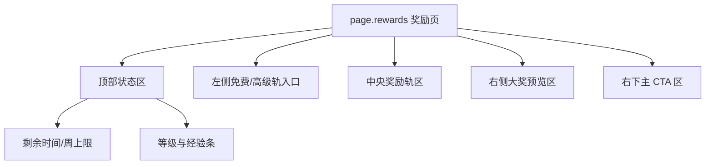
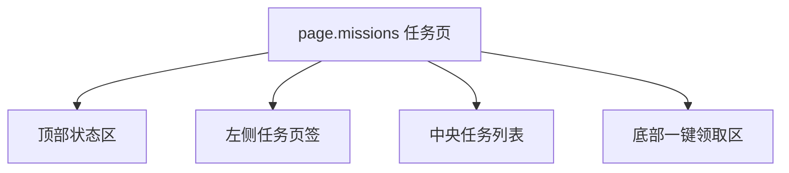
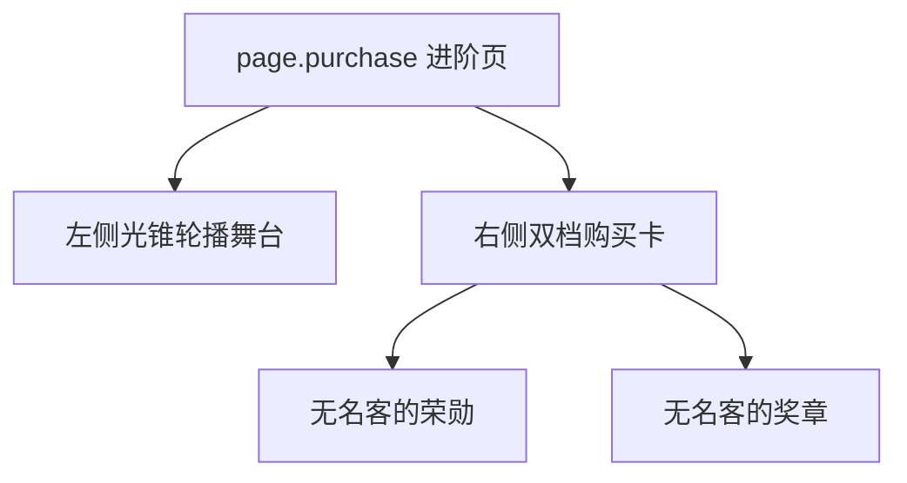
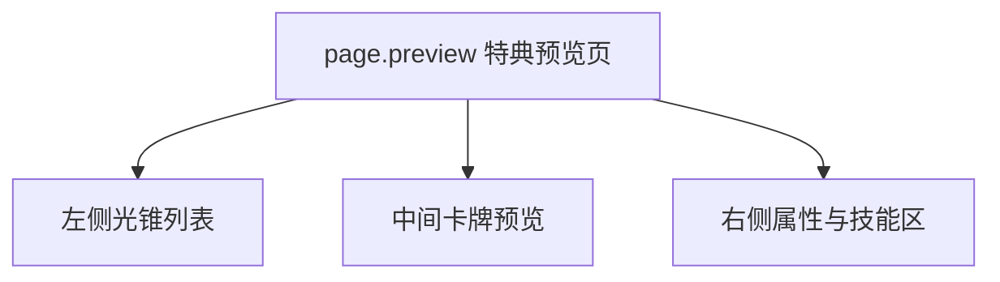

# 星穹铁道 - 战令系统 (无名勋礼) 系统级分析

## 0. 预处理：视觉噪声过滤 [MANDATORY]
> [!IMPORTANT]
> 原始截图含系统状态栏与视频水印残留，已过滤，仅分析游戏原生战令页面。

## 0.5 OCR Context (原始文本上下文)
<details>
<summary>点击展开查看提取的 UI 文本</summary>

### [奖励页]
- **核心文案**：无名勋礼、无名客的赠礼、无名客的荣勋。
- **状态数据**：0/800、本周经验上限 0/8000、剩余时间 39 天。
- **CTA**：购买等级、解锁无名客的荣勋。

### [任务页]
- **页签**：本日任务、本周任务、本期任务。
- **任务文案**：登录游戏、派遣 1 次委托、每日实训活跃度达到 500。
- **CTA**：领取、追踪、一键领取。

### [进阶页]
- **档位**：无名客的荣勋 ¥68、无名客的奖章 ¥128。
- **卖点**：立即提升 10 级、额外可领取、星海宝藏任选光锥。

### [特殊奖励信息页]
- **信息结构**：左侧光锥列表、中间大卡牌、右侧属性与技能说明。
- **用途**：战令进阶特典预览。

</details>

## 0.6 视觉参考 (Visual Reference) [MANDATORY]


*图 1：奖励主页面。*


*图 2：任务页面。*


*图 3：进阶购买页。*


*图 4：特殊奖励信息页。*

---

## 1. 页面矩阵与系统概览 (Page Matrix & Overview)

### 1.1 页面矩阵

| 页面 ID | 页面名称 | 页面角色 | 核心目标 | 入口线索 | 退出线索 | 视觉权重 |
|---|---|---|---|---|---|---|
| `page.rewards` | 奖励页 | hub | 同屏展示等级、双轨奖励、赛季剩余时间和主大奖 | 战令入口 | 切任务页 / 打开进阶页 / 打开奖励预览 | P0 |
| `page.missions` | 任务页 | detail | 用日/周/期任务驱动经验获取并回流奖励页 | 顶部任务图标 | 返回奖励页 / 任务跳玩法 | P0 |
| `page.purchase` | 进阶页 | checkout | 对比 68 / 128 两档并外显“任选光锥”卖点 | 奖励页解锁 CTA | 支付成功返回奖励页 / 关闭 | P0 |
| `page.preview` | 特殊奖励信息页 | detail | 展示可选光锥的详细数值与技能说明 | 进阶页或奖励页的特典入口 | 返回进阶页 / 切换其他光锥 | P1 |

### 1.2 系统概览
- 该系统的核心特征是 **统一顶栏 + 视图切换图标 + 单大奖预览卡**。
- `page.rewards` 通过“周上限”与“核心大奖卡牌”同时出现，既管控升级节奏，也持续放大进阶价值。
- `page.preview` 说明星铁战令不只卖通用资源，还卖“可选择的限定特典”，因此详情预览页在结构里是重要补充页，而不是边角说明。

---

## 2. 页面级信息架构 (Page-level IA)

### 2.1 页面 IA 树









### 2.2 空间区域拆解 (Spatial Region Breakdown)

| 区域 ID | 所属页面 | 区域名称 | 空间槽位 | 构图职责 | 主内容 | 阅读优先级 | 滚动方式 | 可观察证据 |
|---|---|---|---|---|---|---|---|---|
| `region.header` | `page.rewards` | 顶部状态区 | `top_bar` | 统一外显赛季信息和等级进度 | 剩余时间、0/800、本周经验上限、购买等级 | P0 | none | 图 1 |
| `region.track_nav` | `page.rewards` | 左侧轨道入口区 | `left_rail` | 表达免费轨/付费轨分层 | 无名客的赠礼、无名客的荣勋 | P1 | none | 图 1 |
| `region.reward_track` | `page.rewards` | 奖励轨区 | `center_panel` | 承载等级推进与可领奖励 | 1-10 级双轨奖励格 | P0 | horizontal | 图 1 |
| `region.hero_preview` | `page.rewards` | 右侧大奖预览区 | `center_stage` | 强化核心特典价值 | 大尺寸光锥卡牌 | P0 | none | 图 1 |
| `region.mission_tabs` | `page.missions` | 任务分组区 | `left_rail` | 切换日/周/期任务 | 本日、本周、本期 | P0 | none | 图 2 |
| `region.mission_list` | `page.missions` | 任务列表区 | `center_panel` | 展示任务与对应操作 | 任务项、奖励值、领取/追踪 | P0 | vertical | 图 2 |
| `region.claim_action` | `page.missions` | 一键领取区 | `bottom_bar` | 承载批量回收操作 | 一键领取 | P0 | none | 图 2 |
| `region.carousel_stage` | `page.purchase` | 光锥轮播区 | `center_stage` | 形成战令特典的沉浸式预览 | 轮播光锥卡 | P0 | none | 图 3 |
| `region.tier_cards` | `page.purchase` | 双档购买区 | `right_panel` | 外显两档价格与即时可得内容 | 68 档、128 档卡片 | P0 | none | 图 3 |
| `region.preview_selector` | `page.preview` | 光锥选择列 | `left_rail` | 支持同一奖励池内切换 | 多张光锥缩略卡 | P1 | vertical | 图 4 |
| `region.preview_detail` | `page.preview` | 详情说明区 | `right_panel` | 展示具体数值和技能说明 | 生命、攻击、防御、光锥技能 | P0 | vertical | 图 4 |

---

## 3. 组件清单与状态线索 (Components & States)

### 3.1 组件清单

| component_id | 所属页面 | 所属区域 | 组件类型 | 文案/数据 | 状态线索 | 用户动作 | 证据 |
|---|---|---|---|---|---|---|---|
| `label.level_progress` | `page.rewards` | `region.header` | progress_bar | 0/800 | 当前等级态 | none | 图 1 |
| `label.weekly_cap` | `page.rewards` | `region.header` | badge | 本周经验上限 0/8000 | 数值态 | none | 图 1 |
| `btn.buy_level` | `page.rewards` | `region.header` | secondary_button | 购买等级 | enabled | tap | 图 1 |
| `reward.cell` | `page.rewards` | `region.reward_track` | reward_cell | 各等级奖励 | locked / claimable / premium_locked / claimed | tap | 图 1 |
| `card.featured_reward` | `page.rewards` | `region.hero_preview` | preview_card | 光锥卡牌 | preview | tap | 图 1 |
| `tab.mission_group` | `page.missions` | `region.mission_tabs` | tab | 本日 / 本周 / 本期 | selected / red_dot | tap | 图 2 |
| `mission.item` | `page.missions` | `region.mission_list` | list_item | 登录游戏、派遣委托等 | ready / jumpable / incomplete | tap | 图 2 |
| `btn.claim_all` | `page.missions` | `region.claim_action` | primary_button | 一键领取 | enabled / disabled | tap | 图 2 |
| `card.tier_68` | `page.purchase` | `region.tier_cards` | preview_card | 无名客的荣勋 ¥68 | default | tap / pay | 图 3 |
| `card.tier_128` | `page.purchase` | `region.tier_cards` | preview_card | 无名客的奖章 ¥128 | recommended | tap / pay | 图 3 |
| `list.preview_option` | `page.preview` | `region.preview_selector` | list | 光锥列表 | selected / unselected | tap | 图 4 |
| `panel.preview_stats` | `page.preview` | `region.preview_detail` | info_card | 属性与技能说明 | scrollable | read | 图 4 |

### 3.2 状态表达
- `reward.cell` 用锁图标与彩色资源图标并存的方式表达“你知道奖励是什么，但暂时拿不到”。
- `tab.mission_group` 的红点承担未处理提醒，比文字计数更轻量。
- `mission.item` 同时存在“领取”和“追踪”两种动作，说明任务列表本身承担行为路由职责。
- `card.tier_128` 通过更多即时可得奖励、额外图标和更高价格形成默认推荐档。

---

## 4. 交互链路与导航推导 (Interaction & Navigation)

### 4.1 主路径
1. 进入 `page.rewards`，先读取赛季剩余时间、当前等级与周上限。
2. 查看中间奖励轨和右侧大奖卡，判断当前努力目标。
3. 若需要补经验，切到 `page.missions` 完成日/周/期任务。
4. 完成任务后在任务页执行 `btn.claim_all`，再回到奖励页确认轨道状态变化。
5. 若决定付费，点击解锁入口进入 `page.purchase`，再根据“任选光锥”进入 `page.preview` 查看特典细节。

### 4.2 跳转关系表

| 来源页面 | 触发组件 | 目标页面/弹层 | 跳转类型 | 证据 |
|---|---|---|---|---|
| `page.rewards` | 顶部任务图标 | `page.missions` | tab_switch | 图 1, 图 2 |
| `page.missions` | 顶部奖励图标 | `page.rewards` | tab_switch | 图 1, 图 2 |
| `page.rewards` | 解锁无名客的荣勋 | `page.purchase` | push | 图 1, 图 3 |
| `page.purchase` | 星海宝藏任选光锥 | `page.preview` | push | 图 3, 图 4 |
| `page.preview` | `list.preview_option` | 当前预览内容切换 | content_switch | 图 4 |

### 4.3 反馈闭环
- 任务完成后通过任务项按钮状态切换与一键领取触发即时回收反馈。
- 奖励页通过右侧单张大奖卡，持续提醒高价值目标，而不是把大奖埋进轨道末端。
- 付费页在支付前就允许进入特典预览，减少购买盲盒感。

---

## 5. 面向生成的线索提炼 (Generation-facing Notes)

### 5.1 页面生成线索

| 页面 ID | 主视觉焦点 | 信息阅读顺序 | 不可缺失组件 | 可后置组件 | 备注 |
|---|---|---|---|---|---|
| `page.rewards` | 奖励轨 + 右侧光锥卡 | 顶部状态 -> 中央奖励轨 -> 右侧大奖 -> CTA | 周上限、双轨奖励、大奖卡、解锁入口 | 次级说明 | 图 1 |
| `page.missions` | 左页签 + 中任务列表 | 顶部状态 -> 页签 -> 列表 -> 一键领取 | 日/周/期页签、任务项、追踪/领取 | 装饰背景 | 图 2 |
| `page.purchase` | 左侧轮播光锥 + 右侧双档卡 | 左舞台 -> 68 档 -> 128 档 | 轮播特典、双档卡、价格、立即提升 10 级 | 次级文案 | 图 3 |
| `page.preview` | 中央大卡 + 右侧技能说明 | 左列表 -> 中央卡牌 -> 右侧详情 | 选项列、大卡、技能说明 | 背景粒子 | 图 4 |

### 5.2 可疑点与待裁定
- `⚠️ 待裁定`：奖励页中“说明”图标打开后的规则页未在当前截图集展示。
- `⚠️ 待裁定`：部分任务跳转目标系统名称未在截图中完整显示，只能确认存在“追踪/前往”逻辑。

### 5.3 次级 UX 诊断
- 星铁战令的长处是节奏信息透明，玩家很容易知道“本周还能肝多少”。
- 代价是奖励页顶部信息密度偏高，因此右侧大奖卡必须保持足够大，才能持续承担视觉锚点。

---

## 6. 抽象定义 (Analysis Manifest)
```json
{
  "system_name": "BattlePass_HSR",
  "is_multi_page": true,
  "pages": [
    {
      "page_id": "page.rewards",
      "role": "hub",
      "regions": [
        {
          "region_id": "region.reward_track",
          "position": "center",
          "components": ["reward.cell", "card.featured_reward"]
        }
      ]
    },
    {
      "page_id": "page.missions",
      "role": "detail",
      "regions": [
        {
          "region_id": "region.mission_tabs",
          "position": "left",
          "components": ["tab.mission_group"]
        },
        {
          "region_id": "region.mission_list",
          "position": "center",
          "components": ["mission.item", "btn.claim_all"]
        }
      ]
    },
    {
      "page_id": "page.purchase",
      "role": "checkout",
      "regions": [
        {
          "region_id": "region.carousel_stage",
          "position": "left",
          "components": ["card.tier_68", "card.tier_128"]
        }
      ]
    },
    {
      "page_id": "page.preview",
      "role": "detail",
      "regions": [
        {
          "region_id": "region.preview_selector",
          "position": "left",
          "components": ["list.preview_option"]
        },
        {
          "region_id": "region.preview_detail",
          "position": "right",
          "components": ["panel.preview_stats"]
        }
      ]
    }
  ],
  "components": [
    {
      "component_id": "reward.cell",
      "type": "reward_cell",
      "page_id": "page.rewards",
      "state_hints": ["locked", "claimable", "premium_locked", "claimed"],
      "action_hints": ["preview_reward"]
    },
    {
      "component_id": "mission.item",
      "type": "list_item",
      "page_id": "page.missions",
      "state_hints": ["ready", "jumpable", "incomplete"],
      "action_hints": ["claim_task", "track_task"]
    }
  ],
  "navigation_hints": [
    {
      "from": "page.rewards",
      "trigger": "task_icon",
      "to": "page.missions"
    },
    {
      "from": "page.rewards",
      "trigger": "unlock_nameless_honor",
      "to": "page.purchase"
    },
    {
      "from": "page.purchase",
      "trigger": "choose_light_cone",
      "to": "page.preview"
    }
  ]
}
```

---
*关联页面：[[mechanics/战斗通行证系统.md]] | [[concepts/UI锚点.md]]*
