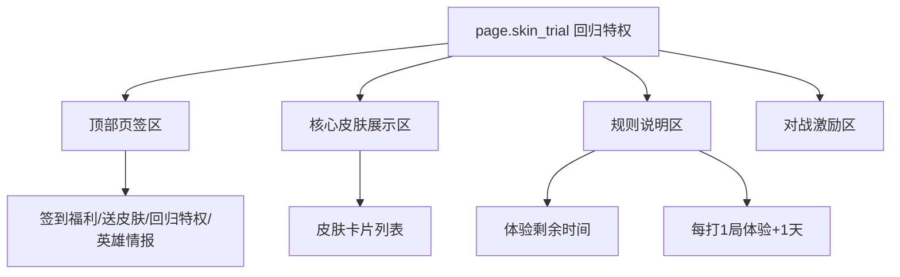
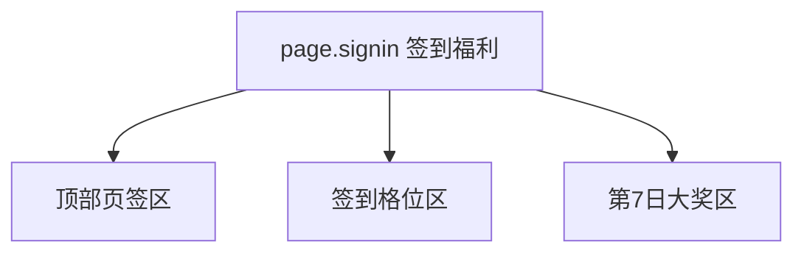

# 王者荣耀 - 回归系统 (回归福利) 系统级分析

## 0. 预处理：视觉噪声过滤 [MANDATORY]
> [!IMPORTANT]
> 原始截图含 Bilibili 水印及视频字幕，已过滤，仅分析游戏原生 UI。

## 0.5 OCR Context (原始文本上下文)
<details>
<summary>点击展开查看各页面文本</summary>

### [回归特权页]
- **标题**：皮肤限时免费用，体验剩余 8 天
- **核心机制**：每打 1 局，体验时间 +1 天
- **皮肤池**：多款史诗皮肤并列展示

### [签到福利页]
- **标题**：完成回归签到，签到 7 日可获大奖
- **核心奖励**：归字徽章 588、排位加星卡、排位保护卡

### [英雄情报]
- **内容**：推荐英雄、版本强势信息

</details>

## 0.6 视觉参考 (Visual Reference) [MANDATORY]


*图 1：回归特权页。*


*图 2：签到福利页。*


*图 3：英雄情报页。*


*图 4：送皮肤页。*

---

## 1. 页面矩阵与系统概览 (Page Matrix & Overview)

### 1.1 页面矩阵

| 页面 ID | 页面名称 | 页面角色 | 核心目标 | 入口线索 | 退出线索 | 视觉权重 |
|---|---|---|---|---|---|---|
| `page.skin_trial` | 回归特权 | hub | 展示皮肤试用特权与延长机制 | 回归福利入口 | 切换页签 / 开始对战 | P0 |
| `page.signin` | 签到福利 | detail | 承载 7 日签到和终极大奖 | 顶部页签 | 领取奖励 / 切换页签 | P0 |
| `page.hero_info` | 英雄情报 | detail | 提供版本 Meta 和推荐英雄 | 顶部页签 | 进入英雄/玩法相关页 | P1 |
| `page.gift_skin` | 送皮肤 | detail | 提供免费皮肤礼赠 | 顶部页签或运营入口 | 领取皮肤 / 返回 | P0 |
| `page.friend_feed` | 好友近况 | detail | 用好友动态触发回流社交动机 | 顶部页签 | 查看后返回 | P1 |

### 1.2 系统概览
- 该系统是 **页签式福利中心**，但真正的核心不是“签到”，而是 `page.skin_trial` 与 `page.gift_skin` 这两个高价值内容入口。
- 从页面素材看，系统将“体验高价值皮肤”与“重新进入对局”直接绑定，形成行为闭环。

---

## 2. 页面级信息架构 (Page-level IA)

### 2.1 页面 IA 树





### 2.2 空间区域拆解 (Spatial Region Breakdown)

| 区域 ID | 所属页面 | 区域名称 | 空间槽位 (Spatial Slot) | 构图职责 | 主内容 | 阅读优先级 | 滚动方式 | 可观察证据 |
|---|---|---|---|---|---|---|---|---|
| `region.top_tabs` | `page.skin_trial` | 顶部页签区 | `top_bar` | 顶部全局导航 | 多个回归子页签 | P1 | horizontal | 图 1 |
| `region.skin_showcase` | `page.skin_trial` | 皮肤展示区 | `center_stage` | 核心视觉模型展示 | 多款史诗皮肤卡片 | P0 | horizontal | 图 1 |
| `region.trial_rule` | `page.skin_trial` | 规则说明区 | `right_panel` | 规则说明与转化 | 剩余体验时间、每局 +1 天 | P0 | none | 图 1 |
| `region.signin_grid` | `page.signin` | 签到格位区 | `center_panel` | 日常资源领取 | 7 日签到奖励 | P0 | none | 图 2 |
| `region.final_reward` | `page.signin` | 终极奖励区 | `right_panel` | 大奖放大锚点 | 第 7 日大奖放大展示 | P0 | none | 图 2 |
| `region.meta_cards` | `page.hero_info` | 版本情报区 | `center_panel` | 信息详情陈列 | 推荐英雄、版本强势 | P1 | vertical | 图 3 |
| `region.skin_gift` | `page.gift_skin` | 送皮肤展示区 | `center_stage` | 核心福利视觉呈现 | 免费皮肤候选卡 | P0 | horizontal | 图 4 |

---

## 3. 组件清单与状态线索 (Components & States)

### 3.1 组件清单

| component_id | 所属页面 | 所属区域 | 组件类型 | 文案/数据 | 状态线索 | 用户动作 | 证据 |
|---|---|---|---|---|---|---|---|
| `tab.return_section` | `page.skin_trial` | `region.top_tabs` | tab | 签到福利、送皮肤、回归特权、英雄情报 | 选中 / 未选中 | tap | 图 1 |
| `card.skin_trial` | `page.skin_trial` | `region.skin_showcase` | preview_card | 多款史诗皮肤 | 可预览 / 可体验 | tap | 图 1 |
| `label.trial_timer` | `page.skin_trial` | `region.trial_rule` | countdown | 体验剩余 8 天 | 进行中 | none | 图 1 |
| `label.match_extension` | `page.skin_trial` | `region.trial_rule` | badge | 每打 1 局体验 +1 天 | 规则态 | none | 图 1 |
| `signin.cell` | `page.signin` | `region.signin_grid` | reward_cell | 每日签到奖励 | 已领 / 今日可领 / 未来锁定 | tap | 图 2 |
| `reward.day7_anchor` | `page.signin` | `region.final_reward` | hero_reward_card | 第 7 日大奖 | 放大高亮 | tap | 图 2 |
| `card.hero_meta` | `page.hero_info` | `region.meta_cards` | info_card | 推荐英雄、版本情报 | 可阅读 / 可跳转 | tap | 图 3 |
| `card.skin_gift` | `page.gift_skin` | `region.skin_gift` | gift_card | 免费皮肤候选 | 可领取 | tap | 图 4 |

### 3.2 状态表达
- `card.skin_trial` 的主状态不是“已领/未领”，而是“可体验”和“体验剩余时间”。
- `label.trial_timer` 与 `label.match_extension` 组合成持续激活状态。
- `signin.cell` 明确具备 `claimable / claimed / locked`。
- `reward.day7_anchor` 是典型终极奖励锚点，起到长期回访提醒作用。

---

## 4. 交互链路与导航推导 (Interaction & Navigation)

### 4.1 主路径
1. 进入回归福利中心，默认看到 `page.skin_trial`。
2. 在皮肤展示区浏览高价值皮肤，并理解“每局 +1 天”的留存规则。
3. 进入对局后，通过行为延长体验时长。
4. 返回页签区，继续完成 `page.signin` 的 7 日签到。
5. 再查看 `page.hero_info` 以降低版本脱节感。

### 4.2 跳转关系表

| 来源页面 | 触发组件 | 目标页面/弹层 | 跳转类型 | 证据 |
|---|---|---|---|---|
| `page.skin_trial` | `tab.return_section` | `page.signin` | tab_switch | 图 1, 图 2 |
| `page.skin_trial` | `tab.return_section` | `page.hero_info` | tab_switch | 图 1, 图 3 |
| `page.skin_trial` | `tab.return_section` | `page.gift_skin` | tab_switch | 图 1, 图 4 |
| `page.skin_trial` | `card.skin_trial` | 对局或皮肤预览相关流程 | push | 图 1 |
| `page.hero_info` | `card.hero_meta` | 英雄或玩法系统 | push | 图 3 |

### 4.3 反馈闭环
- 系统的主反馈不是“领取一大堆资源”，而是“开始打一局就能继续保留皮肤体验”。
- 签到页通过第 7 日大奖放大，持续把玩家拉回长期目标。
- 页签切换承担大部分系统导航反馈。

---

## 5. 面向生成的线索提炼 (Generation-facing Notes)

### 5.1 页面生成线索

| 页面 ID | 主视觉焦点 | 信息阅读顺序 | 不可缺失组件 | 可后置组件 | 备注 |
|---|---|---|---|---|---|
| `page.skin_trial` | 多款皮肤卡 + 体验规则 | 页签 -> 皮肤展示 -> 剩余时间 -> 行为规则 | 页签、皮肤卡、体验倒计时、每局 +1 天规则 | 辅助说明 | 图 1 |
| `page.signin` | 7 日签到 + 第 7 日大奖 | 页签 -> 日常奖励 -> 终极大奖 | 7 格签到、第 7 日大格位 | 背景装饰 | 图 2 |
| `page.hero_info` | 版本情报卡 | 标题 -> 推荐内容 -> 跳转入口 | 推荐英雄 / 版本信息 | 次级说明 | 图 3 |
| `page.gift_skin` | 免费皮肤候选 | 标题 -> 皮肤卡片 -> 领取动作 | 免费皮肤卡、领取入口 | 说明文字 | 图 4 |

### 5.2 可疑点与待裁定
- `⚠️ 待裁定`：`page.friend_feed` 仅在 OCR 文本中出现页签线索，当前没有完整截图展开其页面结构。
- `⚠️ 待裁定`：`card.skin_trial` 是否支持直接试穿预览弹层，现有截图未展示。

### 5.3 次级 UX 诊断
- 系统最强的回流钩子是高价值皮肤试用，而不是资源补偿。
- 对已经脱离排位语境的用户，部分签到奖励的感知价值可能弱于皮肤内容本身。

---

## 6. 抽象定义 (Analysis Manifest)
```json
{
  "system_name": "ReturnSystem_HoK",
  "is_multi_page": true,
  "pages": [
    {
      "page_id": "page.skin_trial",
      "role": "hub",
      "regions": [
        {
          "region_id": "region.skin_showcase",
          "position": "center",
          "components": ["card.skin_trial", "label.trial_timer", "label.match_extension"]
        }
      ]
    },
    {
      "page_id": "page.signin",
      "role": "detail",
      "regions": [
        {
          "region_id": "region.signin_grid",
          "position": "center",
          "components": ["signin.cell", "reward.day7_anchor"]
        }
      ]
    }
  ],
  "components": [
    {
      "component_id": "card.skin_trial",
      "type": "preview_card",
      "page_id": "page.skin_trial",
      "state_hints": ["previewable", "trial_active"],
      "action_hints": ["enter_match_or_preview"]
    },
    {
      "component_id": "signin.cell",
      "type": "reward_cell",
      "page_id": "page.signin",
      "state_hints": ["claimable", "claimed", "locked"],
      "action_hints": ["claim_reward"]
    }
  ],
  "navigation_hints": [
    {
      "from": "page.skin_trial",
      "trigger": "tab.return_section",
      "to": "page.signin"
    },
    {
      "from": "page.skin_trial",
      "trigger": "card.skin_trial",
      "to": "match_flow"
    }
  ]
}
```

---
*关联页面：[[analysis/王者荣耀-签到系统.md]] | [[games/王者荣耀.md]]*
