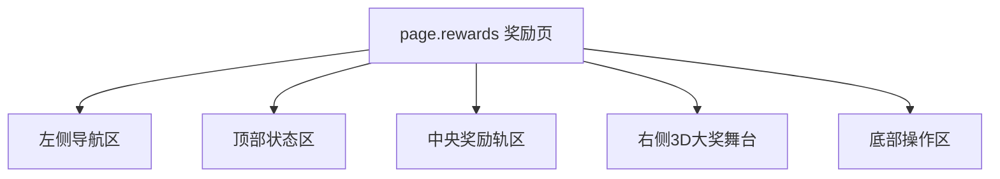
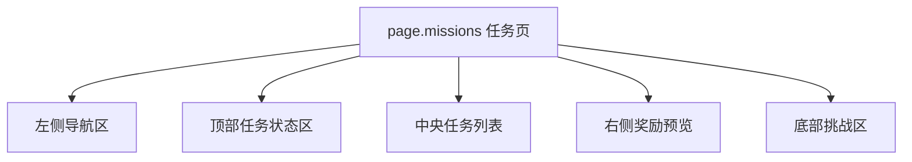
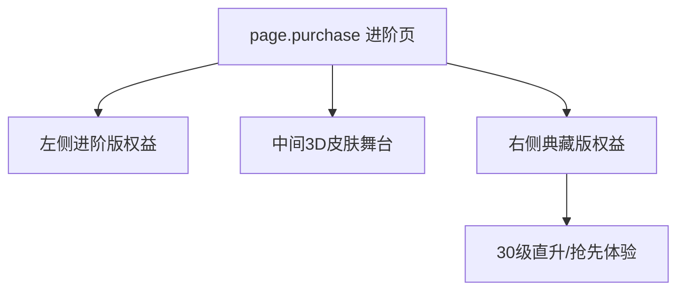

# 王者荣耀 - 战令系统 (荣耀战令) 系统级分析

## 0. 预处理：视觉噪声过滤 [MANDATORY]
> [!IMPORTANT]
> 原始截图包含系统返回手势区与录屏残留信息，已过滤，仅分析游戏原生战令系统。

## 0.5 OCR Context (原始文本上下文)
<details>
<summary>点击展开查看提取的 UI 文本</summary>

### [奖励页]
- **核心文案**：荣耀战令、S32 赛季、获得经验、购买等级、进阶战令、一键领取。
- **导航项**：奖励、任务、兑换、成长。
- **大奖文案**：驭风魔法、进阶版 80 级。

### [任务页]
- **核心文案**：本周任务经验 0/14040、第 3 周任务、前往、赛季挑战 0/5。
- **社交线索**：组队加成。

### [兑换页]
- **兑换门类**：皮肤、英雄、货币、头像框等。
- **状态词**：3 级解锁、4 级解锁、5 级解锁。

### [成长页]
- **核心文案**：当前赛季、历史赛季、下赛季进阶后可继承 0 级。

### [进阶页]
- **核心文案**：进阶、典藏、30 级战令等级、80 级皮肤抢先体验。

</details>

## 0.6 视觉参考 (Visual Reference) [MANDATORY]


*图 1：奖励主页面。*


*图 2：任务页面。*


*图 3：兑换页面。*


*图 4：成长页面。*


*图 5：进阶购买页。*

---

## 1. 页面矩阵与系统概览 (Page Matrix & Overview)

### 1.1 页面矩阵

| 页面 ID | 页面名称 | 页面角色 | 核心目标 | 入口线索 | 退出线索 | 视觉权重 |
|---|---|---|---|---|---|---|
| `page.rewards` | 奖励页 | hub | 展示双轨奖励、当前赛季等级与 80 级大奖 | 战令主入口 | 切任务/兑换/成长 / 进阶页 | P0 |
| `page.missions` | 任务页 | detail | 通过周任务和赛季挑战驱动对局行为 | 左侧任务页签 | 返回奖励页 / 跳玩法 | P0 |
| `page.exchange` | 兑换页 | detail | 把战令等级转成解锁与兑换目标 | 左侧兑换页签 | 返回奖励页 | P1 |
| `page.growth` | 成长页 | detail | 说明赛季继承和长线成长规则 | 左侧成长页签 | 返回奖励页 | P1 |
| `page.purchase` | 进阶页 | checkout | 对比进阶版与典藏版，并放大即时特权 | 奖励页进阶按钮 | 支付成功返回奖励页 / 关闭 | P0 |

### 1.2 系统概览
- 该系统是 **左侧系统导航 + 中央奖励/任务内容 + 右侧 3D 大奖展示** 的复合结构。
- 相比其他战令，王者把 `兑换` 与 `成长` 两个次级页面也放入同一主入口体系内，说明战令在这里既是奖励系统，也是赛季成长中心。
- `page.purchase` 的核心不是列出所有奖励，而是用 **3D 皮肤模型 + 双档权益列表** 推动典藏版转化。

---

## 2. 页面级信息架构 (Page-level IA)

### 2.1 页面 IA 树







### 2.2 空间区域拆解 (Spatial Region Breakdown)

| 区域 ID | 所属页面 | 区域名称 | 空间槽位 | 构图职责 | 主内容 | 阅读优先级 | 滚动方式 | 可观察证据 |
|---|---|---|---|---|---|---|---|---|
| `region.side_nav` | `page.rewards` | 左侧导航区 | `left_rail` | 承担系统内跨页切换 | 奖励、任务、兑换、成长 | P0 | none | 图 1 |
| `region.header` | `page.rewards` | 顶部状态区 | `top_bar` | 外显赛季、等级、资源和主动作 | S32 赛季、0/2000、获得经验、购买等级 | P0 | none | 图 1 |
| `region.reward_track` | `page.rewards` | 奖励轨区 | `center_panel` | 展示双轨奖励推进 | 1-10 级奖励列、精英版/进阶版 | P0 | horizontal | 图 1 |
| `region.hero_stage` | `page.rewards` | 大奖展示区 | `center_stage` | 放大 80 级皮肤与获得欲望 | 3D 模型、大奖名称 | P0 | none | 图 1 |
| `region.action_bar` | `page.rewards` | 底部操作区 | `bottom_bar` | 承载进阶和领取操作 | 进阶战令、一键领取 | P0 | none | 图 1 |
| `region.mission_header` | `page.missions` | 任务状态区 | `top_bar` | 告知本周经验与当前周数 | 本周任务经验 0/14040、第 3 周任务 | P0 | none | 图 2 |
| `region.mission_list` | `page.missions` | 任务列表区 | `center_panel` | 组织任务与前往按钮 | 组队加成任务、前往 | P0 | vertical | 图 2 |
| `region.reward_preview` | `page.missions` | 右侧奖励预览区 | `right_panel` | 用具体奖励维持任务动力 | 降段保护卡 | P1 | none | 图 2 |
| `region.exchange_grid` | `page.exchange` | 兑换网格区 | `center_panel` | 展示等级解锁与兑换目标 | 皮肤宝箱、英雄宝箱、货币等 | P0 | vertical | 图 3 |
| `region.exchange_preview` | `page.exchange` | 大奖预览区 | `center_stage` | 放大当前选中兑换大奖 | 乱世虎臣面具模型 | P1 | none | 图 3 |
| `region.growth_timeline` | `page.growth` | 继承轨区 | `center_panel` | 说明长期成长和赛季继承 | 80-130 级继承节点 | P0 | horizontal | 图 4 |
| `region.purchase_basic` | `page.purchase` | 进阶版权益区 | `left_panel` | 展示基础进阶价值 | 进阶版奖励、积分翻倍 | P1 | none | 图 5 |
| `region.purchase_premium` | `page.purchase` | 典藏版权益区 | `right_panel` | 展示典藏版独占优势 | 30 级直升、80 级皮肤抢先体验 | P0 | none | 图 5 |

---

## 3. 组件清单与状态线索 (Components & States)

### 3.1 组件清单

| component_id | 所属页面 | 所属区域 | 组件类型 | 文案/数据 | 状态线索 | 用户动作 | 证据 |
|---|---|---|---|---|---|---|---|
| `nav.section` | `page.rewards` | `region.side_nav` | tab | 奖励 / 任务 / 兑换 / 成长 | selected / red_dot | tap | 图 1 |
| `label.season_progress` | `page.rewards` | `region.header` | progress_bar | S32、0/2000 | 当前等级态 | none | 图 1 |
| `reward.cell` | `page.rewards` | `region.reward_track` | reward_cell | 1-10 级奖励 | claimable / locked / premium_locked / claimed | tap | 图 1 |
| `btn.advance_pass` | `page.rewards` | `region.action_bar` | primary_button | 进阶战令 | enabled | tap | 图 1 |
| `btn.claim_all` | `page.rewards` | `region.action_bar` | primary_button | 一键领取 | enabled / disabled | tap | 图 1 |
| `mission.item` | `page.missions` | `region.mission_list` | list_item | 第 3 周任务 | jumpable / incomplete | tap | 图 2 |
| `btn.goto_mission` | `page.missions` | `region.mission_list` | secondary_button | 前往 | enabled | tap | 图 2 |
| `badge.team_bonus` | `page.missions` | `region.mission_list` | badge | 组队加成 | visible | none | 图 2 |
| `exchange.cell` | `page.exchange` | `region.exchange_grid` | reward_cell | 皮肤/英雄/货币等奖励 | locked_by_level / available | tap | 图 3 |
| `growth.node` | `page.growth` | `region.growth_timeline` | milestone_node | 80-130 级继承节点 | future / current | tap | 图 4 |
| `card.tier_basic` | `page.purchase` | `region.purchase_basic` | preview_card | 进阶版 | default | tap / pay | 图 5 |
| `card.tier_premium` | `page.purchase` | `region.purchase_premium` | preview_card | 典藏版 | recommended | tap / pay | 图 5 |

### 3.2 状态表达
- `nav.section` 的红点直接承担“当前页或其他页有可处理内容”的提醒功能。
- `reward.cell` 把精英版和进阶版上下堆叠，同时用锁图标和不同底色区分付费层。
- `mission.item` 通过“前往”按钮而不是“仅显示目标”来降低任务到玩法的断层。
- `exchange.cell` 用“几级解锁”显式表达延迟满足，说明兑换页承担长线目标展示功能。

---

## 4. 交互链路与导航推导 (Interaction & Navigation)

### 4.1 主路径
1. 进入 `page.rewards`，先看当前赛季等级和右侧 80 级皮肤大奖。
2. 若有可领奖励，执行 `btn.claim_all`。
3. 若等级不足，切到 `page.missions` 获取本周任务并通过 `btn.goto_mission` 跳具体玩法。
4. 在 `page.exchange` 查看更长线的等级解锁奖励。
5. 若被大奖或成长价值打动，点击 `btn.advance_pass` 进入 `page.purchase` 选择进阶版或典藏版。

### 4.2 跳转关系表

| 来源页面 | 触发组件 | 目标页面/弹层 | 跳转类型 | 证据 |
|---|---|---|---|---|
| `page.rewards` | `nav.section[任务]` | `page.missions` | tab_switch | 图 1, 图 2 |
| `page.rewards` | `nav.section[兑换]` | `page.exchange` | tab_switch | 图 1, 图 3 |
| `page.rewards` | `nav.section[成长]` | `page.growth` | tab_switch | 图 1, 图 4 |
| `page.rewards` | `btn.advance_pass` | `page.purchase` | push | 图 1, 图 5 |
| `page.missions` | `btn.goto_mission` | 对应玩法系统 | push | 图 2 |

### 4.3 反馈闭环
- 任务页用右侧具体奖励预览，让“做任务”与“为了什么做”同屏。
- 进阶页通过“30 级直升”和“80 级皮肤抢先体验”把高价档的即时获得感前置。
- 成长页补足了“赛季结束后还会怎样”的长线说明，减少玩家对溢出等级价值的疑虑。

---

## 5. 面向生成的线索提炼 (Generation-facing Notes)

### 5.1 页面生成线索

| 页面 ID | 主视觉焦点 | 信息阅读顺序 | 不可缺失组件 | 可后置组件 | 备注 |
|---|---|---|---|---|---|
| `page.rewards` | 右侧 3D 皮肤大奖 + 中央奖励轨 | 左导航 -> 顶部赛季等级 -> 奖励轨 -> 大奖 -> 底部 CTA | 左导航、双轨奖励、3D 大奖、进阶按钮 | 次级详情按钮 | 图 1 |
| `page.missions` | 任务列表 + 右侧奖励卡 | 顶部经验上限 -> 列表 -> 前往按钮 -> 奖励卡 | 任务列表、前往、赛季挑战 | 装饰背景 | 图 2 |
| `page.exchange` | 中央兑换网格 + 右侧大奖 | 等级进度 -> 兑换格 -> 大奖预览 | 等级锁、网格、大奖说明 | 次级说明 | 图 3 |
| `page.growth` | 继承徽章时间线 | 当前赛季 -> 历史赛季 -> 继承节点 | 时间线、继承说明、CTA | 次级文字 | 图 4 |
| `page.purchase` | 中央 3D 皮肤 + 双档权益 | 左档 -> 中间皮肤 -> 右档 | 双档权益、购买按钮、30 级直升 | 小字价值说明 | 图 5 |

### 5.2 可疑点与待裁定
- `⚠️ 待裁定`：奖励页右下“详情”按钮打开后的独立详情页未在当前截图集中出现。
- `⚠️ 待裁定`：兑换页是否存在额外二级筛选，在当前截图中无法确认。

### 5.3 次级 UX 诊断
- 王者把战令做成“赛季成长中心”，因此系统页数更多，但页面间职责也更清晰。
- 任务页的社交加成是这套系统的特色，它让战令任务不只是个人待办，还和组队行为绑定。

---

## 6. 抽象定义 (Analysis Manifest)
```json
{
  "system_name": "BattlePass_HOK",
  "is_multi_page": true,
  "pages": [
    {
      "page_id": "page.rewards",
      "role": "hub",
      "regions": [
        {
          "region_id": "region.side_nav",
          "position": "left",
          "components": ["nav.section"]
        },
        {
          "region_id": "region.reward_track",
          "position": "center",
          "components": ["reward.cell", "btn.advance_pass", "btn.claim_all"]
        }
      ]
    },
    {
      "page_id": "page.missions",
      "role": "detail",
      "regions": [
        {
          "region_id": "region.mission_list",
          "position": "center",
          "components": ["mission.item", "btn.goto_mission", "badge.team_bonus"]
        }
      ]
    },
    {
      "page_id": "page.exchange",
      "role": "detail",
      "regions": [
        {
          "region_id": "region.exchange_grid",
          "position": "center",
          "components": ["exchange.cell"]
        }
      ]
    },
    {
      "page_id": "page.growth",
      "role": "detail",
      "regions": [
        {
          "region_id": "region.growth_timeline",
          "position": "center",
          "components": ["growth.node"]
        }
      ]
    },
    {
      "page_id": "page.purchase",
      "role": "checkout",
      "regions": [
        {
          "region_id": "region.purchase_premium",
          "position": "right",
          "components": ["card.tier_basic", "card.tier_premium"]
        }
      ]
    }
  ],
  "components": [
    {
      "component_id": "reward.cell",
      "type": "reward_cell",
      "page_id": "page.rewards",
      "state_hints": ["claimable", "locked", "premium_locked", "claimed"],
      "action_hints": ["preview_reward"]
    },
    {
      "component_id": "mission.item",
      "type": "list_item",
      "page_id": "page.missions",
      "state_hints": ["jumpable", "incomplete"],
      "action_hints": ["goto_gameplay"]
    }
  ],
  "navigation_hints": [
    {
      "from": "page.rewards",
      "trigger": "nav.section[任务]",
      "to": "page.missions"
    },
    {
      "from": "page.rewards",
      "trigger": "nav.section[兑换]",
      "to": "page.exchange"
    },
    {
      "from": "page.rewards",
      "trigger": "btn.advance_pass",
      "to": "page.purchase"
    }
  ]
}
```

---
*关联页面：[[mechanics/战斗通行证系统.md]] | [[concepts/约会机制.md]]*
