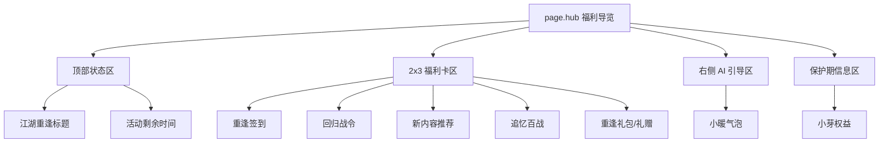
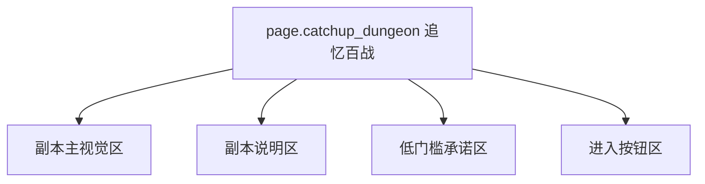

# 逆水寒 - 回归系统 (江湖重逢) 系统级分析

## 0. 预处理：视觉噪声过滤 [MANDATORY]
> [!IMPORTANT]
> 原始截图含 Bilibili 水印、顶部频道标签及“点击屏幕继续”提示文字，已过滤，仅分析游戏原生 UI。

## 0.5 OCR Context (原始文本上下文)
<details>
<summary>点击展开查看各页面文本</summary>

### [福利导览 Hub]
- **标题**：老玩家回归，六大福利专享！
- **模块**：重逢签到、回归战令、新内容推荐、追忆百战、重逢礼包、猜你喜欢
- **引导**：小暖为主人准备了六大专属福利；小芽权益生效中，剩余 14 天

### [追忆百战]
- **机制**：回流专属副本、必掉独珍、AI 队友辅助
- **门槛**：预计耗时 3 分钟，不占用副本奖励次数

### [侠缘礼赠]
- **礼物**：送紫色特技、送自选时装

</details>

## 0.6 视觉参考 (Visual Reference) [MANDATORY]


*图 1：福利导览 Hub。*


*图 2：重逢签到页。*


*图 3：侠缘礼赠页。*


*图 4：追忆百战页。*


*图 5：内容推荐页。*

---

## 1. 页面矩阵与系统概览 (Page Matrix & Overview)

### 1.1 页面矩阵

| 页面 ID | 页面名称 | 页面角色 | 核心目标 | 入口线索 | 退出线索 | 视觉权重 |
|---|---|---|---|---|---|---|
| `page.hub` | 福利导览 | hub | 汇总六大福利入口并提供 AI 引导 | 回归入口或活动入口 | 子页跳转 / 返回主城 | P0 |
| `page.signin` | 重逢签到 | detail | 承载签到留存 | Hub 卡片入口 | 领取后返回 | P0 |
| `page.gift` | 侠缘礼赠 | detail | 提供一次性高价值礼赠 | Hub 卡片入口 | 领取后返回 | P1 |
| `page.battle_pass` | 回归战令 | detail | 提供长线回归任务 | Hub 卡片入口 | 任务跳转 / 返回 | P1 |
| `page.catchup_dungeon` | 追忆百战 | detail | 承载极低门槛追赶副本 | Hub 卡片入口 | 进入副本 / 返回 | P0 |
| `page.content_rec` | 内容推荐 | detail | 提供个性化内容导航 | Hub 卡片入口 | 跳转内容系统 / 返回 | P1 |

### 1.2 系统概览
- 该系统是 **网格式福利 Hub + AI 助手引导** 的结构。
- Hub 的职责不是只列入口，而是通过 `小暖` 和 `小芽权益` 明确告诉玩家“先做什么”和“系统会保护你”。

---

## 2. 页面级信息架构 (Page-level IA)

### 2.1 页面 IA 树





### 2.2 空间区域拆解 (Spatial Region Breakdown)

| 区域 ID | 所属页面 | 区域名称 | 空间槽位 (Spatial Slot) | 构图职责 | 主内容 | 阅读优先级 | 滚动方式 | 可观察证据 |
|---|---|---|---|---|---|---|---|---|
| `region.header` | `page.hub` | 顶部状态区 | `top_bar` | 系统级信息与标题 | 江湖重逢标题、活动剩余时间 | P0 | none | 图 1 |
| `region.welfare_grid` | `page.hub` | 福利卡片区 | `center_panel` | 核心分发面板 | 六大功能卡片 | P0 | none | 图 1 |
| `region.ai_guide` | `page.hub` | AI 引导区 | `right_panel` | 动态辅助指引 | 小暖气泡提示 | P1 | none | 图 1 |
| `region.protection` | `page.hub` | 小芽权益区 | `top_bar` | 特权状态展示 | 保护期剩余 14 天 | P0 | none | 图 1 |
| `region.signin_panel` | `page.signin` | 签到区 | `center_panel` | 日常资源展示 | 签到奖励与主奖励文案 | P0 | none | 图 2 |
| `region.gift_panel` | `page.gift` | 礼赠区 | `center_panel` | 列表型奖励展示 | 时装、特技等奖励列表 | P1 | vertical | 图 3 |
| `region.dungeon_info` | `page.catchup_dungeon` | 副本说明区 | `center_stage` | 视觉沉浸与门槛承诺 | 必掉独珍、AI 助手、3 分钟 | P0 | vertical | 图 4 |
| `region.rec_cards` | `page.content_rec` | 内容推荐区 | `center_panel` | 信息详情陈列 | 推荐内容卡片 | P1 | vertical | 图 5 |

---

## 3. 组件清单与状态线索 (Components & States)

### 3.1 组件清单

| component_id | 所属页面 | 所属区域 | 组件类型 | 文案/数据 | 状态线索 | 用户动作 | 证据 |
|---|---|---|---|---|---|---|---|
| `card.welfare_entry` | `page.hub` | `region.welfare_grid` | entry_card | 重逢签到、回归战令、追忆百战等 | 可进入 | tap | 图 1 |
| `assistant.xiaonuan` | `page.hub` | `region.ai_guide` | assistant_widget | 小暖为主人准备了六大专属福利 | 常驻引导 | tap / read | 图 1 |
| `badge.xiaoya` | `page.hub` | `region.protection` | status_badge | 小芽权益生效中 剩余14天 | 保护期进行中 | none | 图 1 |
| `signin.reward` | `page.signin` | `region.signin_panel` | reward_cell | 交子等奖励 | 可领 / 已领 / 锁定 | tap | 图 2 |
| `gift.item` | `page.gift` | `region.gift_panel` | gift_card | 紫色特技、自选时装等 | 可领取 | tap | 图 3 |
| `label.dungeon_time` | `page.catchup_dungeon` | `region.dungeon_info` | badge | 预计耗时 3 分钟 | 明确门槛 | none | 图 4 |
| `label.dungeon_support` | `page.catchup_dungeon` | `region.dungeon_info` | badge | AI 队友、不占奖励次数 | 保障承诺 | none | 图 4 |
| `card.content_rec` | `page.content_rec` | `region.rec_cards` | entry_card | 推荐内容入口 | 可进入 | tap | 图 5 |

### 3.2 状态表达
- `badge.xiaoya` 是系统级保护状态，直接外显“回归者身份 + 剩余时长”。
- `assistant.xiaonuan` 是持续引导组件，不只是静态说明。
- `label.dungeon_time` 与 `label.dungeon_support` 共同表达“低风险、可立即尝试”的副本状态。
- `signin.reward` 承担日常留存状态切换。

---

## 4. 交互链路与导航推导 (Interaction & Navigation)

### 4.1 主路径
1. 进入 `page.hub`，先看到六大福利总览。
2. 通过 `assistant.xiaonuan` 与 `badge.xiaoya` 感知“有引导、有保护期”。
3. 先完成 `page.signin` 或 `page.gift` 获取即时正反馈。
4. 再进入 `page.catchup_dungeon` 体验 3 分钟低门槛副本。
5. 最后再进入 `page.battle_pass` 和 `page.content_rec` 建立长线回流。

### 4.2 跳转关系表

| 来源页面 | 触发组件 | 目标页面/弹层 | 跳转类型 | 证据 |
|---|---|---|---|---|
| `page.hub` | `card.welfare_entry` | `page.signin` | push | 图 1, 图 2 |
| `page.hub` | `card.welfare_entry` | `page.gift` | push | 图 1, 图 3 |
| `page.hub` | `card.welfare_entry` | `page.catchup_dungeon` | push | 图 1, 图 4 |
| `page.hub` | `card.welfare_entry` | `page.content_rec` | push | 图 1, 图 5 |
| `page.catchup_dungeon` | 进入按钮 | 副本流程 | push | 图 4 |

### 4.3 反馈闭环
- Hub 用 AI 文案和保护期标签提供“心理安全”反馈。
- 追忆百战页把“3 分钟”“AI 辅助”“不占奖励次数”同时放在进入前，减少失败焦虑。
- 即时福利页通过签到和礼赠提供快速正反馈，再把玩家送向长线玩法。

---

## 5. 面向生成的线索提炼 (Generation-facing Notes)

### 5.1 页面生成线索

| 页面 ID | 主视觉焦点 | 信息阅读顺序 | 不可缺失组件 | 可后置组件 | 备注 |
|---|---|---|---|---|---|
| `page.hub` | 六宫格福利 + 小暖引导 | 标题 -> 宫格 -> AI 引导 -> 保护期 | 六张入口卡、小暖、小芽权益、活动倒计时 | 次级装饰 | 图 1 |
| `page.signin` | 国风签到奖励 | 标题 -> 奖励格位 -> 主奖励文案 | 签到格位、奖励图标 | 背景装饰 | 图 2 |
| `page.gift` | 多类型礼赠列表 | 标题 -> 礼物项 -> 领取动作 | 时装/特技等奖励项 | 说明文案 | 图 3 |
| `page.catchup_dungeon` | 低门槛副本承诺 | 主视觉 -> 3分钟 -> AI辅助 -> 进入按钮 | 时间承诺、AI辅助、进入 CTA | 次级说明 | 图 4 |

### 5.2 可疑点与待裁定
- `⚠️ 待裁定`：图 1 中第六张卡片的名称在当前截图里未完全稳定识别，OCR 与视觉阅读可能存在偏差。
- `⚠️ 待裁定`：`page.battle_pass` 未单独展开完整截图，本页结构暂以入口页存在为准，不写入更细组件合同。

### 5.3 次级 UX 诊断
- 这是四款里最强调“系统保护感”的回归设计。
- Hub 内福利入口很多，如果缺少推荐顺序提示，仍可能出现选择过载。

---

## 6. 抽象定义 (Analysis Manifest)
```json
{
  "system_name": "ReturnSystem_NSH",
  "is_multi_page": true,
  "pages": [
    {
      "page_id": "page.hub",
      "role": "hub",
      "regions": [
        {
          "region_id": "region.welfare_grid",
          "position": "center",
          "components": ["card.welfare_entry", "assistant.xiaonuan", "badge.xiaoya"]
        }
      ]
    },
    {
      "page_id": "page.catchup_dungeon",
      "role": "detail",
      "regions": [
        {
          "region_id": "region.dungeon_info",
          "position": "center",
          "components": ["label.dungeon_time", "label.dungeon_support"]
        }
      ]
    }
  ],
  "components": [
    {
      "component_id": "assistant.xiaonuan",
      "type": "assistant_widget",
      "page_id": "page.hub",
      "state_hints": ["persistent"],
      "action_hints": ["guide_order"]
    },
    {
      "component_id": "badge.xiaoya",
      "type": "status_badge",
      "page_id": "page.hub",
      "state_hints": ["protection_active"],
      "action_hints": ["display_remaining_days"]
    }
  ],
  "navigation_hints": [
    {
      "from": "page.hub",
      "trigger": "card.welfare_entry",
      "to": "page.catchup_dungeon"
    },
    {
      "from": "page.catchup_dungeon",
      "trigger": "enter_cta",
      "to": "dungeon_flow"
    }
  ]
}
```

---
*关联页面：[[analysis/逆水寒-14日签到分析.md]] | [[games/逆水寒.md]]*
