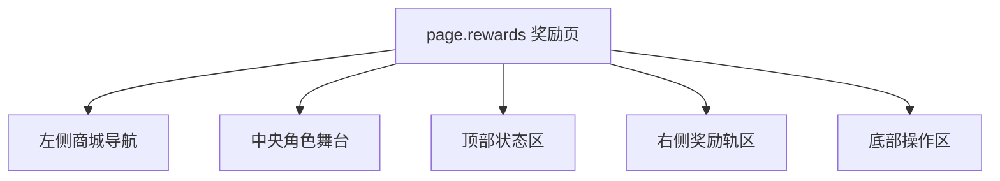
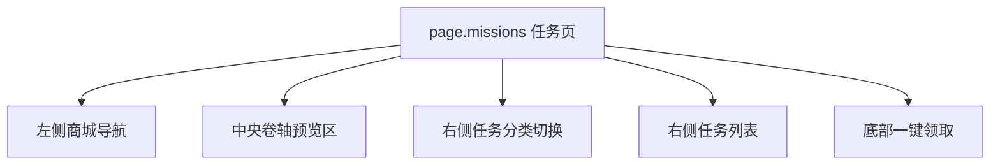
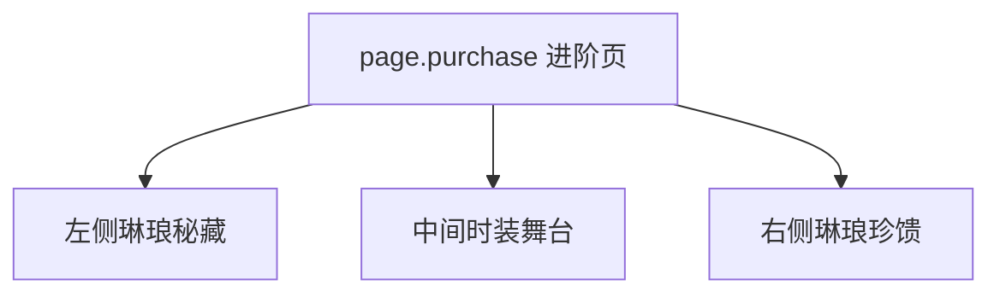

# 逆水寒 - 战令系统 (琳琅战令) 系统级分析

## 0. 预处理：视觉噪声过滤 [MANDATORY]
> [!IMPORTANT]
> 原始截图包含系统返回区与录屏残留信息，已过滤，仅分析游戏原生战令界面。

## 0.5 OCR Context (原始文本上下文)
<details>
<summary>点击展开查看提取的 UI 文本</summary>

### [奖励页]
- **核心文案**：琳琅战令、琳琅奖励、任务、20 级、琳琅经验 0/500、周经验上限 10000/10000。
- **CTA**：购买等级、琳琅进阶、琳琅商店。

### [任务页：本周]
- **任务文案**：获得技能熟练度、活力总消耗、前往、一键领取。

### [任务页：赛季]
- **任务文案**：段位达到琉璃一阶、前往、一键领取。

### [进阶页]
- **档位文案**：琳琅秘藏、琳琅珍馈。
- **卖点**：购买后立即可得、达到特定等级后可得。

</details>

## 0.6 视觉参考 (Visual Reference) [MANDATORY]


*图 1：奖励主页面。*


*图 2：任务页本周态。*


*图 3：任务页赛季态。*


*图 4：进阶购买页。*

---

## 1. 页面矩阵与系统概览 (Page Matrix & Overview)

### 1.1 页面矩阵

| 页面 ID | 页面名称 | 页面角色 | 核心目标 | 入口线索 | 退出线索 | 视觉权重 |
|---|---|---|---|---|---|---|
| `page.rewards` | 奖励页 | hub | 同屏展示角色时装、双轨奖励、周上限与主 CTA | 战令入口 | 切任务页 / 进入商店 / 打开进阶页 | P0 |
| `page.missions` | 任务页 | detail | 通过本周/赛季任务驱动玩家前往不同玩法 | 顶部任务页签 | 返回奖励页 / 跳玩法 | P0 |
| `page.purchase` | 进阶页 | checkout | 通过双档时装权益和即时奖励推动付费 | 奖励页琳琅进阶 | 支付成功返回奖励页 / 关闭 | P0 |

### 1.2 系统概览
- 该系统是 **左侧商城导航 + 中央角色舞台 + 右侧奖励/任务面板** 的武侠拟物化结构。
- `page.rewards` 与 `page.missions` 共用同一“琳琅别册”母板，只是右侧内容从奖励轨切成任务卷轴。
- 相比其他战令，逆水寒把 `琳琅商店` 直接放在主页底部，说明战令币消费是主流程的一部分，而不是满级后的附属去向。

---

## 2. 页面级信息架构 (Page-level IA)

### 2.1 页面 IA 树







### 2.2 空间区域拆解 (Spatial Region Breakdown)

| 区域 ID | 所属页面 | 区域名称 | 空间槽位 | 构图职责 | 主内容 | 阅读优先级 | 滚动方式 | 可观察证据 |
|---|---|---|---|---|---|---|---|---|
| `region.mall_nav` | `page.rewards` | 左侧商城导航 | `left_rail` | 承担金玉馈体系内跨页切换 | 琳琅战令、月卡、充值返利 | P1 | none | 图 1 |
| `region.hero_stage` | `page.rewards` | 中央角色舞台 | `center_stage` | 用 3D 时装模型建立大奖吸引力 | 角色时装、进阶 30 级标识 | P0 | none | 图 1 |
| `region.header` | `page.rewards` | 顶部状态区 | `top_bar` | 组织等级、经验、周上限和购买入口 | 20 级、0/500、10000/10000、购买等级 | P0 | none | 图 1 |
| `region.reward_track` | `page.rewards` | 奖励轨区 | `right_panel` | 展示基础/进阶双轨奖励 | 21-30 级奖励格 | P0 | horizontal | 图 1 |
| `region.action_bar` | `page.rewards` | 底部操作区 | `bottom_bar` | 承载进阶和商店入口 | 琳琅进阶、琳琅商店 | P0 | none | 图 1 |
| `region.hero_panel` | `page.missions` | 卷轴预览区 | `center_stage` | 用单个卷轴奖励强化目标感 | 等级 21 可得卷轴奖励 | P1 | none | 图 2 |
| `region.mission_tabs` | `page.missions` | 任务切换区 | `right_panel` | 在同页切换本周/赛季任务态 | 本周、赛季 | P0 | none | 图 2, 图 3 |
| `region.mission_list` | `page.missions` | 任务列表区 | `right_panel` | 展示任务和前往按钮 | 技能熟练度、活力消耗、段位任务 | P0 | vertical | 图 2, 图 3 |
| `region.claim_action` | `page.missions` | 领取区 | `bottom_bar` | 批量领取任务奖励 | 一键领取 | P0 | none | 图 2, 图 3 |
| `region.purchase_basic` | `page.purchase` | 左档权益区 | `left_panel` | 呈现基础进阶价值 | 琳琅秘藏内容、¥68 | P1 | none | 图 4 |
| `region.purchase_premium` | `page.purchase` | 右档权益区 | `right_panel` | 呈现高价档额外即时奖励 | 琳琅珍馈、即时可得、¥163 | P0 | none | 图 4 |

---

## 3. 组件清单与状态线索 (Components & States)

### 3.1 组件清单

| component_id | 所属页面 | 所属区域 | 组件类型 | 文案/数据 | 状态线索 | 用户动作 | 证据 |
|---|---|---|---|---|---|---|---|
| `nav.mall_section` | `page.rewards` | `region.mall_nav` | tab | 琳琅战令 / 月卡 / 充值返利 | selected / unselected | tap | 图 1 |
| `label.level_progress` | `page.rewards` | `region.header` | progress_bar | 20 级、0/500 | 当前等级态 | none | 图 1 |
| `label.weekly_cap` | `page.rewards` | `region.header` | badge | 周经验上限 10000/10000 | 数值上限态 | none | 图 1 |
| `reward.cell` | `page.rewards` | `region.reward_track` | reward_cell | 21-30 级奖励 | locked / premium_locked / current | tap | 图 1 |
| `btn.open_store` | `page.rewards` | `region.action_bar` | secondary_button | 琳琅商店 | enabled | tap | 图 1 |
| `btn.advance_pass` | `page.rewards` | `region.action_bar` | primary_button | 琳琅进阶 | enabled | tap | 图 1 |
| `tab.mission_group` | `page.missions` | `region.mission_tabs` | tab | 本周 / 赛季 | selected / unselected | tap | 图 2, 图 3 |
| `mission.item` | `page.missions` | `region.mission_list` | list_item | 技能熟练度、活力消耗、段位要求 | jumpable / incomplete | tap | 图 2, 图 3 |
| `btn.goto_mission` | `page.missions` | `region.mission_list` | secondary_button | 前往 | enabled | tap | 图 2, 图 3 |
| `btn.claim_all` | `page.missions` | `region.claim_action` | primary_button | 一键领取 | enabled / disabled | tap | 图 2, 图 3 |
| `card.tier_basic` | `page.purchase` | `region.purchase_basic` | preview_card | 琳琅秘藏 | default | tap / pay | 图 4 |
| `card.tier_premium` | `page.purchase` | `region.purchase_premium` | preview_card | 琳琅珍馈 | recommended | tap / pay | 图 4 |

### 3.2 状态表达
- `reward.cell` 在基础与进阶轨之间用上下分层和锁图标同时表达“等级未达”和“付费未解锁”。
- `tab.mission_group` 不是顶部横签，而是右侧垂直切换，说明任务页的右面板承担主交互职责。
- `btn.open_store` 的常驻存在说明战令商店是平行主路径，而非隐藏子流程。
- `card.tier_premium` 通过“购买后立即可得”与更高价格构成高价值档的即时性承诺。

---

## 4. 交互链路与导航推导 (Interaction & Navigation)

### 4.1 主路径
1. 进入 `page.rewards`，先看中央角色时装与当前等级进度。
2. 在右侧奖励轨中识别当前和未来等级奖励。
3. 若想补经验，切到 `page.missions`，在本周/赛季任务间切换并使用 `btn.goto_mission` 跳玩法。
4. 若想消费战令币，使用 `btn.open_store` 进入商店主路径。
5. 若想解锁进阶奖励，点击 `btn.advance_pass` 进入 `page.purchase` 进行档位选择。

### 4.2 跳转关系表

| 来源页面 | 触发组件 | 目标页面/弹层 | 跳转类型 | 证据 |
|---|---|---|---|---|
| `page.rewards` | 顶部任务页签 | `page.missions` | tab_switch | 图 1, 图 2 |
| `page.missions` | `tab.mission_group` | 本周态 / 赛季态 | content_switch | 图 2, 图 3 |
| `page.rewards` | `btn.advance_pass` | `page.purchase` | push | 图 1, 图 4 |
| `page.rewards` | `btn.open_store` | 琳琅商店 | push | 图 1 |
| `page.missions` | `btn.goto_mission` | 对应玩法系统 | push | 图 2, 图 3 |

### 4.3 反馈闭环
- 奖励页通过中央时装与右侧轨道同屏，持续把“升到 30 级可得什么”具体化。
- 任务页通过本周/赛季切换，让玩家在短期目标与长期目标之间快速切换。
- 进阶页把“即时可得”和“达到特定等级后可得”分开展示，减少玩家对付费内容覆盖范围的疑惑。

---

## 5. 面向生成的线索提炼 (Generation-facing Notes)

### 5.1 页面生成线索

| 页面 ID | 主视觉焦点 | 信息阅读顺序 | 不可缺失组件 | 可后置组件 | 备注 |
|---|---|---|---|---|---|
| `page.rewards` | 中央时装角色 + 右侧奖励轨 | 左导航 -> 中央角色 -> 顶部进度 -> 右轨 -> 底部 CTA | 角色舞台、周上限、双轨奖励、进阶按钮、商店入口 | 次级装饰光效 | 图 1 |
| `page.missions` | 卷轴奖励预览 + 右侧任务列 | 中央卷轴 -> 右侧本周/赛季 -> 任务项 -> 一键领取 | 本周/赛季切换、前往按钮、一键领取 | 底部提示 | 图 2, 图 3 |
| `page.purchase` | 中间时装舞台 + 左右权益卡 | 左档 -> 中间时装 -> 右档 | 双档权益、价格、即时可得内容 | 小字说明 | 图 4 |

### 5.2 可疑点与待裁定
- `⚠️ 待裁定`：`琳琅商店` 的实际页面结构未在当前截图批次展开，只能确认其是主入口之一。
- `⚠️ 待裁定`：奖励格点击后是否存在独立奖励详情弹层，当前截图未展示。

### 5.3 次级 UX 诊断
- 逆水寒的长处是强拟物和低违和感，战令不像独立活动页，更像商城体系中的一本“别册”。
- 代价是右侧任务面板的文字密度较高，若无“前往”按钮，任务完成路径会更难理解。

---

## 6. 抽象定义 (Analysis Manifest)
```json
{
  "system_name": "BattlePass_NSH",
  "is_multi_page": true,
  "pages": [
    {
      "page_id": "page.rewards",
      "role": "hub",
      "regions": [
        {
          "region_id": "region.hero_stage",
          "position": "center_left",
          "components": ["label.level_progress", "btn.advance_pass", "btn.open_store"]
        },
        {
          "region_id": "region.reward_track",
          "position": "right",
          "components": ["reward.cell"]
        }
      ]
    },
    {
      "page_id": "page.missions",
      "role": "detail",
      "regions": [
        {
          "region_id": "region.mission_tabs",
          "position": "right",
          "components": ["tab.mission_group"]
        },
        {
          "region_id": "region.mission_list",
          "position": "right_center",
          "components": ["mission.item", "btn.goto_mission", "btn.claim_all"]
        }
      ]
    },
    {
      "page_id": "page.purchase",
      "role": "checkout",
      "regions": [
        {
          "region_id": "region.purchase_basic",
          "position": "left",
          "components": ["card.tier_basic"]
        },
        {
          "region_id": "region.purchase_premium",
          "position": "right",
          "components": ["card.tier_premium"]
        }
      ]
    }
  ],
  "components": [
    {
      "component_id": "reward.cell",
      "type": "reward_cell",
      "page_id": "page.rewards",
      "state_hints": ["locked", "premium_locked", "current"],
      "action_hints": ["preview_reward"]
    },
    {
      "component_id": "mission.item",
      "type": "list_item",
      "page_id": "page.missions",
      "state_hints": ["jumpable", "incomplete"],
      "action_hints": ["goto_gameplay"]
    }
  ],
  "navigation_hints": [
    {
      "from": "page.rewards",
      "trigger": "任务",
      "to": "page.missions"
    },
    {
      "from": "page.rewards",
      "trigger": "btn.advance_pass",
      "to": "page.purchase"
    },
    {
      "from": "page.rewards",
      "trigger": "btn.open_store",
      "to": "琳琅商店"
    }
  ]
}
```

---
*关联页面：[[mechanics/战斗通行证系统.md]] | [[concepts/拟物化交互.md]]*
