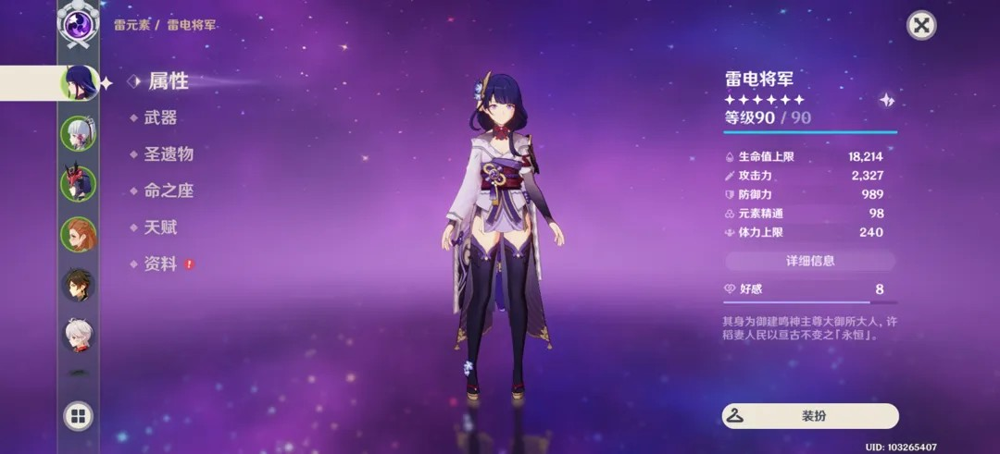
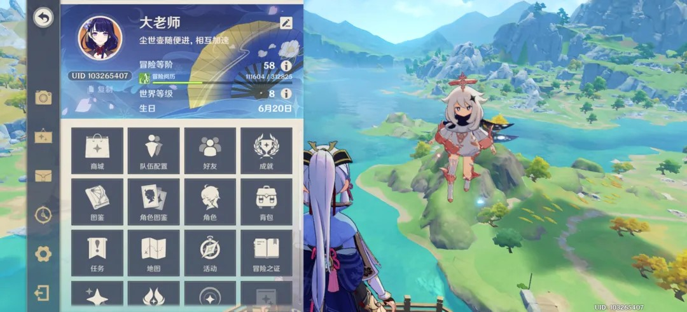

# 原神 (Genshin Impact)

## 交互设计概况
《原神》是移动端设备上“重度 UI 复杂系统”适配的行业标杆。其交互设计核心在于：
1. **多端统一性**：一套 UI 逻辑覆盖触屏、手柄与键鼠，通过侧边呼出菜单（派蒙菜单）与转轮快捷键解决输入冲突。
2. **符号化叙事**：通过扁平化的图标与柔和的色彩分布，在极高信息密度下维持了二次元美术风格的轻盈感。

## 系统分析子页
- [[analysis/原神-角色养成系统.md]] —— 深度拆解属性、武器、圣遗物、命座与天赋的交互层级。
- [[analysis/原神-背包与资源管理.md]] —— 分析网格化资产管理、角标设计与批量操作逻辑。
- [[analysis/原神-祈愿系统.md]] —— 探讨抽卡仪式感、信息分层与商业化引导设计。
- [[analysis/原神-大地图系统.md]] —— 解析 POI 视觉分层、传送路径与多层空间导航。

## 关键 UI 资产 (精选)
- **角色面板**: 
- **主菜单**: 
- **地图系统**: 
